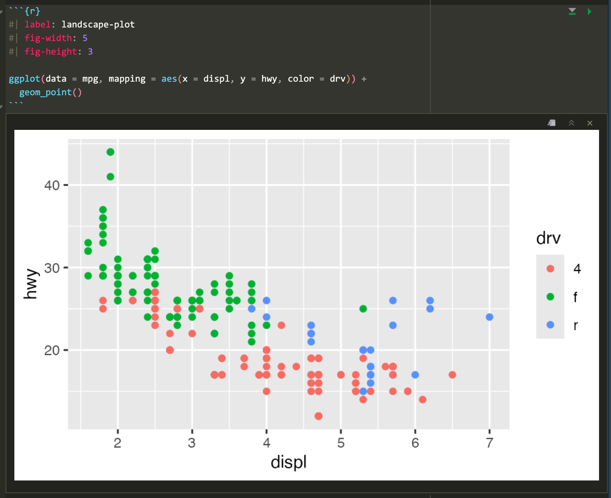

```{r setup, include=FALSE}
knitr::opts_chunk$set(
  fig.width = 6, 
  fig.height = 6 * 0.618, 
  fig.align = "center", 
  out.width = "90%",
  collapse = TRUE
)

library(tidyverse)
set.seed(1234)
```

Hi everyone!

Great work with week 4! You're getting the hang of grouping and summarizing, which is crucial for reshaping and manipulating all sorts of data before feeding it to `ggplot()`! 

Here are a bunch of (hopefully helpful!) FAQs from that exercise.


### I can't remember everything I need to type / I can't memorize all the code / I had to look stuff up on the internet / Why didn't you cover this specific thing?

That's great! It's impossible to memorize all this stuff. You shouldn't! That's why documentation exists. 

It is not cheating to look at the help pages for functions in R. It is not cheating to turn to google. You *should* do this!

Remember this from the "Copy, paste, and tweak" announcement a while ago:

> Inevitably in the classes where I teach R, I have students say things like “I’m trying to do this without looking at any documentation!” or “I can't do this without googling—I'm a failure!”. While the effort to be fully independent and perfect with code is noble, it’s *totally unnecessary*. Everyone looks stuff up all the time—being able to do something without looking stuff up shouldn’t be your end goal. 
> 
> Eventually you’ll be able to whip out basic `ggplot(..., aes(...)) + geom_point() + geom_smooth() + labs()` kinds of things without copying and pasting—that comes naturally over time, and you see me do that in the videos. But as soon as I have to start changing axis breaks or do anything beyond the standard stuff, I immediately start googling and looking at the documentation. Everyone does it. The authors of these packages do it. That's why documentation exists. So don’t feel bad if you do it too. It’s the dirty little secret of all programming everywhere—it’s impossible to write code without referring to documentation or other people’s code (or your past code). 

Do **not** be super noble and force yourself to write everything from scratch! **Do** look things up!

Relatedly, a few of you have noted (with a little frustration) that you wanted to do something like change colors or add labels and those things weren't covered (yet) in the content or lesson, so you had to look it up yourself on the internet. That's normal and how this works! It is impossible to teach everything related to R and ggplot. The way you learn this stuff is by saying "This plot is neat, but I want to change the colors a bit and move the caption to the left side" and then figuring out how to do that, either by (1) remembering what you've learned, or (2) searching for how to do it (a) in the documentation, (b) in the primers or the course website (you can search these sites with the magnifying glass icon in the top navigation bar), (c) in your own past work, or (d) or on Google or somewhere else.


### It seems weird that we can randomly jitter points to accurately reveal relationships?

Yeah! This does feel a little weird and wrong. Like, if you have a scatterplot, you don't really want to mess up the data a little do you?

Sometimes you actually do though.

There are a couple situations where jittering is fine and normal and acceptable and okay.

First, here's a plot of three different species of penguins across three different Antarctic islands:

```{r}
# There are some rows with missing data, so we'll drop those
penguins <- palmerpenguins::penguins |> drop_na(sex)

ggplot(penguins, aes(x = species, y = island)) +
  geom_point()
```

This plot is helpful—it shows that Torgersen Island only has Adelie penguins, Dream Island has Adelies and Chinstraps, and Biscoe Island has Adelies and Gentoos.

HOWEVER, there are actually 300+ points here, but you can't actually see them. They're all stacked on top of each other. We can jitter the points a little to see them all:

```{r}
ggplot(penguins, aes(x = species, y = island)) +
  geom_point(position = position_jitter())
```

This is more helpful because now we can see how many of each type of penguin there are. For example, Biscoe Island has both Adelies and Gentoos, but there are a lot more Gentoos.

You can control how much spread the jittering gets with the `width` and `height` arguments to `position_jitter()`:

```{r}
ggplot(penguins, aes(x = species, y = island)) +
  # Randomly spread out across 25% of the width and 10% of the height of each category
  geom_point(position = position_jitter(width = 0.25, height = 0.1))
```

Jittering in this case is totaly fine and good because moving a point from the very middle of the Adelie axis mark on the x-axis to a little bit left of the axis mark doesn't distort the fact that it's still an Adelie.

Controlling the direction of jittering is helpful when one of the axes has numeric values. Like this plot showing body mass across species:

```{r}
ggplot(penguins, aes(x = species, y = body_mass_g)) +
  geom_point()
```

That's not very helpful since there are so many points still stacked on each other. We can jitter this horizontally, **but not vertically**. If we jitter vertically, we'll randomly add/substract body mass from each penguin, which we don't want to do:

```{r}
ggplot(penguins, aes(x = species, y = body_mass_g)) +
  # height = 0 makes it so points don't jitter up and down
  geom_point(position = position_jitter(width = 0.25, height = 0))
```


### I want my lollipop/bar chart to go sideways—how do I do that?

This one's super easy! If you want the columns or lines to go sideways, switch the x and y aesthetics:

```{r}
penguin_counts <- penguins |>
  group_by(species) |> 
  summarize(total = n())
```

Here are vertical bars:

```{r}
ggplot(penguin_counts, aes(x = species, y = total)) +
  geom_col()
```

And here are horizontal bars:

```{r}
ggplot(penguin_counts, aes(x = total, y = species)) +
  geom_col()
```

In theory it's also possible to use `coord_flip()` to rotate the x and y axes:

```{r}
ggplot(penguin_counts, aes(x = species, y = total)) +
  geom_col() + 
  coord_flip()
```

But **I do not recommend this**. For one thing, we told it to put species on the x-axis and now it's on the y-axis and now we have to remember that. For another thing, `coord_flip()` doesn't flip stuff in the legend. 

For instance, here's a lollipop chart with a legend. The legend entries are mini point ranges that are vertical:

```{r}
ggplot(penguin_counts, aes(x = species, y = total, color = species)) +
  geom_pointrange(aes(ymin = 0, ymax = total))
```

If we flip that with `coord_flip()`, the plot itself becomes horizontal, but the legend entries are still vertical:

```{r}
ggplot(penguin_counts, aes(x = species, y = total, color = species)) +
  geom_pointrange(aes(ymin = 0, ymax = total)) +
  coord_flip()
```

Ew. That breaks the "R" (repetition) in CRAP.

If we swap the x and y aesthetics (and use `xmin` and `xmax` instead of `ymin` and `ymax`), both the plot and the legend entries will be horizontal:

```{r}
ggplot(penguin_counts, aes(y = species, x = total, color = species)) +
  geom_pointrange(aes(xmin = 0, xmax = total))
```


### I stored something as an object and now I can't see it—why?

This is a common thing! In exercise 4, you made little summarized datasets and then plotted them.

When you do something without storing it as an object, R will display it directly in your document, like this:

```{r}
1 + 2 + 3
```

That shows 6, as expected.

If you store the results of that as an object, like `x` here, you won't actually see the 6!

```{r}
x <- 1 + 2 + 3
```

If you want to see the value, you need to run the name of the object:

```{r}
x
```

I'll often do this in the same chunk, like this:

```{r}
x <- 1 + 2 + 3
x
```

Or like this:

```{r}
penguin_counts <- penguins |> 
  group_by(species) |> 
  summarize(total = n())
penguin_counts
```

Or like this:

```{.r}
# Make a plot
my_plot <- ggplot() + 
  geom_whatever()

# Show it
my_plot
```

R comes with a special shortcut syntax for simultaneously making an object *and* displaying it in the console—wrap the command in parentheses:

```{r}
# Make an object called x *and* show it
(x <- 1 + 2 + 3)
```


### Why does R keep yelling at me with warnings and messages?

By now you've seen ominous looking red text in R, like `'summarise()' has grouped output by 'Gender'. You can override using the '.groups' argument` or `Warning: Removed 2 rows containing missing values`, and so on. You might have panicked a little after seeing this and thought you were doing something wrong.

Never fear! You're most likely not doing anything wrong.

R shows red text in the console pane in three different situations:

- **Errors**: When the red text is a legitimate error, it will be prefaced with “Error in…” and will try to explain what went wrong. Generally when there’s an error, the code will not run. For example, if you see `Error in ggplot(...) : could not find function "ggplot"`, it means that the `ggplot()` function is not accessible because the package that contains the function (`ggplot2`) was not loaded with `library(ggplot2)` (or `library(tidyverse)`, which loads `ggplot2`). Thus you cannot use the `ggplot()` function without the `ggplot2` package being loaded first.
- **Warnings**: When the red text is a warning, it will be prefaced with “Warning:” and R will try to explain why there’s a warning. Generally your code will still work, but with some caveats. For example if you create a scatterplot based on a dataset where two of the rows of data have missing entries that would be needed to create points in the scatterplot, you will see this warning: `Warning: Removed 2 rows containing missing values (geom_point)`. R will still produce the scatterplot with all the remaining non-missing values, but it is warning you that two of the points aren’t there.
- **Messages**: When the red text doesn’t start with either “Error” or “Warning”, it’s just a friendly message. You’ll see these messages when you load R packages or when you read data saved in spreadsheet files with `read_csv()`. These are helpful diagnostic messages and they don’t stop your code from working. This is what `'summarise()' has grouped output by 'Gender'...` is—just a helpful note.

Remember, when you see red text in the console, don’t panic. It doesn’t necessarily mean anything is wrong. Rather:

- If the text starts with “Error”, figure out what’s causing it. Think of errors as a red traffic light: something is wrong!
- If the text starts with “Warning”, figure out if it’s something to worry about. For instance, if you get a warning about missing values in a scatterplot and you know there are missing values, you’re fine. If that’s surprising, look at your data and see what’s missing. Think of warnings as a yellow traffic light: everything is working fine, but watch out/pay attention.
- Otherwise, the text is just a message. Read it, wave back at R, and thank it for talking to you. Think of messages as a green traffic light: everything is working fine and keep on going!


### Why do I keep getting messages like `summarise() has grouped output by 'BLAH'` when using `group_by()` and `summarize()`?

[See this for a detailed explanation and illustration about what's going on.](https://www.andrewheiss.com/blog/2024/04/04/group_by-summarize-ungroup-animations/#leftover-groupings-and-ungroup)

In short, this happens when you use `summarize()` after grouping by two or more things. When you use `summarize()` on a grouped dataset, {dplyr} will automatically ungroup the last of the groups and leave everything else grouped.

So if you do this:

```{.r}
animals |>
  group_by(intake_type, intake_month) |>
  summarize(total = n())
```

…R will stop grouping by `intake_month` (since it's the last specified group) and leave the data grouped by `intake_type`, and you'll get a message letting you know that that's the case.

You can turn off those messages for individual chunks if you use `message: false` in the chunk options. Or alternatively, you can include this line near the top of your document to disable all the warnings:

```{.r}
options(dplyr.summarise.inform = FALSE)
```

### When do we use `summarize()` vs. `mutate()` with `group_by()`?

You can use either `summarize()` or `mutate()` (or anything else, really) after `group_by()`. It's important to remember that the two functions do two different things.

**`summarize()` collapses data into a single row.** If you use it on a regular ungrouped data frame, you get literally one row, with columns for each of the new columns you told it to create:

```{r}
penguins |>
  summarize(
    total_penguins = n(),
    avg_weight = mean(body_mass_g)
  ) 
```

**`summarize()` is destructive** and will throw away all the columns you don't tell it to work with.

If you use `summarize()` after `group_by()`, it will collapse *each group* into a single row. Here we get three rows, one per species:

```{r}
penguins |>
  group_by(species) |> 
  summarize(
    total_penguins = n(),
    avg_weight = mean(body_mass_g)
  ) 
```

**`mutate()` adds columns.** If you use it on grouped data, like after `group_by()`, it'll add a column in each group. **`mutate()` is not destructive** and it will keep all existing columns. When you use functions that summarize data, like finding the mean, median, standard deviation, or count, you can *can* technically put those results in `mutate()` and keep all the other values in the data, but it leads to some weird repeating behavior. Like here, the total number and average weight for Adelie penguins is indeed 146 and 3706 grams, but that's repeated for every individual Adelie penguin here.

```{r}
penguins |>
  group_by(species) |> 
  mutate(
    total_penguins = n(),
    avg_weight = mean(body_mass_g),
    .after = species
  )
```

That can be okay! Like, what if you want to calculate how much higher or lower each penguin is from the species average? `group_by() |> mutate()` is great for that!:

```{r}
penguins |>
  group_by(species) |> 
  mutate(
    avg_weight = mean(body_mass_g),
    diff_from_avg = body_mass_g - avg_weight,
    .after = species
  )
```

Penguin 1 is 43.8 grams heavier than the Adelie average (3706 grams); penguin 4 is 456 grams lighter than the Adelie average.

Both `group_by() |> summarize()` and `group_by() |> mutate()` are useful—it just depends on what you want to do with the groups you make.


### How can I hide warnings and messages?

In general, you'll want to try to deal with errors and warnings, often by adjusting or clarifying something in your code. In your final rendered documents, you typically want to have nice clean output without any warnings or messages. You can fix these warnings and messages in a couple ways: (1) change your code to deal with them, or (2) just hide them.

For instance, if you do something like this to turn off the fill legend:

```r
# Not actual code; don't try to run this
ggplot(data = whatever, aes(x = blah, y = blah, fill = blah)) +
  geom_col() +
  guides(fill = FALSE)
```

You'll get this warning:

```r
## Warning: The `<scale>` argument of `guides()` cannot be `FALSE`. Use "none" 
## instead as of ggplot2 3.3.4.
## This warning is displayed once every 8 hours.
## Call `lifecycle::last_lifecycle_warnings()` to see where this warning was
## generated.
```

You'll still get a plot and the fill legend will be gone and that's great, but the warning is telling you that that code has been deprecated and is getting phased out and will eventually stop working. ggplot helpfully tells you how to fix it: use `guides(fill = "none")` instead. Changing that code removes the warning and everything will work just fine:

```r
# Not actual code; don't try to run this
ggplot(data = whatever, aes(x = blah, y = blah, fill = blah)) +
  geom_col() +
  guides(fill = "none")
```

In other cases, though, nothing's wrong and R is just being talkative. For instance, when you load {tidyverse}, you get a big wall of text:

```{r load-tidyverse-fake}
library(tidyverse)
## ── Attaching core tidyverse packages ─────────────────── tidyverse 2.0.0 ──
## ✔ dplyr     1.1.4     ✔ readr     2.1.5
## ✔ forcats   1.0.0     ✔ stringr   1.5.1
## ✔ ggplot2   3.5.1     ✔ tibble    3.2.1
## ✔ lubridate 1.9.3     ✔ tidyr     1.3.1
## ✔ purrr     1.0.2     
## ── Conflicts ───────────────────────────────────── tidyverse_conflicts() ──
## ✖ dplyr::filter() masks stats::filter()
## ✖ dplyr::lag()    masks stats::lag()
## ℹ Use the conflicted package to force all conflicts to become errors
```

That's all helpful information—it tells you that R loaded 9 related packages for you ({ggplot2}, {dplyr}, etc.). But none of that needs to be in a rendered document. You can turn off those messages and warnings using chunk options:

```{r}
#| echo: fenced
#| label: load-packages
#| warning: false
#| message: false
library(tidyverse)
```

The same technique works for other messages too. In exercise 3, for instance, you saw this message a lot:

```r
## `summarise()` has grouped output by 'Gender'. 
## You can override using the .groups` argument.
```

That's nothing bad and you did nothing wrong—that's just R talking to you and telling you that it did something behind the scenes. When you use `group_by()` with one variable, like `group_by(Gender)`, once you're done summarizing and working with the groups, R ungroups your data automatically. When you use `group_by()` with two variables, like `group_by(Gender, Film)`, once you're done summarizing and working with the groups, R ungroups the last of the variables and gives you a data frame that is still grouped by the other variables. So with `group_by(Gender, Film)`, after you've summarized stuff, R stops grouping by `Film` and groups by just `Gender`. That's all the `summarise() has grouped output by...` message is doing—it's telling you that it's still grouped by something. It's no big deal.

So, to get rid of the message in this case, you can use `message: false` in the chunk options to disable the message:

```{r load-lotr-data, include=FALSE}
# Load the separate datasets
fellowship <- read_csv(here::here("projects", "03-exercise", "data", "The_Fellowship_Of_The_Ring.csv"))
tt <- read_csv(here::here("projects", "03-exercise", "data", "The_Two_Towers.csv"))
rotk <- read_csv(here::here("projects", "03-exercise", "data", "The_Return_Of_The_King.csv"))

# bind_rows() stacks data frames on top of each other
lotr_wide <- bind_rows(fellowship, tt, rotk) |> 
  # Make the Film column a categorical variable (factor), and put it in the
  # order the categories appear (so the films are in the correct order)
  mutate(Film = fct_inorder(Film))

# Make this wide data tidy
lotr <- lotr_wide |>
  # This is the new way to make data long
  pivot_longer(cols = c(Female, Male), 
               names_to = "Gender", values_to = "Words")
```

```{r}
#| echo: fenced
#| label: lotr-use-two-groups
#| message: false
lotr_gender_film <- lotr |> 
  group_by(Gender, Film) |> 
  summarize(total = sum(Words))
```


### Why did we need to group a second time when calculating the proportions for the heatmap?

At the end of exercise 4, you created a heatmap showing the proportions of different types of intake types across months. In the instructions, I said you’d need to use `group_by()` twice to get predictable proportions. Some of you have wondered what this means. Here's a quick illustration.

When you group by a column, R splits your data into separate datasets behind the scenes, and when you use `summarize()`, it calculates summary statistics (averages, counts, medians, etc.) for each of those groups. So when you used `group_by(intake_type, intake_month)`, R made smaller datasets of Owner Surrender in January, Stray in January, Wildlife in January, Owner Surrender in February, and so on. Then when you used `summarize(total = n())`, you calculated the number of rows in each of those groups, thus giving you the number of animals per intake type per month. That’s basic `group_by() |> summarize()` stuff.

Once you have a count of animals per intakee type per monthh, you have to decide how you want to calculate proportions. In particular, you need to figure out what your denominator is. Do you want the proportion of all animals within each intake type per month (e.g. X% of animals in January are owner surrender, Y% in January are strays, and Z% in January are wildlife), so that each month constitutes 100%? Do you want the proportion of months for each intake type (e.g. X% of owner surrenders happen in January, Y% of owner surrenders happen in February, and so on until 100% of the owner surrenders are accounted for). *This* is where the second `group_by()` matters.

For example, if you group by intake type and then use mutate to calculate the proportion, the proportion in each intake type will add up to 100%. Notice the denominator column here—it’s unique to each intake type (2323 for owner surrenders, 19911 for strays, etc.). **This means you can say things like "10.3% of owner surrenders happened in February."**

```{.r}
animals |>
  group_by(intake_type, intake_month) |>
  summarize(total = n()) |>
  group_by(intake_type) |>
  mutate(denominator = sum(total),
         proportion = total / denominator)
#> # A tibble: 36 × 5
#> # Groups:   intake_type [3]
#>    intake_type     intake_month total denominator proportion
#>    <chr>           <ord>        <int>       <int>      <dbl>
#>  1 Owner Surrender January        196        2323     0.0844
#>  2 Owner Surrender February       240        2323     0.103 
#>  3 Owner Surrender March          254        2323     0.109 
#>  4 Owner Surrender April          189        2323     0.0814
#>  5 Owner Surrender May            206        2323     0.0887
#>  6 Owner Surrender June           190        2323     0.0818
#>  7 Owner Surrender July           165        2323     0.0710
#>  8 Owner Surrender August         214        2323     0.0921
#>  9 Owner Surrender September      175        2323     0.0753
#> 10 Owner Surrender October        167        2323     0.0719
#> 11 Owner Surrender November       157        2323     0.0676
#> 12 Owner Surrender December       170        2323     0.0732
#> 13 Stray           January       1124       19911     0.0565
#> 14 Stray           February      1097       19911     0.0551
#> # ℹ 22 more rows
```

If you group by month for the second grouping instead, the proportion within each month will add to 100%. Notice how the denominator for January is 1521 (196 owner surrenders, 1124 strays, and 201 wildlife), February is 1541, and so on. **This means you can say things like "73.9% of animals in January are strays."**

```{.r}
animals |>
  group_by(intake_month, intake_type) |>
  summarize(total = n()) |>
  group_by(intake_month) |>
  mutate(denominator = sum(total),
         proportion = total / denominator)
#> # A tibble: 36 × 5
#> # Groups:   intake_month [12]
#>    intake_month intake_type     total denominator proportion
#>    <ord>        <chr>           <int>       <int>      <dbl>
#>  1 January      Owner Surrender   196        1521     0.129 
#>  2 January      Stray            1124        1521     0.739 
#>  3 January      Wildlife          201        1521     0.132 
#>  4 February     Owner Surrender   240        1541     0.156 
#>  5 February     Stray            1097        1541     0.712 
#>  6 February     Wildlife          204        1541     0.132 
#>  7 March        Owner Surrender   254        2017     0.126 
#>  8 March        Stray            1325        2017     0.657 
#>  9 March        Wildlife          438        2017     0.217 
#> 10 April        Owner Surrender   189        2419     0.0781
#> # ℹ 26 more rows
```

You can also ungroup completely before calculating the proportion. This makes it so the entire proportion column adds to 100%. **This means you can say things like "4.15% of all animals were strays taken in in February."**

```{.r}
animals |>
  group_by(intake_month, intake_type) |>
  summarize(total = n()) |>
  ungroup() |>
  mutate(denominator = sum(total),
         proportion = total / denominator) 
#> # A tibble: 36 × 5
#>    intake_month intake_type     total denominator proportion
#>    <ord>        <chr>           <int>       <int>      <dbl>
#>  1 January      Owner Surrender   196       26413    0.00742
#>  2 January      Stray            1124       26413    0.0426 
#>  3 January      Wildlife          201       26413    0.00761
#>  4 February     Owner Surrender   240       26413    0.00909
#>  5 February     Stray            1097       26413    0.0415 
#>  6 February     Wildlife          204       26413    0.00772
#>  7 March        Owner Surrender   254       26413    0.00962
#>  8 March        Stray            1325       26413    0.0502 
#>  9 March        Wildlife          438       26413    0.0166 
#> 10 April        Owner Surrender   189       26413    0.00716
#> # ℹ 26 more rows
```

Which one you do is up to you—it depends on the story you’re trying to tell.


### How can I add a line break to the text in my plot?

If you don't want to use the fancier techniques from [the blog post about long labels](https://www.andrewheiss.com/blog/2022/06/23/long-labels-ggplot/), a quick and easy way to deal with longer text is to manually insert a linebreak yourself. This is super easy: include a `\n` where you want a new line:

```{r plot-line-break, fig.width=5, fig.height=3}
ggplot(data = mpg, mapping = aes(x = displ, y = hwy, color = drv)) +
  geom_point() +
  labs(
    title = "Everyone's favorite\nexample plot",
    x = "Displacement\n(proxy for car weight)",
    y = "MPG\n(highway)",
    color = "Drive"
  )
```


### How can I control the dimensions of my figures?

By default, R creates plots that are 7″×7″ squares:

```{r initial-square-plot, warning=FALSE, message=FALSE, fig.width=7, fig.height=7}
library(tidyverse)

ggplot(data = mpg, mapping = aes(x = displ, y = hwy, color = drv)) +
  geom_point()
```

Often, though, those plots are excessively large and can result in text that is too small and dimensions that feel off. You generally want to have better control over the dimensions of the figures you make. For instance, you can make them landscape when there’s lots of text involved. To do this, you can use the `fig-width` and `fig-height` chunk options to control the, um, width and height of the figures:

```{r}
#| echo: fenced
#| label: landscape-plot
#| fig-width: 5
#| fig-height: 3

ggplot(data = mpg, mapping = aes(x = displ, y = hwy, color = drv)) +
  geom_point()
```

The dimensions are also reflected in RStudio itself when you’re working with inline images, so it’s easy to tinker with different values and rerun the chunk without needing to re-render the whole document over and over again:

{width=90%}

#### Bonus artsy mathy fun: Golden rectangles and golden ratios

Because I’m a super nerd, I try to make the dimensions of all my landscape images be golden rectangles, which follow the [golden ratio](https://en.wikipedia.org/wiki/Golden_ratio)—a [really amazing ancient number](https://slate.com/technology/2021/06/golden-ratio-phi-irrational-number-ellenberg-shape.html) that gets used [all the time in art and design](https://www.adobe.com/creativecloud/design/discover/golden-ratio.html). [Check out this neat video](https://www.youtube.com/watch?v=wTlw7fNcO-0) or [this one](https://www.youtube.com/watch?v=2tv6Ej6JVho) to learn more. 

Basically, a golden rectangle is a special rectangle where if you cut it at a specific point, you get a square and a smaller rectangle that is also a golden rectangle. You can then cut that smaller rectangle at the magic point and get another square and another even smaller golden rectangle, and so on.

More formally and mathematically, it's a rectangle where the ratio of the height and width of the subshapes are special values. Note how here the blue square is a perfect square with side lengths *a*, while the red rectangle is another smaller golden rectangle with side lengths *a* and *b*:

$$
\frac{a + b}{a} = \frac{a}{b} = \phi
$$

```{r golden-rectangle, out.width="40%", fig.width=4, fig.height=4*0.618, echo=FALSE}
phi <- (1 + sqrt(5)) / 2

clrs <- viridisLite::viridis(7, option = "plasma", begin = 0, end = 0.9)

update_geom_defaults("text", list(family = "IBM Plex Sans", fontface = "bold.italic", size = 6))

ggplot() +
  annotate(
    geom = "rect", xmin = 0, xmax = 1, ymin = 0, ymax = 1,
    linewidth = 0, fill = colorspace::lighten(clrs[1], 0.8)
  ) +
  annotate(
    geom = "rect", xmin = 1, xmax = phi, ymin = 0, ymax = 1,
    linewidth = 0, fill = colorspace::lighten(clrs[5], 0.8)
  ) +
  annotate(
    geom = "rect", xmin = 0, xmax = phi, ymin = 0, ymax = 1,
    linewidth = 1, fill = NA, color = "black"
  ) +
  annotate(
    geom = "segment", x = 1, xend = 1, y = 0, yend = 1, 
    linetype = "21", linewidth = 0.5
  ) +
  annotate(
    geom = "text", x = 0.5, y = 0.92, label = "a", color = clrs[1]
  ) +
  annotate(
    geom = "text", x = ((phi - 1) / 2) + 1, y = 0.92, label = "b", color = clrs[5]
  ) +
  annotate(
    geom = "text", x = 0.08, y = 0.5, label = "a", color = clrs[1]
  ) +
  annotate(
    geom = "errorbar", xmin = 0.05, xmax = phi - 0.05, y = 0.1, width = 0.1,
    color = clrs[3]
  ) +
  annotate(
    geom = "text", x = phi / 2, y = 0.15, label = "a + b", color = clrs[3]
  ) +
  scale_x_continuous(expand = c(0, 0.01)) +
  scale_y_continuous(expand = c(0, 0.01)) +
  coord_equal() +
  theme_void()
```


It turns out that if you do the algebra to figure out that ratio or $\phi$ (the Greek letter "phi," pronounced as either "fee" or "fie"), it's this:

$$
\phi = \frac{1 + \sqrt{5}}{2} \approx 1.618
$$

That's all really mathy, but it's really just a matter of using that 1.618 number with whatever dimensions you want. For instance, if I want my image to be 6 inches wide, I'll divide it by $\phi$ or 1.618 (or multiply it by 0.618, which is the same thing) to find the height to make a golden rectangle: **6 inches × 0.618 = `r 6 * 0.618` = 3.7 inches**

R can even do the math for you in the chunk options if you use `fig-asp`:

```{r}
#| echo: fenced
#| label: landscape-plot-golden
#| fig-width: 6
#| fig-asp: 0.618

ggplot(data = mpg, mapping = aes(x = displ, y = hwy, color = drv)) +
  geom_point()
```

::: {.callout-tip}
#### Shortcut

If you can't remember that the magic golden ratio $\phi$ is 1.618 or the gross complicated $\frac{1 + \sqrt{5}}{2}$, you can cheat a little and remember $\frac{5}{3}$, which is 1.667, which is often close enough.
:::

I don't do this with *all* my figures, and I often have to fudge the numbers a bit when there are titles and subtitles (i.e. making the height a little taller so that the rectangle around just the plot area still roughly follows the golden ratio), but it makes nice rectangles and [I just think they're neat](https://www.youtube.com/watch?v=DrQqajtiRt4).

For bonus fun, if you draw a curve between the opposite corners of each square of the golden rectangles, you get something called the [golden spiral or Fibonacci spiral](https://en.wikipedia.org/wiki/Golden_spiral), which is replicated throughout nature and art. Graphic designers and artists often make the dimensions of their work fit in golden rectangles and will sometimes even overlay a golden spiral over their work and lay out text and images in specific squares and rectangles. See [this](https://www.adobe.com/creativecloud/design/discover/golden-ratio.html) and [this](https://www.canva.com/learn/what-is-the-golden-ratio/) for some examples.

```{r golden-rectangle-spiral, out.width="40%", fig.width=4, fig.height=4*0.618, echo=FALSE}
ggplot() +
  annotate(
    geom = "rect", xmin = 0, xmax = 1, ymin = 0, ymax = 1,
    linewidth = 0, fill = colorspace::lighten(clrs[2], 0.5)
  ) +
  annotate(
    geom = "curve", x = 0, xend = 1, y = 0, yend = 1, curvature = -0.45,
    color = clrs[2], linewidth = 1
  ) +
  annotate(
    geom = "rect", 
    xmin = 1, xmax = phi, ymin = 1 - (1/phi), ymax = 1,
    linewidth = 0, fill = colorspace::lighten(clrs[3], 0.5)
  ) +
  annotate(
    geom = "curve", 
    x = 1, xend = phi, y = 1, yend = 1 - (1/phi), curvature = -0.45,
    color = clrs[2], linewidth = 1
  ) +
  annotate(
    geom = "rect", 
    xmin = phi - (1 - (1/phi)), xmax = phi, ymin = 0, ymax = 1 - (1/phi),
    linewidth = 0, fill = colorspace::lighten(clrs[4], 0.5)
  ) +
  annotate(
    geom = "curve", 
    x = phi, xend = phi - (1 - (1/phi)), y = 1 - (1/phi), yend = 0, curvature = -0.45,
    color = clrs[2], linewidth = 1
  ) +
  annotate(
    geom = "rect", 
    xmin = 1, xmax = phi - (1 - (1/phi)), ymin = 0, ymax = (1 - (1/phi)) / phi,
    linewidth = 0, fill = colorspace::lighten(clrs[5], 0.5)
  ) +
  annotate(
    geom = "curve", 
    x = phi - (1 - (1/phi)), xend = 1, y = 0, yend = (1 - (1/phi)) / phi, curvature = -0.45,
    color = clrs[2], linewidth = 1
  ) +
  annotate(
    geom = "rect", 
    xmin = 1, xmax = phi - (1 - (1/phi)), ymin = (1 - (1/phi)) / phi, ymax = 1 - (1/phi),
    linewidth = 0, fill = colorspace::lighten(clrs[6], 0.5)
  ) +
  annotate(
    geom = "rect", 
    xmin = 1, xmax = 1 + ((phi - (1 - (1/phi))) - 1) / phi, ymin = (1 - (1/phi)) / phi, ymax = 1 - (1/phi),
    linewidth = 0, fill = colorspace::lighten(clrs[7], 0.5)
  ) +
  annotate(
    geom = "curve", 
    x = 1 + ((phi - (1 - (1/phi))) - 1) / phi, xend = 1,
    y = 1 - (1/phi), yend = (1 - (1/phi)) / phi, curvature = 0.45,
    color = clrs[2], linewidth = 1
  ) +
  scale_x_continuous(expand = c(0, 0.01)) +
  scale_y_continuous(expand = c(0, 0.01)) +
  coord_equal() +
  theme_void()
```
