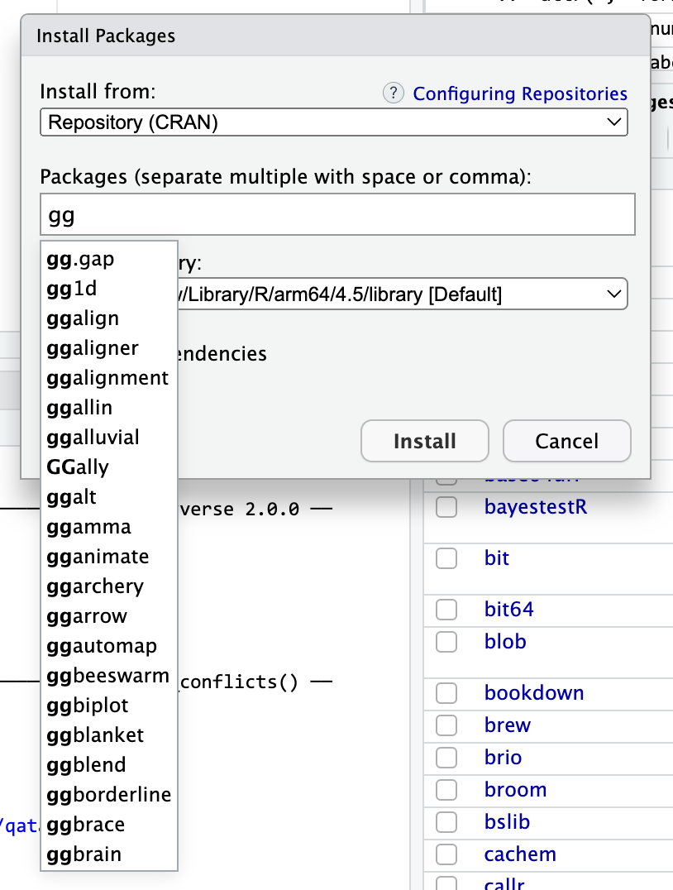
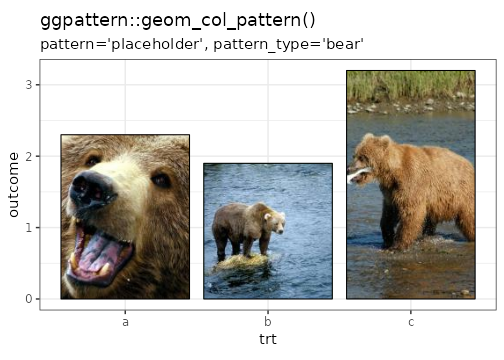
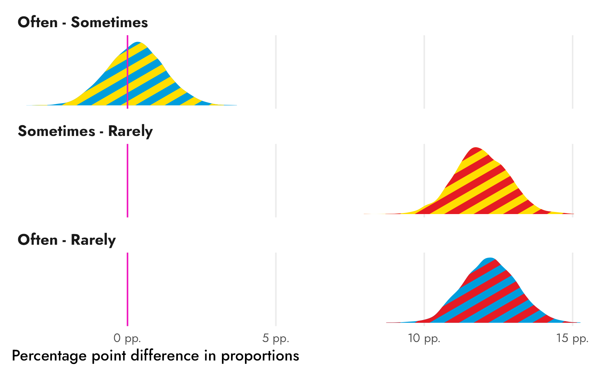

```{r setup, include=FALSE}
knitr::opts_chunk$set(
  fig.width = 6, 
  fig.height = 6 * 0.618, 
  fig.align = "center", 
  out.width = "90%",
  collapse = TRUE
)

library(tidyverse)
set.seed(1234)
```

### This is too much code—Tableau can do all this, so why can't we use that?

Yep. [Leland Wilkinson](https://en.wikipedia.org/wiki/Leland_Wilkinson)—the guy who invented the idea of the grammar of graphics and wrote [the literal *The Grammar of Graphics* book](https://en.wikipedia.org/wiki/Wilkinson%27s_Grammar_of_Graphics)—was actually a semi-cofounder of Tableau. As a result, Tableau uses the same grammar of graphics idea—you map data to aesthetics and show it with geoms (though they don't call things geoms there).

So why R and not Tableau then?

Two main reasons: (1) R is free and you'll be able to use it after you graduate, and (2) using code to make graphics makes those graphics reproducible and more easily changeable. If you want to recreate a Tableau visualization, you have to document all the things you click on; if you want to recreate someone else's Tableau visualization, you have to reverse engineer it by clicking around a bunch. With code-based graphics, once you have a good foundation in R, you can copy, paste, and adapt to make your plots, make modified versions of your plots, or borrow others' code.

Also, Tableau doesn't have the huge community of developers that R and ggplot have. There's no {gghalves} or {ggridges} or any of the different gg-related packages that R has. Go to the Packages panel in RStudio, then click on "Install packages" and start typing "gg", you'll see a ton of ggplot-related packages. I have no idea what most of these do (you can see {ggbeeswarm} there!), but they do something with ggplot. One of those packages is called {ggbrain}—it lets you [plot brain images using ggplot](https://neuroconductor.org/help/ggBrain/articles/intro.html). {ggarchery} sounds neat—it lets you [make nicer arrows for annotating things](https://github.com/mdhall272/ggarchery).

{width="60%"}

Tableau doesn't have this kind of broader extension community.

After this class, you'll be nice and comfortable with the grammar of graphics and should be able to quickly pick up Tableau or other plotting libraries that use the idea of aesthetics and geoms (like Python's [plotnine](https://plotnine.org/) or [seaborn.objects](https://seaborn.pydata.org/tutorial/objects_interface.html), or Javascript's [Observable Plot](https://observablehq.com/plot/getting-started)).

Knowing ggplot will make you a better Tableau user.


### What happened to {ggThemeAssist}? Why isn't it working?

Yeah, so, sad news about that. {ggplot2} v4.0 was released in the fall of 2025 and it did a *major* overhaul of how themes work—[see this blog post for more details](https://tidyverse.org/blog/2025/09/ggplot2-4-0-0/#theme-improvements). It introduced the idea of ink and paper colors that can inherit across theme elements, so you can set an "ink" color have have variations of it appear as the legend background, plot background, title background, and so on. It makes it easier to coordinate legend colors with theme colors.

{ggThemeAssist} hasn't been updated [since August 2016](https://cran.r-project.org/package=ggThemeAssist). It has worked well for the past 10 years, but the theme changes in ggplot v4.0 broke it. To get it working again, the original package authors would need to revamp and update it, or someone else could make a copy of the package and do it themselves, or someone could write a new version from scratch. But nobody has done it yet.

So for now, {ggThemeAssist} is dead 🫡

### I specified chunk options like `fig-width` but they didn't work and they appeared in the document—why?

You can control [all sorts of chunk options](/resource/quarto.qmd#chunk-options), like figure captions, figure dimensions, and so on, like this:

````
```{{r}}
#| fig-width: 6
#| fig-height: 4
#| fig-cap: "Some caption about the plot"

ggplot(data = whatever) + 
  geom_whatever()
```
````

For those chunk options to work, though, they ***must*** (1) be the first lines of the chunk and (2) must start with `#|`. If you include chunk options later, they won't be used as chunk options. 

For example, if you put chunk options after the `# Do stuff here` comment that I include in your placeholder chunks, like this, **it won't work**. Quarto won't know to use those as options and it'll include them in your document as text instead.

````
```{{r}}
# Do stuff here

#| fig-width: 6
#| fig-height: 4
#| fig-cap: "Some caption about the plot"

ggplot(data = whatever) + 
  geom_whatever()
```
````

You can keep the `# Do stuff here` or whatever else you want! It just has to come after the chunk options, like this: 

````
```{{r}}
#| fig-width: 6
#| fig-height: 4

# Do stuff here
# This is fine and good because all the chunk options are at the top
```
````

### Why does R keep complaining about `size` being deprecated?

You've probably seen lots of warnings like this when tinkering with themes:

```default
Warning message:
The `size` argument of `element_line()` is deprecated as of ggplot2 3.4.0.
```

A while ago, you adjusted the size of things in plots with the `size` argument. Want to control the size of points? Use `size`. Want to control the thickness of lines? Use `size`. You used to do something like this:

```{.r}
ggplot(data = whatever) + 
  geom_point(size = 3) + 
  geom_line(size = 5) +
  theme(
    plot.title = element_text(size = 13),
    panel.grid.major = element_line(size = 1)
  )
```

Starting with ggplot2 v3.4 though, things changed. The developers found that it was often confusing to use `size` to refer to things like text size, point size, *and* line thickness, so they made a separate argument to control line thickness: `linewidth`.

So now, if you want to control the size of points or size of text, use `size`; if you want to control the thickness of lines, use `linewidth`, like this:

```{.r}
ggplot(data = whatever) + 
  geom_point(size = 3) + 
  geom_line(linewidth = 5) +
  theme(
    plot.title = element_text(size = 13),
    panel.grid.major = element_line(linewidth = 1)
  )
```

If you forget, R will give you a helpful warning.


### Why should I use `ggsave()` instead of just rendering a Quarto document?

Over the course of the semester, you've been rendering PDFs and Word files, and your plots have appeared in those documents, mixed in with the text and code and output. That's all fine and great.

Sometimes, though, you need a file that is *only* the plot, not all the other text. You'll use these standalone images in Session 10, Mini Project 2, and the final project. In real life, you'll often need to post a PNG version of a graph on a website or on social media. To create a standalone image, you use `ggsave()`.


### I made a bunch of changes to my plot with `theme()` but when I used `ggsave()`, none of them actually saved. Why?

This is a really common occurrence—don't worry! And it's easy to fix!

In the code I gave you in exercise 5, you stored the results of `ggplot()` as an object named `base_plot`, like this (this isn't the same data as exercise 5, but shows the same general principle): 

```{r}
#| label: create-basic-plot

base_plot <- ggplot(mpg, aes(x = displ, y = hwy, color = drv)) +
  geom_point()

base_plot
```

That `base_plot` object contains the basic underlying plot that you wanted to adjust. You then used it with {ggThemeAssist} to make modifications, something like this:

```{r}
#| label: basic-plot-with-theme-stuff

base_plot + 
  theme_dark(base_family = "mono") +
  theme(
    legend.position = "inside",
    legend.title = element_text(family = "Comic Sans MS", size = rel(3)),
    panel.grid = element_line(color = "purple")
  )
```

That's great and nice and ugly and it displays in your document just fine. If you then use `ggsave()` like this:

```{r}
#| label: ggsave-wrong
#| eval: false

ggsave("my_neat_plot.png", base_plot)
```

…you'll see that it actually *doesn't* save all the `theme()` changes. That's because it's saving the `base_plot` object, which is just the underlying base plot before adding theme changes.

If you want to keep the theme changes you make, you need to store them in an object, either overwriting the original `base_plot` object, or creating a new object:

::: {.panel-tabset}
#### Create new object

```{r}
#| label: store-changes-new
#| eval: false

base_plot1 <- base_plot + 
  theme_dark(base_family = "mono") +
  theme(
    legend.position = "inside",
    legend.title = element_text(family = "Comic Sans MS", size = rel(3)),
    panel.grid = element_line(color = "purple")
  )
# Show the plot
base_plot1

# Save the plot
ggsave("my_neat_plot.png", base_plot1)
```

#### Overwrite `base_plot`

```{r}
#| label: store-changes-overwrite
#| eval: false

base_plot <- base_plot + 
  theme_dark(base_family = "mono") +
  theme(
    legend.position = "inside",
    legend.title = element_text(family = "Comic Sans MS", size = rel(3)),
    panel.grid = element_line(color = "purple")
  )
# Show the plot
base_plot

# Save the plot
ggsave("my_neat_plot.png", base_plot)
```

:::


### Does the order of theme things matter? I made changes with `theme()` and then wiped them out with `theme_minimal()`?

Yes, the order matters! The order doesn't matter *within* `theme()`, but you can accidentally undo all your theme adjustments if you're not careful.

For instance, here I make a bunch of changes to the theme, like making the title bold, bigger, and red, and moving the caption to be left-aligned:

```{r}
ggplot(mpg, aes(x = displ, y = cty, color = drv)) +
  geom_point() +
  labs(title = "Example plot", caption = "Neato caption") +
  theme(
    plot.title = element_text(face = "bold", size = rel(1.8), color = "red"),
    plot.caption = element_text(hjust = 0)
  )
```

Then later I decide that I want to use one of the built-in themes like `theme_bw()` to quickly get rid of the gray background:

```{r}
ggplot(mpg, aes(x = displ, y = cty, color = drv)) +
  geom_point() +
  labs(title = "Example plot", caption = "Neato caption") +
  theme(
    plot.title = element_text(face = "bold", size = rel(1.8), color = "red"),
    plot.caption = element_text(hjust = 0)
  ) +
  theme_bw()
```

Oh no! The red title and left-aligned caption are gone! What happened?

The built-in themes like `theme_gray()` (the default), `theme_bw()`, `theme_minimal()`, and so on are really collections of a bunch of different theme presets. You can actually see what all the settings are if you run the function without the parentheses. Notice how `theme_bw()` is really just `theme_grey()` with some extra settings, like making `panel.background` white:

```{r}
theme_bw
```

If you do this to your plot:

```{.r}
... + 
  theme(
    plot.title = element_text(face = "bold", size = rel(1.8), color = "red"),
    plot.caption = element_text(hjust = 0)
  ) +
  theme_bw()
```

…it will modify the title and caption as expected, but then `theme_bw()` will overwrite all those changes with its own presets.

If you want to use a built-in theme like `theme_bw()` *and* make other modifications, the order matters. Use the built-in theme first, then make specific changes with `theme()`:

```{r}
ggplot(mpg, aes(x = displ, y = cty, color = drv)) +
  geom_point() +
  labs(title = "Example plot", caption = "Neato caption") +
  theme_bw() +
  theme(
    plot.title = element_text(face = "bold", size = rel(1.8), color = "red"),
    plot.caption = element_text(hjust = 0)
  )
```

### If I want to use the same theme for all the plots in my document, do I need to reuse all that code all the time?

No!

#### Store settings as an object

Recall from [the lesson for session 5](/lesson/05-lesson.qmd) that you can store all the theme settings as a separate object. If, for instance, I want to use the combination of `theme_bw()` with a red title and left-aligned caption like the question above, I can store those settings as an object first:

```{r}
my_cool_theme <- theme_bw() +
  theme(
    plot.title = element_text(face = "bold", size = rel(1.8), color = "red"),
    plot.caption = element_text(hjust = 0)
  )
```

And then I can add `my_cool_theme` to any other plot:

```{r}
ggplot(mpg, aes(x = displ, fill = drv)) +
  geom_density(alpha = 0.5) +
  labs(title = "A density plot for fun", caption = "Blah blah blah") +
  my_cool_theme
```

That's a totally normal and common approach to all this.

#### `theme_set()`

Another thing you can do is use `theme_set()`, which will change the default setting for all plots in the session. You can include it up near the top of your document after you load your packages.

See this plot? There's no extra theme layer at the end because it was set with `theme_set()`:

```{r}
theme_set(theme_bw())

ggplot(mpg, aes(x = displ, fill = drv)) +
  geom_density(alpha = 0.5) +
  labs(title = "A density plot for fun", caption = "Blah blah blah")
```

Any plots you make will now use `theme_bw()` automatically and you don't have to add it yourself.

You can even pass it a theme object like `my_cool_theme`:

```{r}
theme_set(my_cool_theme)

ggplot(mpg, aes(x = displ, fill = drv)) +
  geom_density(alpha = 0.5) +
  labs(title = "A density plot for fun", caption = "Blah blah blah")
```

Now any plots you make will use those `my_cool_theme` settings automatically:

```{r}
#| include: false
theme_set(theme_grey())
```

I do this all the time. [See this blog post](https://www.andrewheiss.com/blog/2024/03/21/demystifying-ate-att-atu/), for example, where I create a nicer theme that I creatively call `theme_nice()` and then use `theme_set()` to use it automatically for all the plots:

```{.r}
# Download Mulish from https://fonts.google.com/specimen/Mulish
theme_nice <- function() {
  theme_minimal(base_family = "Mulish") +
    theme(
      panel.grid.minor = element_blank(),
      plot.background = element_rect(fill = "white", color = NA),
      plot.title = element_text(face = "bold"),
      axis.title = element_text(face = "bold"),
      strip.text = element_text(face = "bold"),
      strip.background = element_rect(fill = "grey80", color = NA),
      legend.title = element_text(face = "bold")
    )
}

theme_set(theme_nice())
```

### Why would we want to use `rel(1.4)` instead of actual numbers when sizing things?

A lot of you wondered about this! When changing the size of text elements like plot titles, axis labels, and so on, you use the `size` argument in `element_text()`, like this:

```{r}
ggplot(mpg, aes(x = displ, fill = drv)) +
  geom_density(alpha = 0.5) +
  labs(title = "A density plot for fun", caption = "Blah blah blah") +
  theme_minimal() + 
  theme(
    plot.title = element_text(size = 18),
    plot.caption = element_text(size = 18)
  )
```

Here both the title and caption are sized at 18 points (just like choosing 18 point font in Word or Google Docs). It's totally valid to set font sizes with actual numbers.

However, I rarely do this. Instead, I use `rel(...)` to size things so that it's easier to resize plots more dynamically.

All of the built in `theme_*()` functions like `theme_minimal()` and friends have a `base_size` argument that defaults to 11, meaning that the base font size throughout the plot is 11 points. You can change that to other values, like really big text:

```{r}
ggplot(mpg, aes(x = displ, fill = drv)) +
  geom_density(alpha = 0.5) +
  labs(title = "A density plot for fun", caption = "Blah blah blah") +
  theme_minimal(base_size = 20)
```

or really small text:

```{r}
ggplot(mpg, aes(x = displ, fill = drv)) +
  geom_density(alpha = 0.5) +
  labs(title = "A density plot for fun", caption = "Blah blah blah") +
  theme_minimal(base_size = 6)
```

Notice how all the text elements shrink and grow in relation to the `base_size`. That's because the text elements use *relative* sizing instead of *absolute* sizing. If you run `theme_grey` by itself in the console, you'll see all of the exact default theme settings:

```{.r}
theme_grey
#> lots of output
#> ...
#> plot.title = element_text(size = rel(1.2), hjust = 0, 
#>      vjust = 1, margin = margin(b = half_line)), plot.title.position = "panel", 
#> plot.subtitle = element_text(hjust = 0, vjust = 1, margin = margin(b = half_line)), 
#> plot.caption = element_text(size = rel(0.8), hjust = 1, 
#>      vjust = 1, margin = margin(t = half_line)), plot.caption.position = "panel", 
#> ...
```

Notice that `plot.title` is sized to `rel(1.2)` and `plot.caption` is sized to `rel(0.8)`. That means that the title font size will be `1.2 * base_size` and the caption font size will be `0.8 * base_size`. With a base size of 11 points, the title will be `{r} 1.2 * 11` points and the caption will be `{r} 0.8 * 11` points. If the base size is scaled up to 20, the title will be `1.2 * 20`, or `{r} 1.2 * 20` points; if the base size is scaled down to 6, the title will be `1.2 * 6`, or `{r} 1.2 * 6` points.

If you use exact numbers for elements and then change `base_size`, the elements with absolute values will not scale up or down. Like here, if we want tiny text (`base_size = 6`), the title and caption will still be massive at 18 points:

```{r}
ggplot(mpg, aes(x = displ, fill = drv)) +
  geom_density(alpha = 0.5) +
  labs(title = "A density plot for fun", caption = "Blah blah blah") +
  theme_minimal(base_size = 6) +
  theme(
    plot.title = element_text(size = 18),
    plot.caption = element_text(size = 18)
  )
```

So instead of working with absolute numbers, I almost always use relative values. If you [search my code on GitHub](https://github.com/search?q=user%3Aandrewheiss+size+%3D+rel%28&type=code), you'll see a ton of examples where I've done this.


### Why can't I change title text with `theme()`?

`theme()` lets you adjust how parts of your plot look, but it doesn't let you adjust the actual content. If you want to change the labels and titles, use `labs()`:

```{r}
#| label: labs-lots

ggplot(mpg, aes(x = cyl, y = displ, color = drv)) +
  geom_point() +
  labs(
    x = "Cylinders",
    y = "Displacement",
    title = "A plot showing stuff",
    subtitle = "Super neat",
    caption = "Everyone's favorite toy dataset",
    color = "Drive"
  )
```

If you want to adjust the facet titles, you have to make a new column in the data. Facet titles come from the actual data itself. Like here, it says "4", "f", and "r", which are not very helpful:

```{r}
#| label: ugly-facets

ggplot(mpg, aes(x = cyl, y = displ, color = drv)) +
  geom_point() +
  facet_wrap(vars(drv)) +
  guides(color = "none") +
  labs(
    x = "Cylinders",
    y = "Displacement",
    title = "A plot showing stuff",
    subtitle = "Super neat",
    caption = "Everyone's favorite toy dataset",
    color = "Drive"
  )
```

It's using those labels because that's what's in the data

```{r}
mpg |> 
  select(model, displ, year, drv)
```

To adjust those, make a new column with better values:

```{r}
mpg_nice <- mpg |> 
  mutate(drv_nice = case_match(drv,
    "4" ~ "Four-wheel drive",
    "f" ~ "Front-wheel drive",
    "r" ~ "Rear-wheel drive"
  ))

mpg_nice |> 
  select(model, displ, year, drv, drv_nice)
```

Now you can use `drv_nice` instead of `drv` by plotting `mpg_nice` instead of `mpg`:

```{r}
#| label: nice-facets

ggplot(mpg_nice, aes(x = cyl, y = displ, color = drv_nice)) +
  geom_point() +
  facet_wrap(vars(drv_nice)) +
  guides(color = "none") +
  labs(
    x = "Cylinders",
    y = "Displacement",
    title = "A plot showing stuff",
    subtitle = "Super neat",
    caption = "Everyone's favorite toy dataset",
    color = "Drive"
  )
```


### I'm using macOS and couldn't render as PDF when using a custom font—how do I fix that?

This is a weird little quirk about fonts on a Mac. [See here for full details](https://www.andrewheiss.com/blog/2017/09/27/working-with-r-cairo-graphics-custom-fonts-and-ggplot/).

The short version of how to fix it is to tell R and Quarto to use the Cairo PDF rendering program when creating a PDF. Cairo supports custom fonts, while R's default PDF rendering program does not.

Add this to the metadata section of your Quarto file to get it working:

```yaml
title: "Whatever"
author: "Whoever"
format:
  pdf:
    knitr:
      opts_chunk:
        dev: "cairo_pdf"
```

If you're trying to save a PDF with `ggsave()`, you can specify the Cairo engine with the `device` argument:

```{.r}
ggsave(..., filename = "whatever.pdf", ..., device = cairo_pdf)
```


### In chapter 22, Wilke talks about tables—is there a way to make pretty tables with R?

Absolutely! We don't have time in this class to cover tables, but there's a whole world of packages for making beautiful tables with R. Four of the more common ones are [{tinytable}](https://vincentarelbundock.github.io/tinytable), [{gt}](https://gt.rstudio.com/), [{kableExtra}](https://haozhu233.github.io/kableExtra/), and [{flextable}](https://ardata-fr.github.io/flextable-book/):

```{r}
#| label: table-summary
#| echo: false
library(tinytable)

tribble(
  ~`Package`, ~HTML, ~PDF, ~Word, ~` `, ~Notes,
  "[**{tinytable}**](https://vincentarelbundock.github.io/tinytable/)", "**Great**", "**Great**", "Okay", "[Examples](https://vincentarelbundock.github.io/tinytable/vignettes/tinytable.html)", 'Simple, straightforward, and lightweight. It has fantastic support for HTML and it has the absolute best support for PDF, both with Typst and LaTeX.',
  "[**{gt}**](https://gt.rstudio.com/)", "**Great**", "Okay", "Okay", "[Examples](https://gt.rstudio.com/articles/case-study-gtcars.html)", 'Has the goal of becoming the “grammar of tables” (hence “gt”). It is supported by developers at Posit and gets updated and improved regularly.',
  "[**{flextable}**](https://ardata-fr.github.io/flextable-book/)", "**Great**", "Okay", "**Great**", "[Examples](https://ardata-fr.github.io/flextable-book/index.html#walkthrough-simple-example)", "Works really well for HTML output and has the best support for Word output.",
  "[**{kableExtra}**](https://haozhu233.github.io/kableExtra/)", "(Once)<br>Great", "(Once)<br>Great", "Okay", "[Examples](https://haozhu233.github.io/kableExtra/awesome_table_in_html.html)", "Worked really well for HTML output and had great support for PDF output, but development has stalled for the past few years and it seems to be abandoned, which is sad."
) |> 
  tt(width = c(0.15, 0.08, 0.08, 0.08, 0.11, 0.5)) |> 
  format_tt(markdown = TRUE) |> 
  style_tt(fontsize = 0.9) |> 
  style_tt(j = 2:5, align = "c") |> 
  group_tt(j = list(`Output support` = 2:4))
```

Here's a quick illustration of these four packages. All four are incredibly powerful and let you do all sorts of really neat formatting things ([{gt} even makes interactive HTML tables!](https://gt.rstudio.com/reference/opt_interactive.html)), so make sure you check out the documentation and examples. I personally use {tinytable} and {gt} for all my tables, depending on which output I'm working with. When rendering to HTML, I use {tinytable} or {gt}; when rendering to PDF I use {tinytable}; when rendering to Word I use {flextable}.

::: {.panel-tabset}
### Dataset to table-ify

```{r create-table-data, warning=FALSE, message=FALSE}
library(tidyverse)

cars_summary <- mpg |> 
  group_by(year, drv) |>
  summarize(
    n = n(),
    avg_mpg = mean(hwy),
    median_mpg = median(hwy),
    min_mpg = min(hwy),
    max_mpg = max(hwy)
  ) |> 
  ungroup()
```

### {tintytable}

```{r tt-example}
#| classes: no-stripe
library(tinytable)

cars_summary |> 
  select(
    Drive = drv, N = n, Average = avg_mpg, Median = median_mpg, 
    Minimum = min_mpg, Maximum = max_mpg
  ) |> 
  tt() |> 
  group_tt(
    i = list("1999" = 1, "2008" = 4),
    j = list("Highway MPG" = 3:6)
  ) |> 
  format_tt(j = 3, digits = 4) |> 
  style_tt(i = c(1, 5), bold = TRUE, line = "b", line_width = 0.1, line_color = "#dddddd") |> 
  style_tt(j = 2:6, align = "c")
```

### {gt}

```{r gt-example}
#| classes: no-stripe
library(gt)

cars_summary |> 
  gt() |> 
  cols_label(
    drv = "Drive",
    n = "N",
    avg_mpg = "Average",
    median_mpg = "Median",
    min_mpg = "Minimum",
    max_mpg = "Maximum"
  ) |> 
  tab_spanner(
    label = "Highway MPG",
    columns = c(avg_mpg, median_mpg, min_mpg, max_mpg)
  ) |> 
  fmt_number(
    columns = avg_mpg,
    decimals = 2
  ) |> 
  tab_options(
    row_group.as_column = TRUE
  )
```

### {kableExtra}

```{r kableExtra-example, warning=FALSE, message=FALSE}
#| classes: no-stripe
library(kableExtra)

cars_summary |> 
  ungroup() |> 
  select(-year) |> 
  kbl(
    col.names = c("Drive", "N", "Average", "Median", "Minimum", "Maximum"),
    digits = 2
  ) |> 
  kable_styling() |> 
  pack_rows("1999", 1, 3) |> 
  pack_rows("2008", 4, 6) |> 
  add_header_above(c(" " = 2, "Highway MPG" = 4))
```


### {flextable}

```{r flextable-example, message=FALSE}
#| tbl-cap: Flextable example
library(flextable)

cars_summary |> 
  rename(
    "Year" = year,
    "Drive" = drv,
    "N" = n,
    "Average" = avg_mpg,
    "Median" = median_mpg,
    "Minimum" = min_mpg,
    "Maximum" = max_mpg
    ) |> 
  mutate(Year = as.character(Year)) |> 
  flextable() |> 
  colformat_double(j = "Average", digits = 2) |>
  add_header_row(values = c(" ", "Highway MPG"), colwidths = c(3, 4)) |> 
  align(i = 1, part = "header", align = "center") |> 
  merge_v(j = ~ Year) |> 
  valign(j = 1, valign = "top")
```

:::

You can also create more specialized tables for specific situations, like side-by-side regression results tables with [{modelsummary}](https://vincentarelbundock.github.io/modelsummary/) (which uses {gt}, {kableExtra}, or {flextable} behind the scenes)

```{r modelsummary-example}
#| classes: no-stripe
library(modelsummary)

model1 <- lm(hwy ~ displ, data = mpg)
model2 <- lm(hwy ~ displ + drv, data = mpg)

modelsummary(
  list(model1, model2),
  stars = TRUE,
  # Rename the coefficients
  coef_rename = c(
    "(Intercept)" = "Intercept",
    "displ" = "Displacement",
    "drvf" = "Drive (front)",
    "drvr" = "Drive (rear)"),
  # Get rid of some of the extra goodness-of-fit statistics
  gof_omit = "IC|RMSE|F|Log",
  # Use {tinytable}
  output = "tinytable"
)
```


### Double encoding and excessive legends

As you've read, double encoding aesthetics can be helpful for accessibility and printing reasons—for instance, if points have colors and shapes, they're still readable by people who are colorblind or if the image is printed in black and white:

```{r double-encoding-example}
ggplot(mpg, aes(x = displ, y = hwy, color = drv, shape = drv)) +
  geom_point()
```

Sometimes the double encoding can be excessive though, and you can safely remove legends. For example, in exercises 3 and 4, you made bar charts showing counts of different things (words spoken in *The Lord of the Rings*; pandemic-era construction projects in New York City), and lots of you colored the bars, which is great!

```{r car-example-legend}
car_counts <- mpg |> 
  group_by(drv) |> 
  summarize(n = n())

ggplot(car_counts, aes(x = drv, y = n, fill = drv)) +
  geom_col()
```

Car drive here is double encoded: it's on the x-axis and it's the fill. That's great, but having the legend here is actually a little excessive. Both the x-axis and the legend tell us what the different colors of drives are (four-, front-, and rear-wheeled drives), so we can safely remove the legend and get a little more space in the plot area:

```{r car-example-no-legend}
ggplot(car_counts, aes(x = drv, y = n, fill = drv)) +
  geom_col() +
  guides(fill = "none")
```


### Legends are cool, but I've read that directly labeling things can be better. Is there a way to label things without a legend?

Yes! Later in the semester we'll cover [annotations](/content/09-content.qmd), but in the meantime, you can check out a couple packages that let you directly label geoms that have been mapped to aesthetics. 

#### {geomtextpath}

The [{geomtextpath}](https://allancameron.github.io/geomtextpath/) package lets you add labels directly to paths and lines with functions like `geom_textline()` and `geom_labelline()` and `geom_labelsmooth()`.

Like, here's the relationship between penguin bill lengths and penguin weights across three different species:

```{r penguin-textpath, message=FALSE}
# This isn't on CRAN, so you need to install it by running this:
# remotes::install_github("AllanCameron/geomtextpath")
library(geomtextpath)
library(palmerpenguins)  # Penguin data

# Get rid of the rows that are missing sex
penguins <- penguins |> drop_na(sex)

ggplot(
  penguins, 
  aes(x = bill_length_mm, y = body_mass_g, color = species)
) +
  geom_point(alpha = 0.5) +  # Make the points a little bit transparent
  geom_labelsmooth(
    aes(label = species), 
    # This spreads the letters out a bit
    text_smoothing = 80
  ) +
  # Turn off the legend bc we don't need it now
  guides(color = "none")
```

And the average continent-level life expectancy across time: 

```{r gapminder-textpath, message=FALSE}
library(gapminder)

gapminder_lifeexp <- gapminder |> 
  group_by(continent, year) |> 
  summarize(avg_lifeexp = mean(lifeExp))

ggplot(
  gapminder_lifeexp, 
  aes(x = year, y = avg_lifeexp, color = continent)
) +
  geom_textline(
    aes(label = continent, hjust = continent),
    linewidth = 1, size = 4
  ) +
  guides(color = "none")
```

#### {ggdirectlabel}

A new package named [{ggdirectlabel}](https://github.com/MattCowgill/ggdirectlabel) lets you add legends directly to your plot area:

```{r penguins-directlabel, message=FALSE}
# This also isn't on CRAN, so you need to install it by running this:
# remotes::install_github("MattCowgill/ggdirectlabel")
library(ggdirectlabel)

ggplot(
  penguins, 
  aes(x = bill_length_mm, y = body_mass_g, color = species)
) +
  geom_point(alpha = 0.5) +
  geom_smooth() +
  geom_richlegend(
    aes(label = species),  # Use the species as the fake legend labels
    legend.position = "topleft",  # Put it in the top left
    hjust = 0  # Make the text left-aligned (horizontal adjustment, or hjust)
  ) +
  guides(color = "none")
```


### Can we fill with a pattern instead of colors?

Sometimes when you have to create a grayscale plot (like for a document that will only be printed in black and white), it's helpful to fill areas with patterns (stripes, dots, squares, etc.) instead of colors.

You can do this with ggplot plots with [the {ggpattern} package](https://coolbutuseless.github.io/package/ggpattern/):

```{r}
#| label: patterns
#| warning: false
#| message: false

library(tidyverse)
library(ggpattern)

cars_by_drive <- mpg |>
  group_by(drv) |>
  summarize(total = n())

ggplot(cars_by_drive, aes(x = drv, y = total)) +
  geom_col_pattern(
    aes(pattern = drv),
    fill = "white",
    colour = "black",
    pattern_spacing = 0.03
  ) +
    theme_minimal()
```

There are *so many* examples of things you can do [at {ggpattern}'s documentation site](https://coolbutuseless.github.io/package/ggpattern/index.html) (use the "Articles" link in the top navigation bar there). You can [use images as patterns](https://coolbutuseless.github.io/package/ggpattern/articles/patterns-image.html):



[I use it here](https://www.andrewheiss.com/blog/2023/05/15/fancy-bayes-diffs-props/#better-fill-colors) to fill things that show the differences between categories. Like "Often" is blue, "Sometimes" is yellow, and "Rarely" is red, so these densities show the differences between those categories (often minus sometimes is blue and yellow, etc.):



You can even [animate the patterns](https://coolbutuseless.github.io/package/ggpattern/articles/gganimate.html). Play around with it—it's neat!
