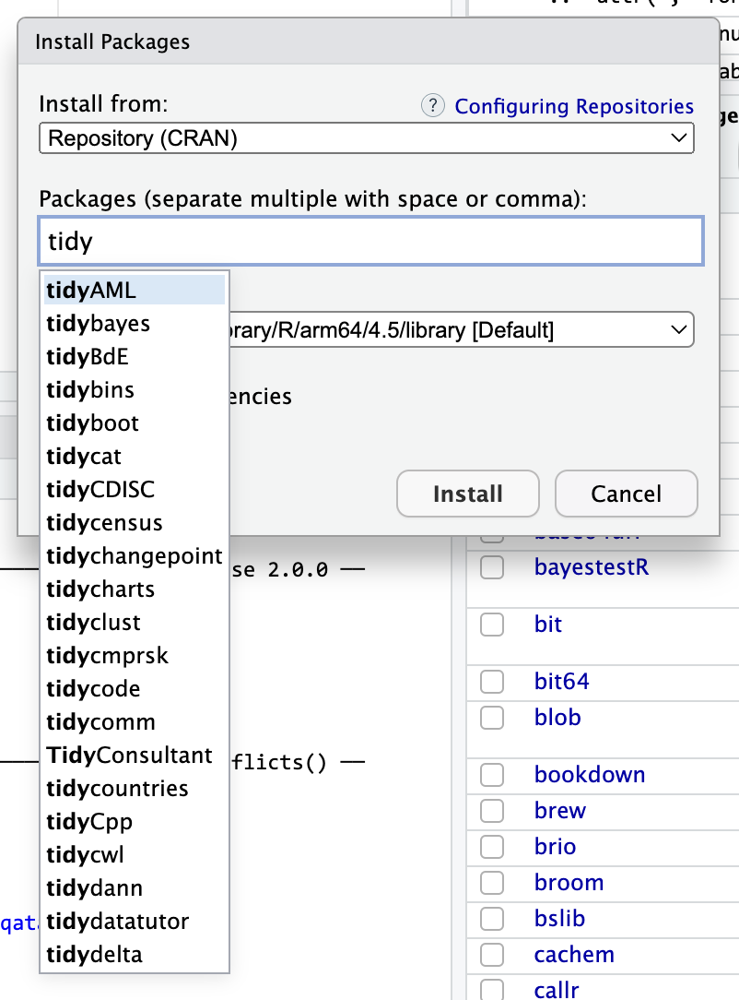
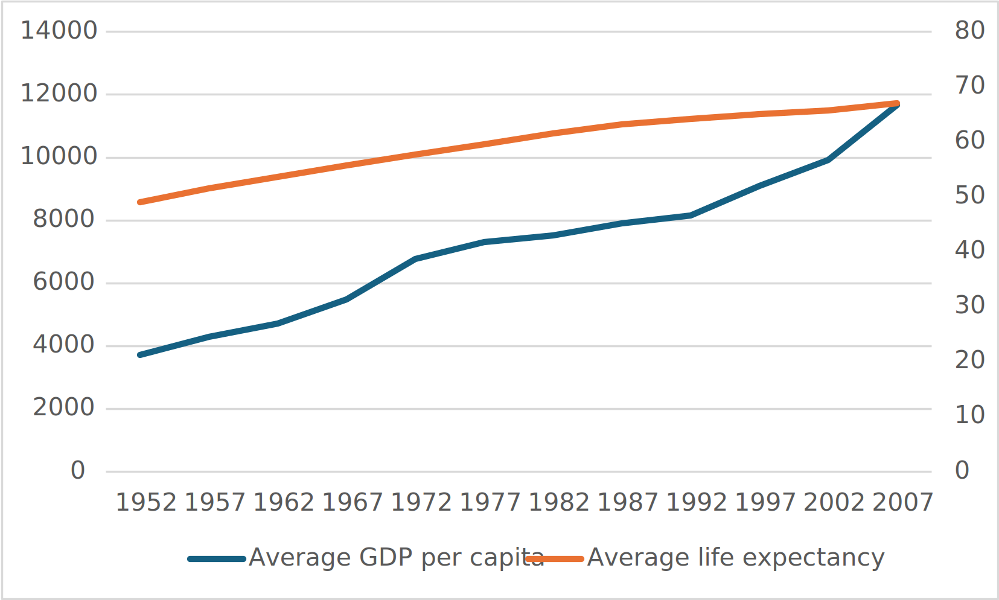

```{r setup, include=FALSE}
knitr::opts_chunk$set(
  fig.width = 6, 
  fig.height = 6 * 0.618, 
  fig.align = "center", 
  out.width = "80%",
  collapse = TRUE
)
```

### Is there some place I can find R packages? There are so many!

There are tens of thousands of R packages, and there's no good way of knowing what's out there. A lot of that is because packages are often created for some really specific niche statistical thing. While CRAN is the main repository of packages, it doesn't really act like an app store and make suggestions.

There are some ways to find helpful packages though:

- **Word of mouth**: You'll often hear about packages in classes and workshops or reading stuff online. You can ask around and see what packages people like to use. You can also check the [R Weekly newsletter](https://rweekly.org/), which includes a section of highlighting new or updated packages.

- **CRAN task views**: While CRAN doesn't formally act as an app store, it does invite experts to make curated lists of packages for specific tasks, which it calls [CRAN Task Views](https://cran.r-project.org/web/views/). For instance, if you're interested in doing causal inference, [there are a bunch of packages](https://cran.r-project.org/web/views/CausalInference.html) with helpful tools in them.

- **Google**: If you have a specific thing you want to do, you can search for "r package BLAH" on Google. For instance, if you want to access CDC data, you could hunt around their website for it, or you could search for "cdc data r package" and discover several CDC-related packages, like [{EPHTrackR}](https://github.com/CDCgov/EPHTrackR) and [{CDCPLACES}](https://cran.r-project.org/web/packages/CDCPLACES/index.html)

- **The install packages menu**: This is actually kind of an oblique approach, but it's surprisingly useful! Many packages fit within a larger ecosystem. For instance, you've been learning about the [tidyverse](https://www.tidyverse.org/), which is a collection of packages that all work together nicely. You've seen packages like {ggrepel} that extend {ggplot} to make nicer, non-overlapping labels. Package authors will try to name their packages to fit within the ecosystem they're supposed to be in.

  For example, notice how {ggrepel} starts with "gg". The norm in the packages-that-extend-ggplot world is to use the "gg" prefix. If you go to the Packages panel in RStudio, then click on "Install packages" and start typing "gg", you'll see a ton of ggplot-related packages. I have no idea what most of these do (you can see {ggbeeswarm} there!), but they do something with ggplot. One of those packages is called {ggbrain}—it lets you [plot brain images using ggplot](https://neuroconductor.org/help/ggBrain/articles/intro.html). {ggarchery} sounds neat—it lets you [make nicer arrows for annotating things](https://github.com/mdhall272/ggarchery).

  {width="60%"}

  You can do the same thing with other larger ecosystems. Start typing "tidy" and you'll see things like [{tidycensus}](https://walker-data.com/tidycensus/index.html) (which lets you grab data from the US Census API) and [{tidybayes}](https://mjskay.github.io/tidybayes/) (which lets you work with Bayesian models in a tidy way).

  {width="60%"}


### When is it better to use `augment()` vs. `marginaleffects::predictions()`?

The two approaches do the same thing, but it's *far easier* to use `marginaleffects::predictions()`. Just use {marginaleffects}.

For example, here's a regression model that predicts penguin body mass based on flipper length, bill length, bill depth, and sex. 

```{r}
#| warning: false
#| message: false

library(tidyverse)
library(palmerpenguins)

penguins <- palmerpenguins::penguins |> 
  drop_na(sex)

model <- lm(
  body_mass_g ~ flipper_length_mm + bill_length_mm + bill_depth_mm + sex, 
  data = penguins
)
```

Let's say we want to see predicted body mass across a range of flipper lengths while holding all other variables constant. Here are three ways:

::: {.panel-tabset}
#### `broom::augment()`

With `augment()`, we need to create a small data frame to plug into the model, and then we have to calculate our own confidence intervals:

```{r}
library(broom)

# Make mini dataset
newdata <- tibble(
  flipper_length_mm = seq(172, 231, by = 1),  # Smallest and biggest flipper lengths
  bill_length_mm = mean(penguins$bill_length_mm),
  bill_depth_mm = mean(penguins$bill_depth_mm),
  sex = "male"  # Use male because there are more males than females
)

# Plug mini dataset into model and calculate confidence intervals
predicted_values <- augment(
  model,
  newdata = newdata,
  se_fit = TRUE
) |> 
  mutate(
    conf.low = .fitted + (-1.96 * .se.fit),
    conf.high = .fitted + (1.96 * .se.fit)
  )

# Plot it
ggplot(predicted_values, aes(x = flipper_length_mm, y = .fitted)) +
  geom_ribbon(aes(ymin = conf.low, ymax = conf.high), alpha = 0.5) +
  geom_line()
```

#### `marginaleffects::predictions()`

With {marginaleffects}, we don't need to make our own little newdata data frame, and we don't need to calculate confidence intervals on our own. It will automatically hold all variables at their means or modes.

```{r}
library(marginaleffects)

predicted_values_easy <- predictions(
  model,
  newdata = datagrid(flipper_length_mm = seq(172, 231, by = 1))
)

# Plot it
ggplot(predicted_values_easy, aes(x = flipper_length_mm, y = estimate)) +
  geom_ribbon(aes(ymin = conf.low, ymax = conf.high), alpha = 0.5) +
  geom_line()
```

#### `marginaleffects::plot_predictions()`

If all you care about is the plot and not the data frame of predictions, you can actually use a shortcut (`plot_predictions()`) and make a plot automatically:

```{r}
library(marginaleffects)

plot_predictions(model, condition = "flipper_length_mm")
```

:::

All three approaches do exactly the same thing, but using `augment()` take a lot more work. **Just use {marginaleffects} for everything.**


### I've used `summary()` in the past to look at model objects, but you recommend using `tidy()`. Why?

If you've worked with R before, you've probably used `summary()` to look at the results of regression models, like this:

```{r}
summary(model)
```

That's great and fine—there's nothing wrong with that. `summary()` shows all the coefficients and model diagnostics. However, if you want to extract the coefficient values to plot (like in a coefficient plot), or if you want to compare the R² values for several models, good luck extracting that information programmatically. `summary()` produces a big wall of (helpful) text.

It's trickier when using other types of models too. Every model outputs slightly different `summary()` text. Like, here are the results for a logistic regression model that predicts whether a penguin is a Gentoo or not (i.e. a binary outcome):

```{r}
penguins_with_binary <- penguins |> 
  mutate(is_gentoo = species == "Gentoo")

model_logistic <- glm(
  is_gentoo ~ body_mass_g + flipper_length_mm,
  family = binomial(link = "logit"),
  data = penguins_with_binary
)

summary(model_logistic)
```

All the results are there, but they're embedded in the wall of text.

The advantage of {broom} is that it outputs data frames with standard column names for all types of regression models. Each of these models have the same columns for `term`, `estimate`, etc.

```{r}
tidy(model)
tidy(model_logistic)
```

You can get the model diagnostics (like R², AIC, BIC, etc.) out using `glance()`:

```{r}
glance(model)
glance(model_logistic)
```

And since these {broom} functions return data frames, you can do anything you want with them. With logistic regression, for example, it is common to exponentiate coefficients to create odds ratios. Good luck doing that with the output of `summary()`. With `tidy()`, we can do it with `mutate()`:

```{r}
tidy(model_logistic) |> 
  mutate(estmate = exp(estimate))
```


### I tried to render my document and got an error about duplicate chunk labels. Why?

You can ([and should!](/resource/quarto.qmd#chunk-names)) name your R code chunks—[see here for more about how and why](/resource/quarto.qmd#chunk-names). All chunk names must be unique, though. 

Often you'll copy and paste a chunk from earlier in your document to later, like to make a second plot based on the first. That's fine—just make sure that you change the chunk name.

If there are chunks with repeated names, R will yell at you:


To fix it, change the name of one of the duplicated names to something unique:


### I tried calculating something with `sum()` or `cor()` and R gave me NA instead of a number. Why?

This nearly always happens because of missing values. Let's make a quick little dataset to illustrate what's going on (and how to fix it):

```{r make-example-na-data, warning=FALSE, message=FALSE}
library(tidyverse)

example <- tibble(
  x = c(1, 2, 3, 4, 5),
  y = c(6, 7, NA, 9, 10),
  z = c(2, 6, 5, 7, 3)
)

example
```

The `y` column has a missing value (`NA`), which will mess up any math we do.

Without running any code, what's the average of the `x` column? We can find that with math (add all the numbers up and divide by how many numbers there are):

$$
\frac{1 + 2 + 3 + 4 + 5}{5} = 3
$$

Neat. We can confirm with R:

```{r avg-good}
# With dplyr
example |> 
  summarize(avg = mean(x))

# With base R
mean(example$x)
```

What's the average of the `y` column? Math time:

$$
\frac{6 + 7 + \text{?} + 9 + 10}{5} = \text{Who even knows}
$$

We have no way of knowing what the average is because of that missing value.

If we try it with R, it gives us NA instead of a number:

```{r avg-na}
example |> 
  summarize(avg = mean(y))
```

To fix this, we can tell R to remove all the missing values from the column before calculating the average so that it does this:

$$
\frac{6 + 7 + 9 + 10}{4} = 8
$$

Include the argument `na.rm = TRUE` to do that:

```{r avg-na-rm}
example |> 
  summarize(avg = mean(y, na.rm = TRUE))
```

This works for lots of R's calculating functions, like `sum()`, `min()`, `max()`, `sd()`, `median()`, `mean()`, and so on:

```{r summarize-lots}
example |> 
  summarize(
    total = sum(y, na.rm = TRUE),
    avg = mean(y, na.rm = TRUE),
    median = median(y, na.rm = TRUE),
    min = min(y, na.rm = TRUE),
    max = max(y, na.rm = TRUE),
    std_dev = sd(y, na.rm = TRUE)
  )
```

This works a little differently with `cor()` because you're working with multiple columns instead of just one. If there are any missing values in any of the columns you're correlating, you'll get NA for the columns that use it. Here, we have a correlation between `x` and `z` because there are no missing values in either of those, but we get NA for the correlation between `x` and `y` and between `z` and `y`:

```{r cor-missing}
example |> 
  cor()
```

Adding `na.rm` to `cor()` doesn't work because `cor()` doesn't actually have an argument for `na.rm`:

```{r cor-na-rm, error=TRUE}
example |>
  cor(na.rm = TRUE)
```

Instead, if you look at the documentation for `cor()` (run `?cor` in your R console or search for it in the Help panel in RStudio), you'll see an argument named `use` instead. By default it will use all the rows in the data (`use = "everything"`), but we can change it to `use = "complete.obs"`. This will remove all rows where something is missing before calculating the correlation:

```{r cor-complete, error=TRUE}
example |>
  cor(use = "complete.obs")
```

### Should I always just use `na.rm = TRUE` then?

**NO!** I personally think this is bad practice. I like to not include it because it makes me pay attention to what's actually in the data. If I calculate an average for a column and it gives me `NA`, then I know to go look at the data to see why it's missing. Maybe there's an error with the data, or maybe I combined two datasets and some rows accidentally got dropped as a result, or maybe the data just is that way. 

Having missing values isn't bad and there are often legitimate reasons for them! In the {qatarcars} data in Exercise 9, the column on fuel efficiency has a bunch of missing values, but that's because electric cars don't use fuel. 

I use the same philosophy when using `warning: false` and `message: false` with Quarto chunks. It *is* possible to turn off all warnings and messages for all chunks in a document, but I don't like doing that because it can hide legitimate issues. I'll disable warnings or messages for a chunk that creates them only if I know that they're innocuous (like all the messages you get when running `library(tidyverse)`).

So in short, I recommend just using things like `mean(blah)` and only adding `mean(blah, na.rm = TRUE)` if you run into legitimate missing values.

::: {.callout-note}
#### LLM "tell"

This is actually one way I can typically guess that code comes from an LLM like ChatGPT. R code from LLMs will almost always include `na.rm = TRUE` even if it's not necessary.
:::


### What about missing data with regression? What does R do then?

If you're running a regression model, R will automatically remove any rows from the data that have missing values before running the regression (this is called ["listwise deletion"](https://en.wikipedia.org/wiki/Listwise_deletion)). You can control that using the `na.action` argument in the `lm()` function. You can try to fill in (or impute) missing data with fancier tools like [the {mice} package](https://amices.org/mice/).


### I want my bars to be sorted in my plot. How can I control their order?

Sorting categories by different values is important for showing trends in your data. By default, R will plot categorical variables in alphabetical order, but often you'll want these categories to use some sort of numeric order, likely based on a different column. 

There are a few different ways to sort categories, and you've seen how back in Exercise 4, but here's a more detailed explanation. 

First, let's make a summarized dataset of the total population in each continent in 2007 (using our trusty ol' gapminder data):

```{r make-gapminder-data}
library(gapminder)

# Find the total population in each continent in 2007
population_by_continent <- gapminder |> 
  filter(year == 2007) |> 
  group_by(continent) |> 
  summarize(total_population = sum(pop))
population_by_continent
```

By default the continents will be in alphabetic order:

```{r plot-gapminder-alphabetic}
ggplot(
  population_by_continent,
  aes(x = continent, y = total_population, fill = continent)
) +
  geom_col() +
  guides(fill = "none")  # The legend is redundant because of the x-axis
```

In this case it's more useful to plot these in order of total population. My favorite approach for this is to (1) sort the data how I want it with `arrange()` and (2) lock the order of the category in place with `fct_inorder()`. Note how the mini dataset is now sorted and Oceania comes first:

```{r make-gapminder-sorted}
plot_data_sorted <- population_by_continent |> 
  # Sort by population
  arrange(total_population) |> 
  # Make continent use the order it's currently in
  mutate(continent = fct_inorder(continent))
plot_data_sorted
```

If we plot it, the continents will be in order:

```{r plot-gapminder-sorted}
ggplot(
  plot_data_sorted,
  aes(x = continent, y = total_population, fill = continent)
) +
  geom_col() +
  guides(fill = "none")
```

This plots the continents in reverse order, with Oceania on the left. We can reverse this by either arranging the data in descending population order, or by using `fct_rev()` to reverse the continent order:

::: {.panel-tabset}
#### Sort in descending order

```{r plot-gapminder-desc}
plot_data_sorted <- population_by_continent |> 
  # Sort by population in descending order
  arrange(desc(total_population)) |> 
  # Lock in the continent order
  mutate(continent = fct_inorder(continent))

ggplot(
  plot_data_sorted,
  aes(x = continent, y = total_population, fill = continent)
) +
  geom_col() +
  guides(fill = "none")
```

#### Use `fct_rev()`

```{r plot-gapminder-fct-rev}
plot_data_sorted <- population_by_continent |> 
  # Sort by population in ascending order
  arrange(total_population) |> 
  # Lock in the continent order
  mutate(continent = fct_inorder(continent))

ggplot(
  plot_data_sorted,
  # Reverse the continent order with fct_rev()
  aes(x = fct_rev(continent), y = total_population, fill = fct_rev(continent))
) +
  geom_col() +
  guides(fill = "none")
```

:::

An alternative to the two-step `arrange() |> mutate(blah = fct_inorder(blah))` is to use `fct_reorder()`, which takes two arguments: (1) the column you want to be reordered and (2) the column you want to sort it by:

```{r plot-gapminder-fct-reorder}
plot_data_sorted <- population_by_continent |> 
  # Sort continent by total_population in descending order
  mutate(continent = fct_reorder(continent, total_population, .desc = TRUE))

ggplot(
  plot_data_sorted,
  aes(x = continent, y = total_population, fill = continent)
) +
  geom_col() +
  guides(fill = "none")
```

That's only one line instead of two, which is nice, but I tend to be fan of the two step approach because it's more explicit and gives me more control over sorting. For instance, here I want all the gapminder countries to be sorted by year (descending), continent, and life expectancy so we can see descending life expectancy within each continent over time. 

I'm sure there's a way to sort by multiple columns in different orders like this with `fct_reorder()`, but I never remember how. Plus, if I run this `super_sorted_data` code up until the end of `arrange()`, I can look at it in RStudio to make sure all the ordering I want is right. That's harder to do with `fct_reorder()`.

```{r gapminder-wild, fig.width=8, fig.height=7}
super_sorted_data <- gapminder |> 
  filter(year >= 1997) |> 
  # Get the countries in order of year (descending), continent, and life expectancy
  arrange(desc(year), continent, lifeExp) |>
  # Lock the country name order in place + lock the year in place
  mutate(
    country = fct_inorder(country),
    # year is currently a number, so we need to change it to a factor before
    # reordering it
    year = fct_inorder(factor(year))
  )

ggplot(super_sorted_data, aes(y = country, x = lifeExp, fill = continent)) +
  geom_col() +
  facet_wrap(vars(year)) +
  # Reverse the order legend so that Oceania is at the top, since it's at the
  # top in the plot
  guides(fill = guide_legend(reverse = TRUE)) +
  theme_minimal() +
  # Remove country names and y-axis gridlines + put legend on the bottom
  theme(
    axis.text.y = element_blank(),
    axis.ticks.y = element_blank(),
    panel.grid.major.y = element_blank(),
    panel.grid.minor.y = element_blank(),
    legend.position = "bottom"
  )
```

You can also specify any arbitrary category order with `fct_relevel()`

```{r plot-gapminder-arbitrary}
plot_data_sorted <- population_by_continent |> 
  # Use this specific continent order
  mutate(continent = fct_relevel(
    continent, 
    c("Asia", "Oceania", "Europe", "Americas", "Africa"))
  )

ggplot(
  plot_data_sorted,
  aes(x = continent, y = total_population, fill = continent)
) +
  geom_col() +
  guides(fill = "none")
```

### Are there other legitimate cases for using dual y-axes?

Not really.

In the lecture, I explain that the only "legal" kind of second axis is when the values in the second axis are mathematical transformations of the first axis, like unit conversions (°F vs. °C, miles vs. kilometers, pounds vs. kilograms) or percentages (counts vs. proportions).

That's "legal" because the value in the second axis is the same value in the first axis—it's just mathematically transformed.

Like here's a dual axis chart showing miles per gallon (a standard measure in the United States) on one side and liters per 100 km (a standard measure in the rest of the world) on the other side. This is legal and fine and good because the measure is fuel efficiency—it's just displayed two different ways:

- 1 L/100km ≈ 235.2146 / MPG
- 1 MPG ≈ 235.2146 / L/100km

```{r}
mpg |>
  ggplot(aes(x = drv, y = hwy, color = drv)) +
  geom_point(position = position_jitter(width = 0.25, seed = 123)) +
  scale_y_continuous(
    sec.axis = sec_axis(
      transform = \(x) (235.2146 / x),
      breaks = seq(0, 20, by = 3),
      name = "L/100km"
    ),
    name = "MPG"
  ) +
  guides(color = "none")
```

Here's another legal dual y-axis chart that shows GDP per capita by continent over time. It's fine because it's converting US dollars to Euros, which only involves math (right now, \$1 = €0.86). They're not two separate columns:

```{r}
#| warning: false
#| message: false

library(gapminder)
library(scales)

gapminder |> 
  group_by(year) |> 
  summarize(avg_gdpPercap = mean(gdpPercap)) |> 
  ggplot(aes(x = year, y = avg_gdpPercap)) + 
  geom_line(color = "#0074D9", linewidth = 1) +
  scale_y_continuous(
    sec.axis = sec_axis(
      transform = \(x) (x * 0.86),
      name = "GDP per capita (€)",
      labels = label_currency(prefix = "€")
    ),
    name = "GDP per capita ($)",
    labels = label_currency(prefix = "$")
  ) + 
  labs(title = "Average GDP per capita", x = NULL)
```

Once you throw a second different variable into the other axis, you're forcing relationships where they don't exist.

To illustrate this I had to make this chart in Excel because ggplot (purposely!) makes it nearly impossible to do this. This is a bad plot:



```{r}
#| eval: false
#| include: false

# In Excel, select the GDP and life expectancy columns and insert a line chart, 
# then ight-click the life expectancy series and go to Format Data Series → 
# Secondary Axis
gapminder |> 
  group_by(year) |> 
  summarize(avg_gdpPercap = mean(gdpPercap), avg_lifeExp = mean(lifeExp)) |> 
  write_csv("~/Desktop/gapminder.csv")
```

If you want to show how both GDP per capita and life expectancy change over time, use two plots:

```{r}
library(patchwork)

gapminder_plot_data <- gapminder |> 
  group_by(year) |> 
  summarize(avg_gdpPercap = mean(gdpPercap), avg_lifeExp = mean(lifeExp))

p1 <- ggplot(gapminder_plot_data, aes(x = year, y = avg_gdpPercap)) + 
  geom_line(color = "#0074D9", linewidth = 1) +
  scale_y_continuous(labels = label_currency(prefix = "$")) +
  labs(x = NULL, y = "GDP per capita ($)", title = "Wealth")

p2 <- ggplot(gapminder_plot_data, aes(x = year, y = avg_lifeExp)) + 
  geom_line(color = "#FF851B", linewidth = 1) +
  labs(x = NULL, y = "Life expectancy", title = "Health")

p1 / p2
```
