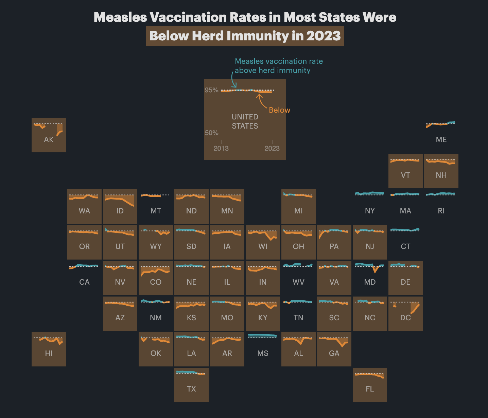

```{r setup, include=FALSE}
knitr::opts_chunk$set(
  fig.width = 6, 
  fig.height = 6 * 0.618, 
  fig.align = "center", 
  out.width = "80%",
  collapse = TRUE
)
```


### Using `paste0()` to build complex text is annoying! Is there a better way?

In the example, I use `paste0()` to build text. The `paste()` function takes text and variables and concatenates them together into one string or character variable.

For instance, if I want to take the penguins data and make a column that says something like `Species (sex; weight: X g; flipper length: Y mm)`, I'd do this:

```{r}
#| warning: false
#| message: false

library(tidyverse)

penguins |> 
  mutate(nice_label = paste0(
    species, " (", sex, "; weight: ", body_mass, 
    " g; flipper length: ", flipper_len, " mm)"
  )) |> 
  select(nice_label) |> 
  head(4)
```

That works, but that mix of variable names and quoted things inside `paste0()` is horrendously gross and hard to read and annoying to type!

Fortunately there's a better way! [The {glue} package](https://glue.tidyverse.org/){target="_blank"} (which is installed as part of the tidyverse, but not loaded with `library(tidyverse)`) lets you substitute variable values directly in text without needing to separate everything with commas. Anything inside curly braces `{}` will get replaced with the value in the data:

```{r}
library(glue)

penguins |> 
  mutate(nice_label = glue(
    "{species} ({sex}; weight: {body_mass} g; flipper length: {flipper_len} mm)"
  )) |> 
  select(nice_label) |> 
  head(4)
```

Much nicer!


### Why did we use free y-axis scales? Wouldn't it be better to keep them the same across panels?

Sure! Either way is fine—it just depends on the story you're trying to tell. If you want to see the shape of the trend within each state, having free scales is helpful. If you want to compare trends across states, using fixed scales is better.


### I tried to resize my small multiples plot and it didn't work—why?

I saw two common issues for why small multiples plots didn't resize correctly:

1. You used `fig.width` or `fig_width` or `figwidth` instead of `fig-width`. You have to use `fix-width` and `fig-height` (with a `-` dash)
2. You included other content earlier in the chunk. [Remember from this](/news/2026-02-17_faqs_week-05.qmd#i-specified-chunk-options-like-fig-width-but-they-didnt-work-and-they-appeared-in-the-documentwhy) that chunk options *must* be the first things inside a chunk.


### Why did my slopegraph labels repeat on both sides?

When making your slopegraph, lots of you used two `geom_text()` (or `geom_text_repel()`) layers with different `hjust` arguments to make the labels left- and right-aligned, but you ended up with this:

```{r}
#| warning: false
#| message: false

library(gapminder)
library(ggrepel)

example_slope_graph <- gapminder |>
  filter(year %in% c(1977, 2007), continent != "Oceania") |>
  group_by(year, continent) |>
  summarize(avg_lifeExp = mean(lifeExp))

ggplot(
  example_slope_graph,
  aes(x = factor(year), y = avg_lifeExp, color = continent, group = continent)
) +
  geom_line() +
  geom_text(aes(label = continent), hjust = 0) +
  geom_text(aes(label = continent), hjust = 1) +
  guides(color = "none") +
  labs(x = NULL, y = "Average life expectancy") +
  theme_minimal()
```

That's because you're plotting the values twice. You *should* plot them twice, but you need to control which ones you're plotting. You want the labels for the left side of the plot (1977 here) to be right-aligned and the labels for the right side of the plot (2007 here) to be left-aligned.

To do that, you can filter the data that you're plotting with each of the `geom_text()` layers:

```{r}
#| warning: false
#| message: false

ggplot(
  example_slope_graph,
  aes(x = factor(year), y = avg_lifeExp, color = continent, group = continent)
) +
  geom_line() +
  geom_text(
    data = filter(example_slope_graph, year == 2007),
    aes(label = continent),
    hjust = 0
  ) +
  geom_text(
    data = filter(example_slope_graph, year == 1977),
    aes(label = continent),
    hjust = 1
  ) +
  guides(color = "none") +
  labs(x = NULL, y = "Average life expectancy") +
  theme_minimal()
```

Alternatively, you can avoid filtering and instead make two different columns—one with labels for the first/left side and one with labels for the last/right side. This is what I do [in the example](/example/08-example.qmd#slopegraphs). This is especially useful if you're customizing the labels so that the first is formatted differently from the last.

For instance, we can use the continent name and life expectancy for the first label and just the life expectancy for the last label, since there's no need to repeat the continent name. We'll use `glue()` from the {glue} package to make two label columns. The first version is only present in 1977; the second version is only present in 2007:

```{r}
#| warning: false
#| message: false

library(glue)

example_slope_graph_nice_labels <- gapminder |>
  filter(year %in% c(1977, 2007), continent != "Oceania") |>
  group_by(year, continent) |>
  summarize(avg_lifeExp = mean(lifeExp)) |>
  mutate(
    label_first = ifelse(
      year == 1977,
      glue("{continent}:\n{round(avg_lifeExp, 2)} years"),
      NA
    ),
    label_last = ifelse(
      year == 2007,
      glue("{round(avg_lifeExp, 2)} years"),
      NA
    )
  )
example_slope_graph_nice_labels
```

Now we can use those two label columns and we don't need to filter anymore:

```{r}
#| warning: false
#| message: false

ggplot(
  example_slope_graph_nice_labels,
  aes(x = factor(year), y = avg_lifeExp, color = continent, group = continent)
) +
  geom_line() +
  geom_text(aes(label = label_first), hjust = 1) +
  geom_text(aes(label = label_last), hjust = 0) +
  guides(color = "none") +
  labs(x = NULL, y = "Average life expectancy") +
  theme_minimal()
```

### The guide lines in the slopegraph look like real lines of data! Is there a way to fix that?

If you're using {ggrepel} the repelled labels will have little guide lines to indicate the points they're supposed to represent:

```{r}
#| warning: false
#| message: false

ggplot(
  example_slope_graph,
  aes(x = factor(year), y = avg_lifeExp, color = continent, group = continent)
) +
  geom_line() +
  geom_text_repel(
    data = filter(example_slope_graph, year == 2007),
    aes(label = continent),
    hjust = 0,
    direction = "y",
    nudge_x = 0.5,
    seed = 1234
  ) +
  geom_text_repel(
    data = filter(example_slope_graph, year == 1977),
    aes(label = continent),
    hjust = 1,
    direction = "y",
    nudge_x = -0.5,
    seed = 1234,
  ) +
  guides(color = "none") +
  labs(x = NULL, y = "Average life expectancy") +
  theme_minimal()
```

Those guide lines are helpful, but they look too much like actual data lines! It looks like life expectancy goes flat for the years before 1977 and after 2007.

This is breaking the C in CRAP—there's not a lot of contrast between the data lines and the guide lines.

To fix it, make them different and add contrast. For instance, we can make the data lines thicker with `linewidth` and make the guide lines dotted with `segment.linetype`:

```{r}
#| warning: false
#| message: false

ggplot(
  example_slope_graph,
  aes(x = factor(year), y = avg_lifeExp, color = continent, group = continent)
) +
  geom_line(linewidth = 1.5) +
  geom_text_repel(
    data = filter(example_slope_graph, year == 2007),
    aes(label = continent),
    hjust = 0,
    direction = "y",
    nudge_x = 0.5,
    seed = 1234,
    segment.linetype = "dotted"
  ) +
  geom_text_repel(
    data = filter(example_slope_graph, year == 1977),
    aes(label = continent),
    hjust = 1,
    direction = "y",
    nudge_x = -0.5,
    seed = 1234,
    segment.linetype = "dotted"
  ) +
  guides(color = "none") +
  labs(x = NULL, y = "Average life expectancy") +
  theme_minimal()
```

### Are geofacet plots used in real life?

Yes! You'll see them pop up all over the place. Check out [this article by ProPublica](https://www.propublica.org/article/whooping-cough-measles-outbreak-vaccine-hesitancy-trump), for example, which includes maps like this:




### How can I get month and weekday names or abbreviations for dates?

Many of you have asked how to take month numbers and change them into month names or month abbreviations. 

I've seen some of you use something like a big if else statement: if the month number is 1, use "January"; if the month number is 2, use "February"; and so on

```r
... |>
  mutate(month_name = case_when(
    month_number == 1 ~ "January",
    month_number == 2 ~ "February",
    month_number == 3 ~ "March",
    ...
  ))
```

While that works, it's kind of a brute force approach. There's a better, far easier way!

The {lubridate} package (one of the nine packages that gets loaded when you run `library(tidyverse)`) has some neat functions for extracting and formatting parts of dates. You saw these in Exercise 4:

```r
# Add columns for the year and month
mutate(
  intake_year = year(intake_date),
  intake_month = month(intake_date, label = TRUE, abbr = FALSE)
)
```

These take dates and do stuff with them. For instance, let's put today's date in a variable named `x`:

```{r}
x <- ymd("2025-10-21")
x
```

We can extract the year using `year()`:

```{r}
year(x)
```

…or the week number using `weeknum()`:

```{r}
week(x)
```

…or the month number using `month()`:

```{r}
month(x)
```

If you look at the help page for `month()`, you'll see that it has arguments for `label` and `abbr`, which will toggle text instead numbers, and full month names instead of abbreviations:

```{r}
month(x, label = TRUE, abbr = TRUE)
month(x, label = TRUE, abbr = FALSE)
```

It outputs ordred factors too, so the months are automatically in the right order for plotting!

`wday()` does the same thing for days of the week:

```{r}
wday(x)
wday(x, label = TRUE, abbr = TRUE)
wday(x, label = TRUE, abbr = FALSE)
```

So instead of doing weird data contortions to get month names or weekday names, just use `month()` and `wday()`. You can use them directly in `mutate()`. For example, here they are in action in a little sample dataset:

```{r}
example_data <- tribble(
  ~event, ~date,
  "Moon landing", "1969-07-20",
  "WHO COVID start date", "2020-03-13"
) |>
  mutate(
    # Convert to an actual date
    date_actual = ymd(date),
    # Extract a bunch of things
    year = year(date_actual),
    month_num = month(date_actual),
    month_abb = month(date_actual, label = TRUE, abbr = TRUE),
    month_full = month(date_actual, label = TRUE, abbr = FALSE),
    week_num = week(date_actual),
    wday_num = wday(date_actual),
    wday_abb = wday(date_actual, label = TRUE, abbr = TRUE),
    wday_full = wday(date_actual, label = TRUE, abbr = FALSE)
  )
example_data
```

### Can I get these automatic month and day names in non-English languages?

Lots of you speak languages other than English. While R function *names* like `plot()` and `geom_point()` and so on are locked into English, the messages and warnings that R spits out can be localized into most other languages. R detects what language your computer is set to use and then tries to match it.

Functions like `month()` and `wday()` also respect your computer's language setting and will give you months and days in whatever your computer is set to. That's neat, but what if your computer is set to French and you want the days to be in English? Or what if your computer is set to English but you're making a plot in German?

You can actually change R's localization settings to get output in different languages!

If you want to see what your computer is currently set to use, run `Sys.getLocale()`:

```{r}
Sys.getlocale()
```

There's a bunch of output there—the first part (`en_US.UTF-8`) is the most important and tells you the language code. The code here follows a pattern and has three parts:

- A language: `en`. This is the langauge, and typically uses a two-character abbreviation following the [ISO 639 standard](https://en.wikipedia.org/wiki/ISO_639-1)
- A territory: `US`. This is the country or region for that language, used mainly to specify the currency. If it's set to `en_US`, it'll use US conventions (like "$" and "color"); if it's set to `en_GB` it'll use British conventions (like "£" and "colour"). It uses a two-character abbreviation following the [ISO 3166 standard](https://en.wikipedia.org/wiki/ISO_3166).
- An encoding: `UTF-8`. This is how the text is actually represented and stored on the computer. This defaults to Unicode (UTF-8) here. You don't generally need to worry about this.

For macOS and Linux (i.e. Posit Cloud), setting locale details is pretty straightforward and predictable because they both follow this pattern consistently:

- `en_GB`: British English
- `fr_FR`: French in France
- `fr_CH`: French in Switzerland
- `de_CH`: German in Switzerland
- `de_DE`: German in Germany

If you run `locale -a` in your *terminal* (not in your R console) on macOS or in Posit Cloud, you'll get a list of all the different locales your computer can use. Here's what I have on my computer:

```{r}
#| echo: false
#| collapse: false
#| class-output: text

system("locale -a", intern = TRUE) |>
  str_split_fixed("\\.", 2) |>
  magrittr::extract(, 1) |>
  unique() |>
  sort()
```

For whatever reason, Windows doesn't use this naming convention. It uses dashes or full words instead, like `en-US` or `american` or `en-CA` or `canadian`. You can [see a list here](https://learn.microsoft.com/en-us/cpp/c-runtime-library/language-strings?view=msvc-170), or google `Windows language country strings` (that's actually [RStudio's official recommendation for finding Windows language codes](https://rstudio.github.io/r-manuals/r-admin/Internationalization.html))

Once you know the language code, you can use it in R. Let's make a little variable named `x` with today's date:

```{r}
x <- ymd("2024-07-12")
```

Because I'm using English as my default locale, the output of `wday()` and `month()` will be in English:

```{r}
wday(x, label = TRUE, abbr = FALSE)
month(x, label = TRUE, abbr = FALSE)
```

Those functions have a `locale` argument, though, so it's really easy to switch between languages:

::: {.panel-tabset}
### Weekdays

```{r}
wday(x, label = TRUE, abbr = FALSE, locale = "en_US")
wday(x, label = TRUE, abbr = FALSE, locale = "fr_FR")
wday(x, label = TRUE, abbr = FALSE, locale = "fr_BE")
wday(x, label = TRUE, abbr = FALSE, locale = "it_IT")
wday(x, label = TRUE, abbr = FALSE, locale = "zh_CN")
```

### Months

```{r}
month(x, label = TRUE, abbr = FALSE, locale = "en_US")
month(x, label = TRUE, abbr = FALSE, locale = "fr_FR")
month(x, label = TRUE, abbr = FALSE, locale = "fr_BE")
month(x, label = TRUE, abbr = FALSE, locale = "it_IT")
month(x, label = TRUE, abbr = FALSE, locale = "zh_CN")
```

:::

You can also set the locale for your entire R session like this:

```{r}
Sys.setlocale(locale = "de_DE")
```

Now `month()` and `wday()` will use German by default without needing to set the `locale` argument:

```{r}
month(x, label = TRUE, abbr = FALSE)
wday(x, label = TRUE, abbr = FALSE)
```

I'll switch everything back to English :)

```{r}
Sys.setlocale(locale = "en_US.UTF-8")
```

### Seeds—why?

There were a couple common questions about seeds:

#### 1. Why do we even need seeds?

Seeds make random things reproducible. They let you make random things *again*.

::: {.callout-note}
#### Minecraft

If you've ever played Minecraft, seeds are pretty important there too. Minecraft worlds (all the mountains, oceans, biomes, mines, etc.) are completely randomly generated. When you create a new world, it gives an option to specify a seed. If you don't, the world will just be random. If you do, the world will still be random, but it'll be the same random. There are actually [Reddit forums where people play around with different seeds](https://www.reddit.com/r/minecraftseeds/) to find interesting random worlds—like weirdly shaped landmasses, interesting starting places, and so on. Some gamers will stream their games on YouTube or Twitch and will share their world's seed so that others can play in the same auto-generated world. That doesn't mean that others play *with* them—it means that others will have mountains and trees and oceans and mines and resources in exactly the same spot as them, since it's the same randomly auto-generated world.
:::

When R (or any computer program, really) generates random numbers, it uses an algorithm to simulate randomness. This algorithm always starts with an initial number, or seed. Typically it will use something like the current number of milliseconds since some date, so that every time you generate random numbers they'll be different. Look at this, for instance:

```{r include=FALSE}
set.seed(1)
```

```{r}
# Choose 3 numbers between 1 and 10
sample(1:10, 3)
```

```{r include=FALSE}
set.seed(2)
```

```{r}
# Choose 3 numbers between 1 and 10
sample(1:10, 3)
```

They're different both times.

That's ordinarily totally fine, but if you care about reproducibility (like having a synthetic dataset with the same random values, or having jittered points in a plot be in the same position every time you render), it's a good idea to set your own seed. This ensures that the random numbers you generate are the same every time you generate them.

If you set a seed, you control how the random algorithm starts. You'll still generate random numbers, but they'll be the same randomness every time, on anyone's computer. Run this on your computer:

```{r}
set.seed(1234)
sample(1:10, 3)
```

You'll get 10, 6, and 5, just like I did here. They're random, but they're reproducibly random.

In data visualization, this is especially important for anything with randomness, like jittering points or repelling labels.

For instance, if we make this jittered strip plot of penguin data:

```{r}
penguins <- palmerpenguins::penguins |> drop_na(sex)

ggplot(penguins, aes(x = species, y = body_mass_g)) +
  # height = 0 makes it so points don't jitter up and down
  geom_point(position = position_jitter(width = 0.25, height = 0))
```

That looks cool. But if we rerender it:

```{r}
ggplot(penguins, aes(x = species, y = body_mass_g)) +
  geom_point(position = position_jitter(width = 0.25, height = 0))
```

…it's slightly different. And if we do it again:

```{r}
ggplot(penguins, aes(x = species, y = body_mass_g)) +
  geom_point(position = position_jitter(width = 0.25, height = 0))
```

…it's different again! It's going to be different every time, which is annoying. 

Slight variations in jittered points is a minor annoyance—a major annoyance is when you tinker with settings in `geom_label_repel()` to make sure everything is nice and not overlapping, and then when you render the plot again, everything is in a completely different spot. This happens because the repelling is random, just like jittering. You want the randomness, but you want the randomness to be the same every time.

To ensure that the randomness is the same each time, you can set a seed. `position_jitter()` and `geom_label_repel()` both have `seed` arguments that you can use. Here's a randomly jittered plot:

```{r}
ggplot(penguins, aes(x = species, y = body_mass_g)) +
  geom_point(position = position_jitter(width = 0.25, height = 0, seed = 1234))
```

And here's that same plot jittered again, but with the same randomness—it's identical!

```{r}
ggplot(penguins, aes(x = species, y = body_mass_g)) +
  geom_point(position = position_jitter(width = 0.25, height = 0, seed = 1234))
```

You can also use `set.seed()` separately outside of the function, which sets the seed for all random things in the document (though note that this doesn't create the same plot that `position_jitter(seed = 1234)` does! There are technical reasons for this, but you don't need to worry about that.)

```{r}
set.seed(1234)

ggplot(penguins, aes(x = species, y = body_mass_g)) +
  geom_point(position = position_jitter(width = 0.25, height = 0))
```

#### 2. How should we choose seeds?

What should you use a seed? Whatever you want, really. [In the slides](/slides/09-slides.html#70), I had these as examples:

- Quick ones:
  - `1234`(`567`)
  - `1`
- Goofy/nerdy ones:
  - `13` (common (un)lucky number)
  - `42` (the [answer to life, the universe, and everything](https://en.wikipedia.org/wiki/Phrases_from_The_Hitchhiker%27s_Guide_to_the_Galaxy#_The_Answer_to_the_Ultimate_Question_of_Life,_the_Universe,_and_Everything_is_42))
  - `8675309` ([Jenny's number](https://www.youtube.com/watch?v=6WTdTwcmxyo))
  - `24601` ([Jean Valjean](https://en.wikipedia.org/wiki/Jean_Valjean)'s inmate number in Les Misérables)
- Practical ones:
  - The date of the analysis, like `20250715` for something written on July 15, 2025
  - A truly random integer based on atmospheric noise from [RANDOM.ORG](https://www.random.org/)

In practice, especially for plots and making sure jittered and repelled things look good and consistent, **it doesn't really matter** what you use.

Here's what I typically do:

- For plotting things, I'll generally just use 1234. If I'm not happy with the shuffling (like two labels are too close, or one point is jittered too far up or something), I'll change it to 12345 or 123456 or 123 until it looks okay.
- For analysis, I'll generate some 6- or 7-digit integer at [RANDOM.ORG](https://www.random.org/) and use that as the seed (I do this all the time! [Check out this search of my GitHub repositories](https://github.com/search?q=user:andrewheiss%20from%20random.org&type=code)). This is especially important in things like Bayesian regression, which uses random simulations to calculate derivatives and do all sorts of mathy things. Seeds are crucial there for getting the same results every time.
