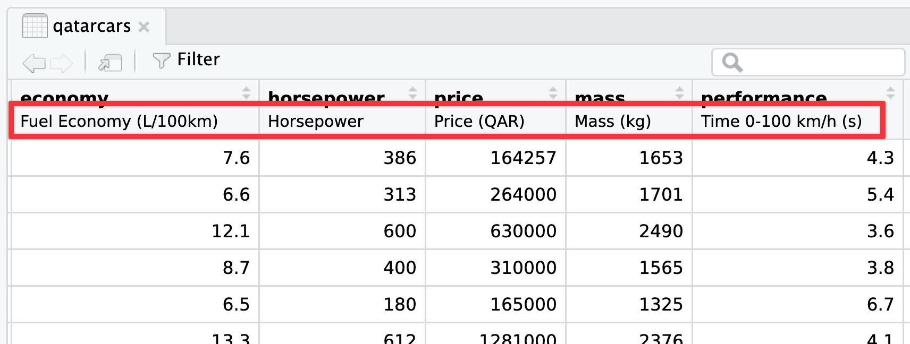
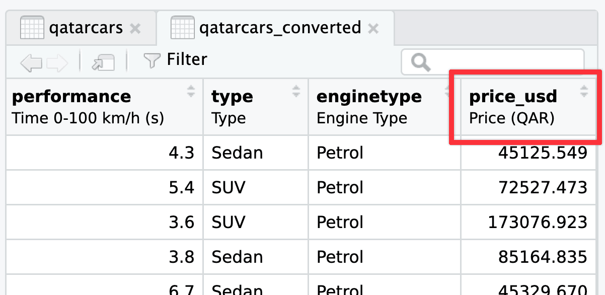
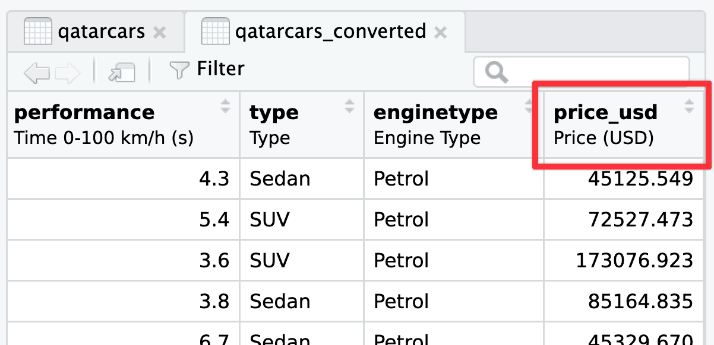

```{r setup, include=FALSE}
knitr::opts_chunk$set(
  fig.width = 6, 
  fig.height = 6 * 0.618, 
  fig.align = "center", 
  out.width = "80%",
  collapse = TRUE
)
```

### There are so many ggplot-specific R packages—how can we remember them or find them all?

A couple weeks ago there was [a related FAQ about all R packages](/news/2026-03-03_faqs_week-07.qmd#is-there-some-place-i-can-find-r-packages-there-are-so-many), and I gave you some helpful strategies for finding R packages in general.

There are also a ton of packages related to {ggplot2} itself. How do you find those? How do I know about things like {ggridges} and {ggdist} and whatnot?

Check out [this really helpful searchable list of all {ggplot2} extensions](https://exts.ggplot2.tidyverse.org/gallery/)! I use that list + word of mouth on social media to discover new packages.


### I converted QAR to USD but the label in my plot still said QAR—what happened?

First, let's look at the problem. The prices of the cars in the `qatarcars` dataset are provided in Qatari riyals (QAR), and we can convert QAR to USD by dividing by 3.64:

```{r}
#| warning: false
#| message: false

library(tidyverse)
library(qatarcars)

qatarcars_converted <- qatarcars |> 
  mutate(price_usd = price / 3.64)
```

That's easy enough. Now let's make a histogram of the prices:

```{r}
ggplot(qatarcars_converted, aes(x = price_usd)) + 
  geom_histogram(color = "white", binwidth = 0.1) + 
  scale_x_log10(labels = scales::label_currency())
```

Those are definitely dollars, not riyals, but the x-axis label still says "Price (QAR)". What's going on?!

This is actually a neat new quirk/feature of ggplot. 

If you've ever used other statistical software like Stata or SAS or SPSS, you've probably worked with column labels and other metadata where you can add extra details about more cryptic column names. For a long time, R has kind of unofficially supported similar column metadata like labels, but it's always been kind of hidden.

The `qatarcars` data has column metadata built in already.^[Mostly because the official canonical data is a Stata dataset; we build the R package based on the Stata data.] You can also use packages like [{haven}](https://haven.tidyverse.org/), [{labelled}](https://larmarange.github.io/labelled/articles/labelled.html), and [{sjlabelled}](https://strengejacke.github.io/sjlabelled/) to add labels to columns (see [this](https://www.pipinghotdata.com/posts/2020-12-23-leveraging-labelled-data-in-r/) and [this](https://www.pipinghotdata.com/posts/2022-09-13-the-case-for-variable-labels-in-r/) for examples). These column labels will appear in the RStudio data viewer, like this:



Starting with ggplot2 v4.0, released in September 2025, ggplot will [actually use those labels](https://tidyverse.org/blog/2025/09/ggplot2-4-0-0/#labels) if they exist. 

This is neat! If you take the time to add labels to your columns, you don't need to necessarily specify them all with `labs()` in your ggplot code—ggplot will automatically use the nice label text.

When you use `mutate()` on a labelled column the original label carries over. So that `price_usd` column we made? Check out its label in the RStudio data viewer:



If you want the proper label to show up in the plot, you have two options: (1) ignore the metadata column label and just use `labs()` like normal, or (2) update the metadata column label.

::: {.panel-tabset}
#### Just use `labs()`

This is actually what I do like 90% of the time, since I'm typically already using `labs()` for other things like title, subtitle, caption, and so on:

```{r}
ggplot(qatarcars_converted, aes(x = price_usd)) + 
  geom_histogram(color = "white", binwidth = 0.1) + 
  scale_x_log10(labels = scales::label_currency()) +
  labs(x = "Price (USD)")
```

#### Update the label

If you want to be super official you can update the metadata label yourself. You can do this without any packages, like this:

```{r}
attr(qatarcars_converted$price_usd, "label") <- "Price (USD)"
```

…but I don't like that syntax because it's kinda ugly and it doesn't work with pipes.

You can also use the `set_variable_labels()` function [from the {labelled} package](https://larmarange.github.io/labelled/articles/labelled.html#using-labelled-with-dplyrmagrittr) to set column labels much easier:

```{r}
library(labelled)

qatarcars_converted <- qatarcars |> 
  mutate(price_usd = price / 3.64) |> 
  set_variable_labels(price_usd = "Price (USD)")
```

Now the correct label will appear both in the RStudio data viewer:



…and in the plot:

```{r}
ggplot(qatarcars_converted, aes(x = price_usd)) + 
  geom_histogram(color = "white", binwidth = 0.1) + 
  scale_x_log10(labels = scales::label_currency())
```

#### Bonus `qar_to_usd()` / `qar_to_eur()`

There's actually one more bonus way to do this. I included [a handful of currency conversion functions in {qatarcars}](https://profmusgrave.github.io/qatarcars/man/currency_conversion.html) that will both convert to/from USD/EUR/QAR *and* update the column label automatically. Like, here's the distribution of prices in Euros:

```{r}
qatarcars_converted <- qatarcars |> 
  mutate(price_eur = qar_to_eur(price))

ggplot(qatarcars_converted, aes(x = price_eur)) + 
  geom_histogram(color = "white", binwidth = 0.1) + 
  scale_x_log10(labels = scales::label_currency(prefix = "€"))
```

:::


### What's the difference between `labs()` and `annotate(geom = "text")`?

**The short version**: `labs()` lets you put text in specific areas *around* the plot; `annotate()` lets you add *one* item of text somewhere in the plot.

The `labs()` function controls how all sorts of outside-of-the-plot text appears. You can use it to control two general categories of things:

1. The title for any aesthetic you set in `aes()`, like the x- and y-axis labels or things in the legend (e.g., if you have `aes(x = THING, size = BLAH, color = BLOOP)`, you can do `labs(x = "Some variable", size = "Something", color = "Something else")`).
2. The title, subtitle, caption, and tag. You haven't really seen tags yet in the class—they're mostly for adding little numbers of letters so you can write things like "In panel A of figure 1", and they're really helpful if you're using {patchwork} to combine plots. 

As you learned in [the lesson](/lesson/09-lesson.qmd), `annotate()` lets you add one single geom inside the plot **without** needing any data mapped to it. You supply the data yourself.

Here's an example showing both: `annotate()` adds arbitrary text at specific points in the plots, `labs()` deals with stuff outside the plot, like the axis labels, titles, and legend names (and this shows `tag` in action too):

```{r}
#| warning: false
#| message: false
#| fig-width: 8
#| fig-height: 3
#| out-width: "100%"

library(tidyverse)
library(patchwork)

p1 <- ggplot(mpg, aes(x = hwy, fill = drv)) +
  geom_density(alpha = 0.5) + 
  # Here's some arbitrary text *inside* the plot
  annotate(
    geom = "text", x = 38, y = 0.10, 
    label = "Some text\nin the plot!"
  ) +
  # Here's some text *outside* the plot
  labs(
    # These are all aesthetics that we set with aes()
    x = "Highway MPG", y = "Density", fill = "Drive",
    # These are general title-y things
    title = "Distribution of highway MPG",
    subtitle = "4-wheel-drive cars have worse gas mileage",
    caption = "Source: the mpg dataset",
    tag = "A"
  ) +
  theme_minimal()

p2 <- ggplot(mpg, aes(x = displ, y = hwy, color = drv)) +
  geom_point() + 
  # Here's some arbitrary text *inside* the plot
  annotate(geom = "text", x = 5, y = 35, label = "Some more text!") +
  # Here's some text *outside* the plot
  labs(
    # These are all aesthetics that we set with aes()
    x = "Displacement", y = "Highway MPG", color = "Drive",
    # These are general title-y things
    title = "Weight and highway MPG",
    subtitle = "Heavier cars get worse mileage",
    caption = "Source: the mpg dataset",
    tag = "B"
  ) +
  theme_minimal()

p1 | p2
```

### What's the difference between `geom_text()` and `annotate(geom = "text")`?

**The short version**: `geom_text()` puts text on *every point* in the dataset; `annotate()` lets you add *one* item of text somewhere in the plot.

All the different `geom_*()` functions show columns from a dataset mapped onto some aesthetic. You have to have set aesthetics with `aes()` to use them, and you've been using things like `geom_point()` all semester:

```{r}
# Just use the first ten rows of mpg
mpg_small <- mpg |> 
  slice(1:10)

ggplot(mpg_small, aes(x = displ, y = hwy)) + 
  geom_point()
```

If we add `geom_text()`, we'll get a label at every one of these points. Essentially, `geom_text()` is just like `geom_point()`, but instead of adding a point, it adds text.

```{r}
ggplot(mpg_small, aes(x = displ, y = hwy)) + 
  geom_point() +
  geom_text(aes(label = model))
```

Here we've mapped the `model` column from the dataset to the label aesthetic, so it's showing the name of the model. You can map any other column too, like `label = hwy`:

```{r}
ggplot(mpg_small, aes(x = displ, y = hwy)) + 
  geom_point() +
  geom_text(aes(label = hwy))
```

Where this trips people up is when you want to add annotations. You might say "Hey! I want to add an label that says 'These are cars!'", so you do this:

```{r}
ggplot(mpg_small, aes(x = displ, y = hwy)) + 
  geom_point() +
  geom_text(label = "These are cars!")
```

Oops. That's no what you want! You're getting the "These are cars!" annotation, but it's showing up at every single point. That's because you're using `geom_text()`—it adds text for every row in the dataset.

In this case, you want to use `annotate()` instead. Again, as you learned in [the lesson](/lesson/09-lesson.qmd), `annotate()` lets you add one single geom to the plot **without** needing any data mapped to it. You supply the data yourself.

For example, there's an empty space in this plot in the upper right corner. Let's put a label at `displ = 2.8` and `hwy = 30`, since there's no data there: 

```{r}
ggplot(mpg_small, aes(x = displ, y = hwy)) + 
  geom_point() +
  annotate(geom = "text", x = 2.8, y = 30, label = "These are cars!")
```

Now there's just one label at the exact location we told it to use.


### How do I know which aesthetics geoms need to use?

With `annotate()`, you have to specify all your own aesthetics manually, like x and y and label in the example above.How did we know that the text geom needed those?

The help page for every geom has a list of possible and required aesthetics. Aesthetics that are in **bold** are required. Here's the list for `geom_text()`—it needs an x, y, and label, and it can do a ton of other things like color, alpha, size, fontface, and so on:

{width="60%"}

If you want to stick a rectangle on a plot with `annotate(geom = "rect")`, you need to look at the help page for `geom_rect()` to see how it works and which aesthetics it needs. 

{width="70%"}

`geom_rect()` needs `xmin`, `xmax`, `ymin`, and `ymax`, and it can also do alpha, color (for the border), fill (for the fill), linewidth, and some other things:

```{r}
ggplot(mpg_small, aes(x = displ, y = hwy)) + 
  geom_point() +
  annotate(
    geom = "rect", 
    xmin = 2.5, xmax = 3.1, ymin = 29, ymax = 31, 
    fill = "red", alpha = 0.2
  ) +
  annotate(geom = "text", x = 2.8, y = 30, label = "These are cars!")
```

In that same help page, it mentions that `geom_tile()` is an alternative to `geom_rect()`, where you define the center of the rectangle with x and y and define the width and the height around that center. This is helpful for getting rectangles centered around certain points. I just eyeballed the 2.5, 3.1, 29, and 31 up there ↑ to get the rectangle centered behind the text. I can get it precise with `geom_tile()` instead:

```{r}
ggplot(mpg_small, aes(x = displ, y = hwy)) + 
  geom_point() +
  annotate(
    geom = "tile", 
    x = 2.8, y = 30, width = 0.5, height = 2, 
    fill = "red", alpha = 0.2
  ) +
  annotate(geom = "text", x = 2.8, y = 30, label = "These are cars!")
```

So always check the "Aesthetics" section of a geom's help page to see what you can do with it!

### It's annoying to have to specify annotation positions using the values of the x/y axis scales. Is there a way to say "Put this in the middle of the graph" instead?

Yeah, this is super annoying. Like, what if you want a label to be horizontally centered in the plot, and have it near the top, maybe like 80% of the way to the top? Here's how to eyeball it:

```{r}
ggplot(mpg_small, aes(x = displ, y = hwy)) + 
  geom_point() +
  annotate(geom = "text", x = 2.4, y = 30, label = "Middle-ish label")
```

But that's not actually centered—the x would need to be something like 2.46 or something ridiculous. And this isn't very flexible. If new points get added or the boundareies of the axes change, that label will most definitely not be in the middle:

```{r}
ggplot(mpg_small, aes(x = displ, y = hwy)) + 
  geom_point() +
  annotate(geom = "text", x = 2.4, y = 30, label = "Middle-ish label") +
  coord_cartesian(xlim = c(1, 3), ylim = c(25, 35))
```

Fortunately there's a way to ignore the values in the x and y axes and instead use relative positioning ([see this for more](https://www.tidyverse.org/blog/2024/02/ggplot2-3-5-0/#ignoring-scales)). If you use a special `I()` function, you can define positions by percentages, so that `x = I(0.5)` will put the annotation at the 50% position in the plot, or right in the middel. `y = I(0.8)` will put the annotation 80% of the way up the y-axis:

```{r}
ggplot(mpg_small, aes(x = displ, y = hwy)) + 
  geom_point() +
  annotate(geom = "text", x = I(0.5), y = I(0.8), label = "Exact middle label")
```

Now that's exactly centered and 80% up, and will be *regardless of how it's zoomed*. If we adjust the axes, it'll still be there:

```{r}
ggplot(mpg_small, aes(x = displ, y = hwy)) + 
  geom_point() +
  annotate(geom = "text", x = I(0.5), y = I(0.8), label = "Exact middle label") +
  coord_cartesian(xlim = c(1, 3), ylim = c(25, 35))
```

Want a rectangle to go all around the plot with corners at 10% and 90%, with a label that's centered and positioned at 90% so it looks like it's connected to the rectangle? Easy!

```{r}
ggplot(mpg_small, aes(x = displ, y = hwy)) + 
  geom_point() +
  annotate(
    geom = "rect", 
    xmin = I(0.1), xmax = I(0.9), ymin = I(0.1), ymax = I(0.9),
    color = "black", linewidth = 0.25, fill = "red", alpha = 0.2
  ) +
  annotate(geom = "label", x = I(0.5), y = I(0.9), label = "Exact middle label")
```

### What's the difference between `geom_text()` and `geom_label()`?

They're the same, except `geom_label()` adds a border and background to the text. See this from the help page for `geom_label()`:

> `geom_text()` adds only text to the plot. `geom_label()` draws a rectangle behind the text, making it easier to read.

Which is better to use? That's entirely context-dependent—there are no right answers.


### What does `update_geom_defaults()` do?

In the FAQs for session 5, [I mentioned the `theme_set()` function](/news/2026-02-17_faqs_week-05.qmd#theme_set), which lets you set a theme for all plots in a document:

```{r}
#| message: false
# Make all plots use theme_minimal()
theme_set(theme_minimal())

# This now uses theme_bw without needing to specify it
ggplot(mpg_small, aes(x = displ, y = hwy)) + 
  geom_point() +
  geom_smooth(method = "lm", se = FALSE)
```

Let's say I want those points to be a little bigger and be squares, and I want the fitted line to be thicker. I can change those settings in the different geom layers:

```{r}
#| message: false
ggplot(mpg_small, aes(x = displ, y = hwy)) + 
  geom_point(size = 3, shape = "square") +
  geom_smooth(method = "lm", se = FALSE, linewidth = 2)
```

What if I want *all* the points and lines in the document to be like that: big squares and thick lines? I'd need to remember to add those settings every time I use `geom_point()` or `geom_smooth()`.

Or, even better, I can change all the default geom settings once:

```{r}
update_geom_defaults("point", list(size = 3, shape = "square"))
update_geom_defaults("smooth", list(linewidth = 2))
```

Now every instance of `geom_point()` and `geom_smooth()` will use those settings:

```{r}
#| message: false
ggplot(mpg_small, aes(x = displ, y = hwy)) + 
  geom_point() +
  geom_smooth(method = "lm", se = FALSE)
```

In [the example for session 9](/example/09-example.qmd#plot-the-data-and-annotate), I used `update_geom_defaults()` to change the font for all the text and label geoms. Without that, I'd need to include `family = "IBM Plex Sans"` in every single layer that used text or labels. 

```{r}
#| include: false

# Restore everything
theme_set(theme_gray())
update_geom_defaults("point", list(size = 1.5, shape = 19))
update_geom_defaults("smooth", list(linewidth = 1))
```

### How do annotations work with facets?

Oh man, this is a tricky one!

Here's a little plot of penguin stuff faceted by penguin species:

```{r}
#| message: false
penguins <- penguins |> drop_na(sex)

ggplot(penguins, aes(x = bill_len, y = body_mass, color = species)) +
  geom_point() +
  guides(color = "none") +  # No need for a legend since we have facets
  facet_wrap(vars(species))
```

Cool. Now let's add a label pointing out that Gentoos are bigger than the others:

```{r}
ggplot(penguins, aes(x = bill_len, y = body_mass, color = species)) +
  geom_point() +
  guides(color = "none") +  # No need for a legend since we have facets
  facet_wrap(vars(species)) +
  annotate(geom = "label", x = 45, y = 3500, label = "big penguins!")
```

Oops. That label appears in every facet! **There is no built-in way to specify that that `annotate()` should only appear in one of the facets.**

There are two solutions: one is super easy and one is more complex but very flexible.

First, the easy one. There's [a package named {ggh4x}](https://teunbrand.github.io/ggh4x/index.html) that has a bunch of really neat ggplot enhancements (like, [check out nested facets](https://teunbrand.github.io/ggh4x/articles/Facets.html#nested_facets)! I love these and use them all the time). One function it includes is `at_panel()`, which lets you constrain `annotate()` layers to specific panels

```{r}
library(ggh4x)

ggplot(penguins, aes(x = bill_len, y = body_mass, color = species)) +
  geom_point() +
  guides(color = "none") +  # No need for a legend since we have facets
  facet_wrap(vars(species)) +
  at_panel(
    annotate(geom = "label", x = 45, y = 3500, label = "big penguins!"),
    species == "Gentoo"
  )
```

Next, the more complex one. With this approach, we don't use `annotate()` and use `geom_label()` instead. I KNOW THIS FEELS WRONG—there was [a whole question above](#whats-the-difference-between-geom_text-and-annotategeom--text) about the difference between the two and I said that `geom_text()` is for labeling all the points in the dataset while `annotate()` is for adding one label.

So the trick here is that we make a tiny little dataset with the annotation details we want:

```{r}
# Make a tiny dataset
super_tiny_label_data <- tibble(
  x = 45, y = 3500, species = "Gentoo", label = "big penguins!"
)
super_tiny_label_data
```

We can then plot it with `geom_label()`, which lets us limit the point to just the Gentoo panel:

```{r}
ggplot(penguins, aes(x = bill_len, y = body_mass, color = species)) +
  geom_point() +
  geom_label(
    data = super_tiny_label_data,
    aes(x = x, y = y, label = label),
    inherit.aes = FALSE  # Ignore all the other global aesthetics, like color
  ) +
  guides(color = "none") +
  facet_wrap(vars(species))
```


### The importance of layer order

So far this semester, most of your plots have involved one or two `geom_*` layers. At one point in some video (I think), I mentioned that layer order doesn’t matter with ggplot. These two chunks of code create identical plots:

```r
ggplot(...) +
  geom_point(...) +
  theme_minimal(...) +
  scale_fill_viridis_c(...) +
  facet_wrap(...) +
  labs(...)

ggplot(...) +
  geom_point(...) +
  labs(...) +
  theme_minimal(...) +
  facet_wrap(...) +
  scale_fill_viridis_c(...)
```

All those functions can happen in whatever order you want, **with one exception**. The order of the geom layers matters. The first geom layer you specify will be plotted first, the second will go on top of it, and so on.

Let’s say you want to have a violin plot with jittered points on top. If you put `geom_point()` first, the points will be hidden by the violins:

```{r plot-violin-top}
penguins <- penguins |> drop_na(sex)

ggplot(penguins, aes(x = species, y = body_mass)) +
  geom_point(position = position_jitter(seed = 1234), size = 0.5) +
  geom_violin(aes(fill = species))
```

To fix it, make sure `geom_violin()` comes first:

```{r plot-violin-bottom}
ggplot(penguins, aes(x = species, y = body_mass)) +
  geom_violin(aes(fill = species)) +
  geom_point(position = position_jitter(seed = 1234), size = 0.5)
```

This layer order applies to annotation layers too. If you want to highlight an area of the plot, adding a rectangle after the geom layers will cover things up, like this ugly yellow rectangle here:

```{r plot-rect-top}
ggplot(penguins, aes(x = bill_len, y = body_mass, color = species)) +
  geom_point() +
  annotate(geom = "rect", xmin = 40, xmax = 60, ymin = 5000, ymax = 6100,
           fill = "yellow", alpha = 0.75)
```

To fix that, put that `annotate()` layer first, then add other geoms on top:

```{r plot-rect-bottom}
ggplot(penguins, aes(x = bill_len, y = body_mass, color = species)) +
  annotate(geom = "rect", xmin = 40, xmax = 60, ymin = 5000, ymax = 6100,
           fill = "yellow", alpha = 0.75) +
  geom_point()
```

This doesn’t mean *all* `annotate()` layers should come first—if you want an extra label on top of a geom, make sure it comes after:

```{r plot-rect-bottom-label-top}
ggplot(penguins, aes(x = bill_len, y = body_mass, color = species)) +
  # Yellow rectangle behind everything
  annotate(geom = "rect", xmin = 40, xmax = 60, ymin = 5000, ymax = 6100,
           fill = "yellow", alpha = 0.75) +
  # Points
  geom_point() +
  # Label on top of the points and the rectangle
  annotate(geom = "label", x = 50, y = 5500, label = "chonky birds")
```

::: {.callout-tip}
#### My personal preferred general layer order

When I make my plots, I try to keep my layers in logical groups. I'll do my geoms and annotations first, then scale adjustments, then guide adjustments, then labels, then facets (if any), and end with theme adjustments, like this:

```{r example-ordering, warning=FALSE, message=FALSE}
library(scales)

ggplot(penguins, aes(x = bill_len, y = body_mass, color = species)) +
  # Annotations and geoms
  annotate(geom = "rect", xmin = 40, xmax = 60, ymin = 5000, ymax = 6100,
           fill = "yellow", alpha = 0.75) +
  geom_point() +
  annotate(geom = "label", x = 50, y = 5500, label = "chonky birds") +
  # Scale adjustments
  scale_x_continuous(labels = label_comma(scale_cut = cut_si("mm"))) +
  scale_y_continuous(labels = label_comma(scale_cut = cut_si("g"))) +
  scale_color_viridis_d(option = "plasma", end = 0.6) +
  # Guide adjustments
  guides(color = guide_legend(title.position = "left")) +
  # Labels
  labs(x = "Bill length", y = "Body mass", color = "Species:",
       title = "Some title", subtitle = "Penguins!", caption = "Blah") +
  # Facets
  facet_wrap(vars(sex)) +
  # Theme stuff
  theme_minimal() +
  theme(plot.title = element_text(face = "bold", size = rel(1.4)),
        plot.caption = element_text(color = "grey50", hjust = 0),
        axis.title.x = element_text(hjust = 0),
        axis.title.y = element_text(hjust = 1),
        strip.text = element_text(hjust = 0, face = "bold"),
        legend.position = "bottom",
        legend.justification = c(-0.04, 0),
        legend.title = element_text(size = rel(0.9)))
```

This is totally arbitrary though! All that really matters is that the geoms and annotations are in the right order and that any theme adjustments you make with `theme()` come after a more general theme like `theme_grey()` or `theme_minimal()`, etc.. I'd recommend you figure out your own preferred style and try to stay consistent—it'll make your life easier and more predictable.
:::
