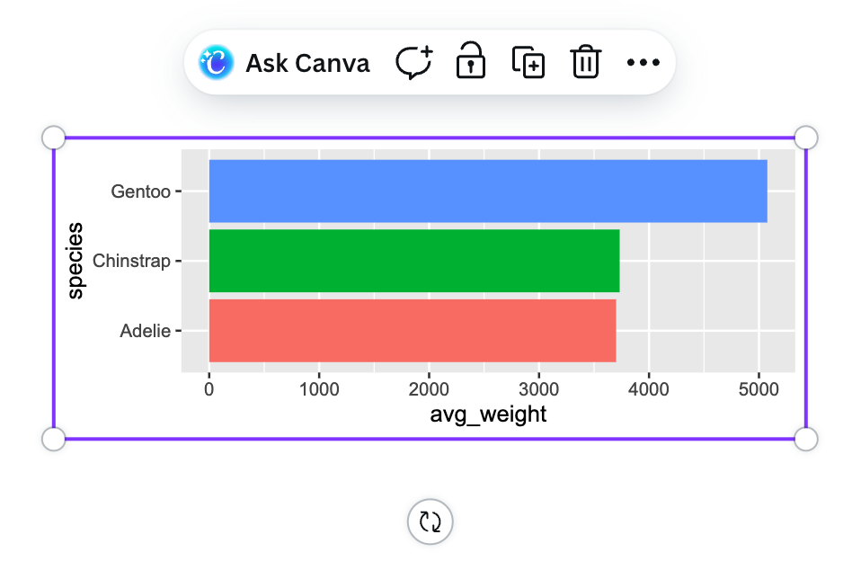
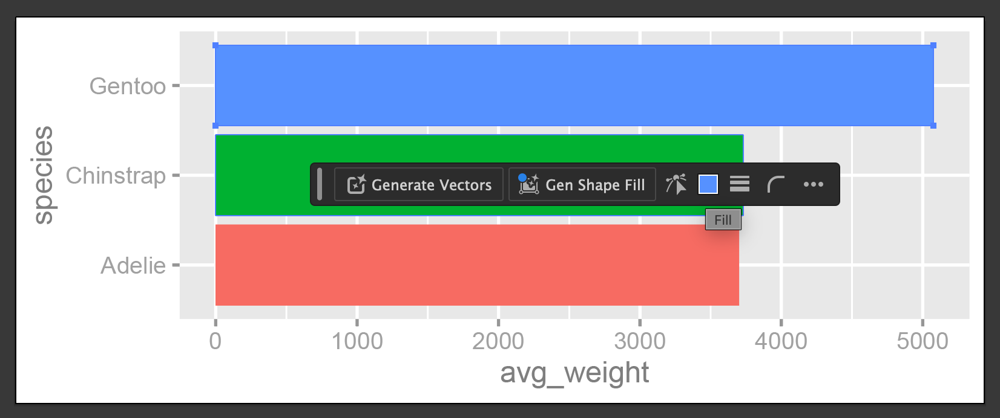
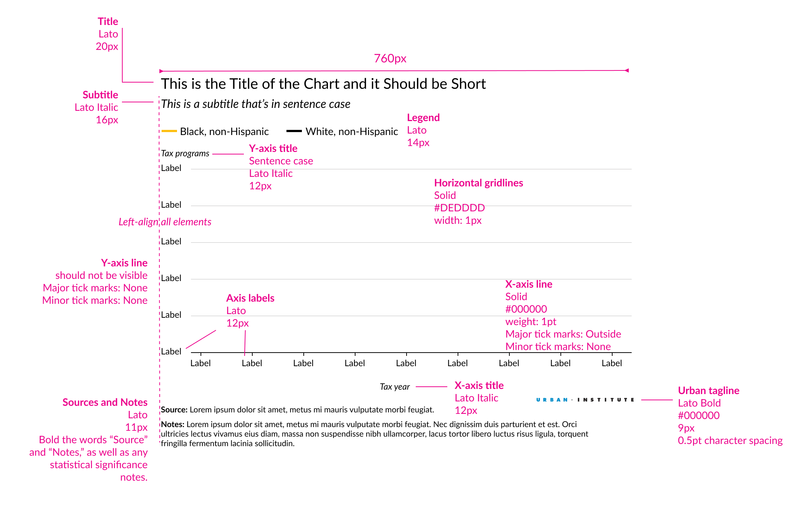
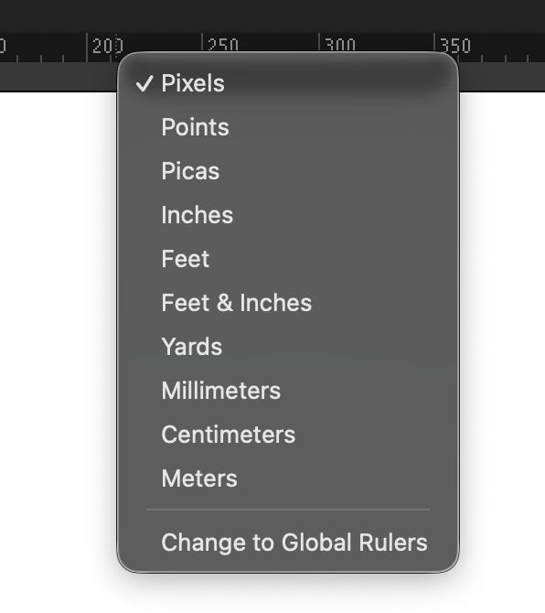
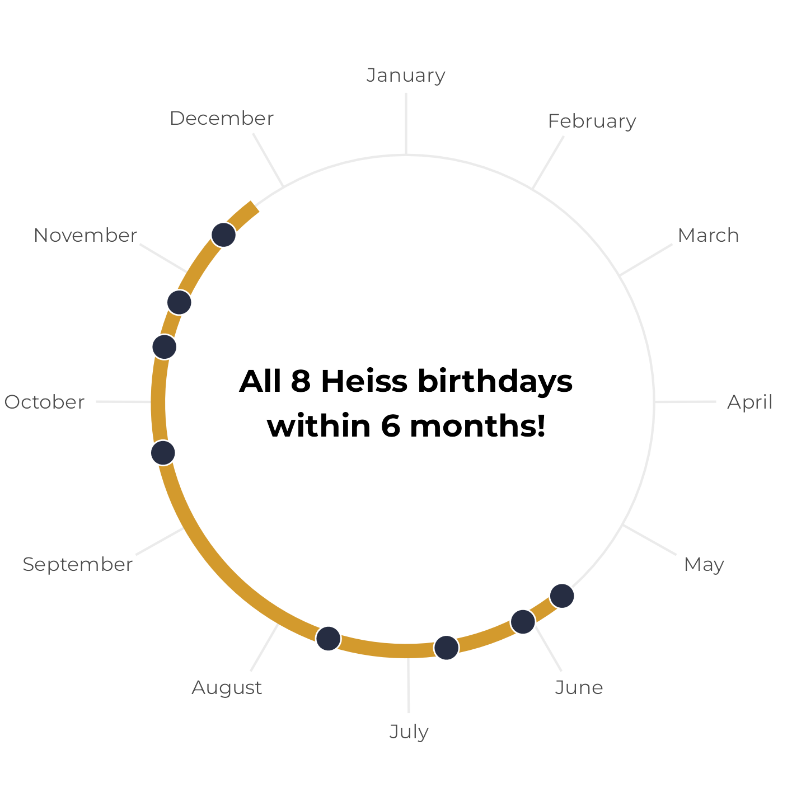

```{r setup, include=FALSE}
knitr::opts_chunk$set(
  fig.width = 6, 
  fig.height = 6 * 0.618, 
  fig.align = "center", 
  out.width = "80%",
  collapse = TRUE
)
```

Great work with exercise 10 and following the Urban Institute style guide! That process is completely normal and good practice for any future jobs you might have. Most organizations have specific style guides with fonts and colors and logos and design specifications (like, [here are GSU's](https://commkit.gsu.edu/website-management/web-color-guidelines/) and [here are UGA's](https://brand.uga.edu/visual-identity/visual-style/#typography)), and even if you're not working with an organization, you can create your own style guides for projects (like, [here are the fonts and colors I use for the class website](https://github.com/andrewheiss/datavizf25.classes.andrewheiss.com?tab=readme-ov-file#fonts-and-colors); and [for a workshop on teach on Quarto Websites](https://andrewheiss.github.io/quarto-websites_2025-10/colophon.html); and [for one of my research projects](https://stats.andrewheiss.com/silent-skywalk/notebook/style-guide.html)).

Here are the FAQs for the week:

### How do I include a separate image in my document?

In exercise 10, you were supposed to include your enhanced plot in the Quarto document with your reflection, but it was a little tricky to do.

Adding images to your document doesn't actually involve R—it's a Markdown thing, just like how you use `*italics*` or `## headings`. The [guide to using Markdown](/resource/markdown.qmd) has an example of the syntax:

```text

```

Again, that's not R code—don't put it in a chunk. If you do, things will break. 

**↓ THIS IS WRONG ↓**

````text
```{{r}}

```
````

Instead, make sure you put the image syntax *outside* of a chunk with your regular text:

````text
Blah blah I'm writing text here.

Here's some code I wrote:

```{{r}}
library(tidyverse)

ggplot(...) +
  geom_whatever()
```

Blah blah I'm writing more text again. Here's a neat picture I made:


````

Quarto lets you do fancier things with images too, like controlling their widths, making them centered or left or right aligned, and laying out multiple figures all at once. [See the documentation for full details and examples](https://quarto.org/docs/authoring/figures.html):

```text
{width=60% fig-align="right"}
```

### When should we add annotations and text in R vs. in a separate program?

There are no exact rules for this! It depends on how much work you want to do where. With {ggtext} and other R packages, you can do a lot of adjustment in R itself without even needing Illustrator.

Some people like adding labels in R; some people like doing it in Illustrator. Some people like modifying colors in R; some people like doing it in Illustrator. If it's easier to add notes and change colors, etc. with `annotate()`, then cool—use R. If you're adding a lot more detail and it would be trickier to do it with R, or if you just don't want to deal with a ton of `annotate()` laters, then cool—use Illustrator.

I personally try to do as much as possible in R before putting anything in Illustrator, not because it's necessarily trickier to do things in Illustrator, but to save time—if I want to make a second similar plot, copying/pasting/adapting the code from the first plot is a lot faster than remembering all the little tweaks I made in Illustrator.

Basically the only guideline is "do things wherever they're easiest."


### Do people really do this two-step process of using R and then using Illustrator?

Yep! This is totally normal! The [Urban Institute's style guide](https://urbaninstitute.github.io/graphics-styleguide/#chart-parts) that you referenced for Exercise 10 requires it—it says specifically to:

1. Add axis titles, labels, and the legend (and set appropriate colors) in Excel or R
2. Add text-heavy things like the title, subtitle, sources, notes, and annotations in something else, like Word (if using that)


### Why can't we use Canva for this?

Canva isn't a vector editing program. When you place a PDF or SVG into Canva, it pixelates it and reduces the quality.

But more importantly, because it turns everything into pixels, you can't edit any of the parts of the original plot. You can't change the font of the labels, you can change the colors of the chart—you can't do anything!

Like, here's a vector SVG placed in Canva. I can resize it and rotate it, but that's it:

{fig-align="center" width="70%"}

```{r}
#| include: false
#| eval: false

library(tidyverse)

penguins |> 
  group_by(species) |> 
  summarize(avg_weight = mean(body_mass, na.rm = TRUE)) |> 
  ggplot(aes(x = avg_weight, y = species, fill = species)) +
  geom_col() +
  guides(fill = "none")

ggsave("~/Desktop/thing.svg", width = 5, height = 2)
```

Here's that same SVG in Illustrator. I can isolate specific parts of it and change the font in the labels, or change the blue of the top bar to some other color. Each little component is editable.

{fig-align="center" width="70%"}

The Canva company bought Affinity in 2024 and in October 2025 the joint Canva + Affinity company released a [free](https://www.canva.com/newsroom/news/affinity-free/) version of [Affinity Studio](https://www.affinity.studio/), so you can now use that for getting a Canva-like experience with vector editing.


### The Urban Institute style guide said to use 6.25 inches or 720 pixels, but in Illustrator/Affinity/Inkscape, it translated 6.25 inches to 450 points—why?

That happened because pixels and points are different units of measurement. A *point* is a [specific typographic measure](https://en.wikipedia.org/wiki/Point_(typography)). There are **72 points in an inch**.

In the font menus in Google Docs and Word where you can make text 12 points or 14 points or whatever? Those numbers aren't just arbitrary. 12-point text is 1/6 of an inch. If you make text be 72 points, it'll be an inch tall.

So 6.25 inches × 72 = 450 typographic points.

Pixels are different. A *pixel* is a unit of measurement for screens and for printing. One pixel is a little dot in a bitmap image. Like with this image here from the lecture in session two, you can see little black and grey and white boxes. Each of those boxes is one pixel.


Pixels are for web-based images because screens don't work with inches. You can control the resolution or quality of images based on how many pixels are included in an inch—that's what DPI (dots per inch) measures. An image that is printed or shown on the screen at 30 DPI will have 30 dots in each inch, which is really low resolution—it'll look boxy and clunky and feel like it fits in Minecraft. An image that is 600 DPI will have 600 dots in each each, which is really high resolution—it'll look nice when printed and when shown on the screen.

The [Urban Institute uses both systems of measurement](https://urbaninstitute.github.io/graphics-styleguide/#chart-parts) depending on the output:

- For print, they want all their images to be 6.25 inches wide, titles to be 12 points tall, axis labels to be 8.5 points tall, and so on
- For screens, they want all their images to be 760 pixels wide, titles to be 20 pixels tall, axis labels to be 12 pixels tall, and so on

::: {.panel-tabset}
#### Print guidelines


#### Web guidelines


:::

Illustrator, Inkscape, and Affinity are all designed to work with both print and screen outputs, so you can switch between what systems of measurement they're using if you want. In Illustrator you can right click on the ruler to quickly switch between them—Inkscape and Affinity have some way to do the same thing.

{fig-align="center" width="40%" .border}


### Are there situations where radial or circular coordinates are useful?

Yep!

Typically radial/polar/circular coordinates are how you make pie charts. In ggplot, a pie chart is a stacked bar chart that uses `coord_radial()`:

```{r}
#| warning: false
#| message: false

library(tidyverse)
library(patchwork)

p1 <- ggplot(mtcars, aes(x = "", fill = factor(cyl))) +
  geom_bar(width = 1) + 
  labs(title = "Stacked bar chart")

p2 <- ggplot(mtcars, aes(x = "", fill = factor(cyl))) +
  geom_bar(width = 1) +
  labs(title = "Pie chart") +
  coord_radial(theta = "y", expand = FALSE)

(p1 | p2) + 
  plot_layout(guides = "collect") &
  theme(legend.position = "bottom", plot.title = element_text(hjust = 0.5))
```

In addition to standard pie charts, you can use `coord_radial()` to make jokey plots too, I guess:

::: {.panel-tabset}
### Pac-Man

```{r}
#| code-fold: true

df <- data.frame(
  variable = c("Does not resemble Pac-Man", "Resembles Pac-Man"),
  value = c(20, 80)
)

mouth_angle <- 360 * 0.2
mouth_bottom <- ((180 - mouth_angle) / 2) + mouth_angle

ggplot(df, aes(x = "", y = value, fill = variable)) +
  geom_col(width = 1) +
  scale_fill_manual(
    values = c("grey80", "#FFFF00"),
    guide = guide_legend(title = NULL, nrow = 2)
  ) +
  coord_radial("y", start = mouth_bottom * (pi / 180), expand = FALSE) +
  # https://fonts.google.com/specimen/Press+Start+2P
  theme_void(base_family = "Press Start 2P") +
  theme(legend.position = "bottom")
```

### Pyramid

```{r}
#| code-fold: true

pyramid_picture <- tribble(
  ~slice                  , ~angle ,
  "Sky"                   ,    280 ,
  "Sunny side of pyramid" ,     60 ,
  "Shady side of pyramid" ,     20
) %>%
  mutate(slice = fct_inorder(slice), angle = angle / 360)

ggplot(pyramid_picture, aes(x = "", y = angle, fill = slice)) +
  geom_bar(width = 1, stat = "identity") +
  scale_fill_manual(values = c("#1C94D2", "#F4E734", "#C5B731"), name = NULL) +
  coord_radial("y", start = 140 * (pi / 180), expand = FALSE) +
  theme_void(base_size = 15, base_family = "Roboto Medium")
```

### Coastal highway

```{r}
#| code-fold: true

beach_picture <- tribble(
  ~slice      , ~angle ,
  "Sky"       ,    160 ,
  "Mountains" ,     20 ,
  "Grass"     ,     25 ,
  "Road"      ,     50 ,
  "Sidewalk"  ,     20 ,
  "Beach"     ,     60 ,
  "Ocean"     ,     25
) %>%
  mutate(slice = fct_inorder(slice), angle = angle / 360)

ggplot(beach_picture, aes(x = "", y = angle, fill = slice)) +
  geom_bar(width = 1, stat = "identity") +
  scale_fill_manual(
    values = c(
      "#7292CB", "#168A46", "#22B34A", "grey20",
      "grey80", "#FFCE05", "#3E69B2"
    ),
    name = NULL
  ) +
  coord_radial("y", start = 270 * (pi / 180), expand = FALSE, reverse = "theta") +
  theme_void(base_size = 20, base_family = "Roboto Medium")
```

:::

As you've read and seen in this class, pie charts aren't the greatest and suffer from all sorts of perceptual issues. 

Radial coordinates can be useful for showing cycles, though—especially time, like weekdays or months. Check out this animated plot that NASA made in 2022 showing monthly temperatures from 1880–2021:

<div class="ratio ratio-16x9 mb-4">
<iframe src="https://www.youtube.com/embed/jWoCXLuTIkI" allow="accelerometer; autoplay; encrypted-media; gyroscope; picture-in-picture" allowfullscreen="" frameborder="0"></iframe>
</div>

Or check out [this plot](https://www.andrewheiss.com/blog/2024/05/03/birthday-spans-simulation-sans-math/#birthday-probabilities) showing how the eight birthdays in my family all fall within a six-month span (which is surprisingly uncommon! If you [look at the full post](https://www.andrewheiss.com/blog/2024/05/03/birthday-spans-simulation-sans-math/), you'll find that there's only a 6.5% chance of that happening in an eight-person household!)

{width="75%" fig-align="center"}
