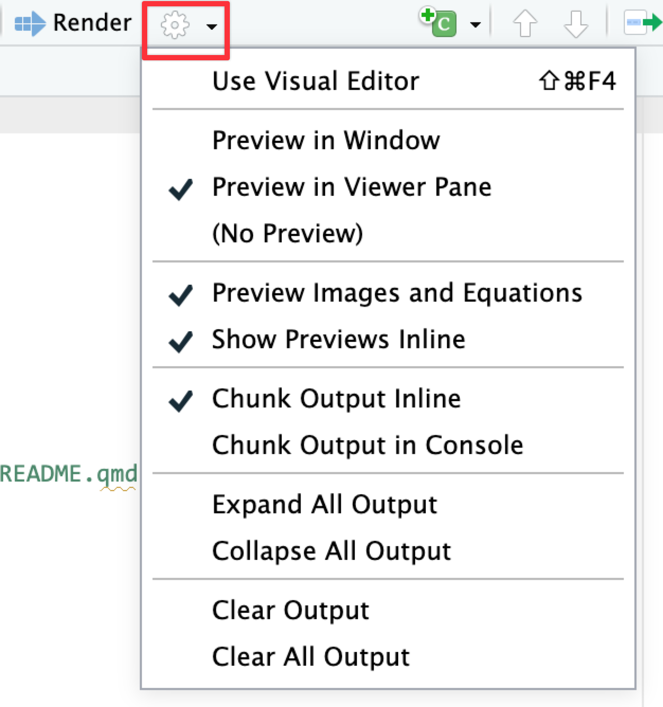
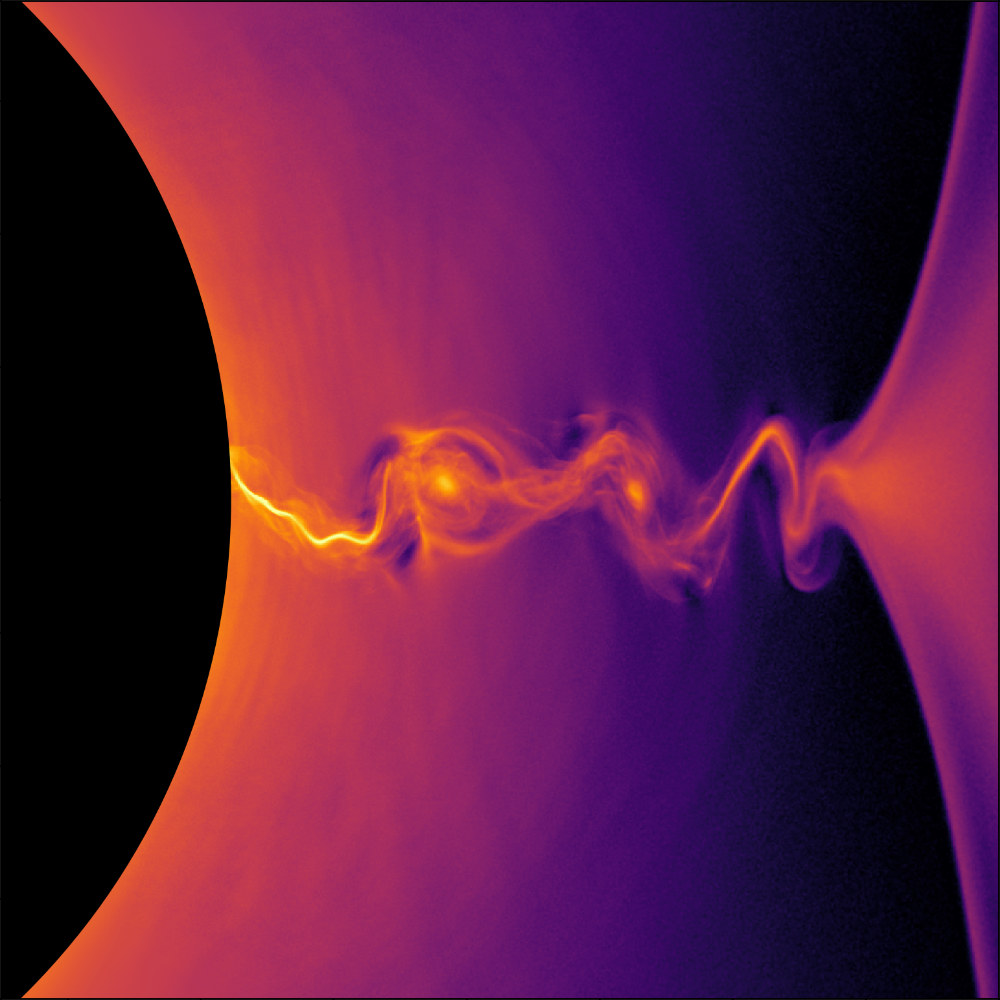
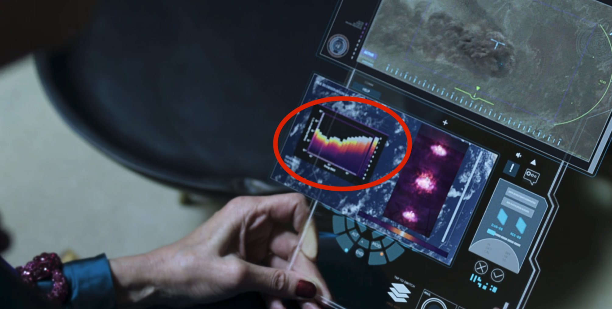
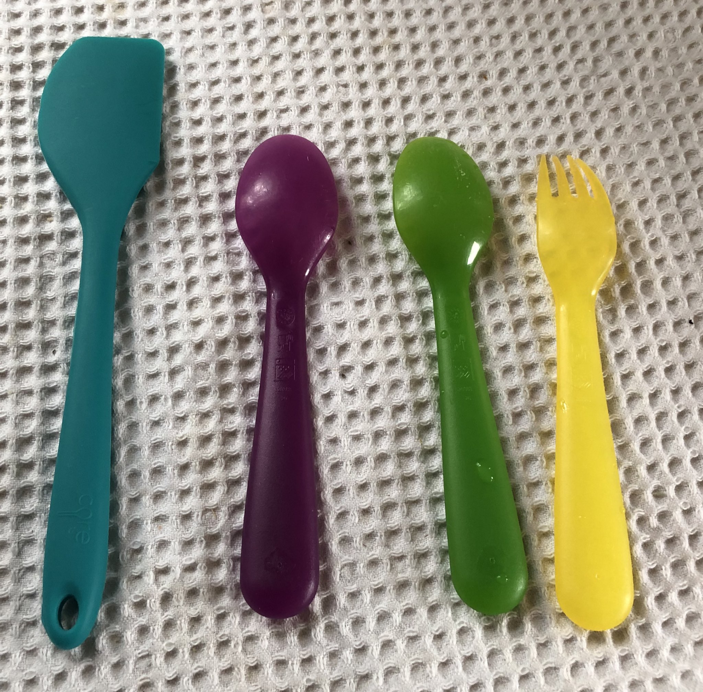



```{r setup, include=FALSE}
knitr::opts_chunk$set(
  fig.width = 6,
  fig.height = 6 * 0.618,
  fig.align = "center",
  out.width = "90%",
  collapse = TRUE
)

options(
  digits = 3, width = 120,
  dplyr.summarise.inform = FALSE
)
```

### `glue()` is so  helpful! Can/should we just use it all the time?

Yeah, `glue()` is wonderful! 

Doing this is tedious and annoying:

```{r}
thing1 <- "cat"
thing2 <- "monkey"

paste0(
  "There is a ", thing1, " and a ", thing2, " calculating pi (", round(pi, 2), ")"
)
```

{glue} lets you do this:

```{r}
library(glue)

thing1 <- "cat"
thing2 <- "monkey"

glue(
  "There is a {thing1} and a {thing2} calculating pi ({round(pi, 2)})"
)
```

You can even use that `glue()` syntax without having to run `library(glue)`. One of the packages that gets loaded when you run `library(tidyverse)` is called [{stringr}](https://stringr.tidyverse.org/), and it contains a bunch of functions that make it easier to work with text. One of the functions it comes with is `str_glue()`, which is just `glue()`. So as long as you've loaded tidyverse, which you likely have since every assignment in this class uses it, you can do this:

```{r}
#| warning: false
#| message: false

library(tidyverse)

thing1 <- "cat"
thing2 <- "monkey"

str_glue("There is a {thing1} and a {thing2} calculating pi ({round(pi, 2)})")
```

You can use `glue()` (or `str_glue()`) whenever you want in place of `paste()` or `paste0()`.


### How do I update my site if I make changes?

If you make changes to your website later, you can update the live version by running `quarto publish` again. It'll go a lot faster after the first time because you won't have to answer all the different initial questions—it should just render and upload right away.

### Can we make our own websites to display our work and our projects?

YES! You can (and should!)! In the past I've had students make portfolio websites showing off their different projects (you can make a [listing that shows a bunch of smaller pages](https://quarto.org/docs/websites/website-listings.html), similar to a blog), and in my other more stats-y classes, I've had students create their final papers and projects using Quarto websites with interactive plots and tables.

I've had students use these websites when applying for jobs, showing potential employers what they've made and what they can do. Having a URL for a site is a really easy way to share the things you make and show off the things you can do.

[My own personal website](https://www.andrewheiss.com/) is built with Quarto and has listings for different talks and research projects and blog posts. Lots and lots and lots of people do the same thing. I'd *highly recommend* building one for yourself. [See this little workshop I teach](https://andrewheiss.github.io/quarto-websites_2025-10/) for a bunch of extra resources and tips for creating your own website.

### Can I customize the URL for my site? Like www.myname.com?

Yep! You can buy a domain name and point it to your website so that people can go to yourname.com instead of yourname.quarto.pub.

Though technically you **can't** use custom domains with Posit Connect Cloud—you'd need to publish your site elsewhere, like at GitHub Pages, which is also free, just a little more complicated to set up. [There are complete instructions here](https://quarto.org/docs/publishing/github-pages.html) (and [here are the instructions](https://quarto.org/docs/publishing/github-pages.html#custom-domain) for managing the domain name if you have one).

[See these slides and resources too](https://andrewheiss.github.io/quarto-websites_2025-10/materials/publishing/).


### Do people use Plotly and Quarto dashboards and websites in the real world?

Absolutely!

In the lecture I mentioned that most COVID dashboards were/are made with Shiny or {flexdashboard}. Both are still popular and you'll see Shiny and {flexdashboard} websites all over the internet.

Many people and organizations have been moving to Quarto. In November 2024, Idaho launched a [new election results dashboard](https://archive.voteidaho.gov/results/2024/general/) for its general election results and it's 100% built with Quarto and Plotly. 

I gave a talk about I helped make that website at Posit's annual posit::conf() conference in 2025 that you can see here, and we made a [whole little companion tutorial site here](https://andrewheiss.github.io/election-desk/).

```{=html}
<div class="ratio ratio-16x9 mb-4">
<iframe src="https://www.youtube.com/embed/UCloM4GcfVY" frameborder="0" allow="accelerometer; autoplay; encrypted-media; gyroscope; picture-in-picture" allowfullscreen></iframe>
</div>
```

And now you can all do similar, real world things too!


### My plot didn’t translate perfectly to ggplotly—why?

In your exercise you used `ggplotly()` to convert a ggplot object into an interactive plot, which I think is magical:

```{r}
#| label: basic-plotly
#| warning: false
#| message: false

library(tidyverse)
library(plotly)

penguins <- penguins |> drop_na(sex)

basic_plot <- ggplot(penguins, aes(x = bill_len, y = body_mass, color = species)) +
  geom_point()

ggplotly(basic_plot)
```

\ 

However, lots of you discovered that Plotly does not translate everything perfectly. Plotly is a separate Javascript library and it doesn’t support every option ggplot does. `ggplotly()` tries its best to translate between R and Javascript, but it can’t get everything. For instance, subtitles, captions, and labels disappear:

```{r}
#| label: fancy-plotly-stuff-missing
#| warning: false

fancy_plot <- ggplot(penguins, aes(x = bill_len, y = body_mass, color = species)) +
  geom_point() +
  annotate(geom = "label", x = 50, y = 5500, label = "chonky birds") +
  labs(title = "Penguin bill length and weight",
       subtitle = "Neato", 
       caption = "Here's a caption")

ggplotly(fancy_plot)
```

\ 

That’s just a limitation with ggplot and plotly. If you want a perfect translation, you’ll need to hack into the guts of the translated Javascript and HTML and edit it manually to add those things.

Alternatively, you can check out other interactive plot packages. [{ggiraph}](https://davidgohel.github.io/ggiraph/) makes really great and customizable interactive plots (and it supports things like subtitles and captions and labels and other annotations ggplotly can't), but with slightly different syntax:

```{r}
#| label: ggiraph-thing

library(ggiraph)

plot_thing <- ggplot(data = penguins) +
  geom_point_interactive(aes(x = bill_len, y = body_mass, color = species,
                             tooltip = species, data_id = species)) +
  annotate(geom = "label", x = 50, y = 5500, label = "chonky birds") +
  labs(title = "Penguin bill length and weight",
       subtitle = "Neato", 
       caption = "Here's a caption")

girafe(ggobj = plot_thing)
```

### How did you get the two value text boxes to stack on top of each other in the bottom row?

First, make sure you check the answer key for Exercise 11 on iCollege—the [complete code](https://andrewheiss.quarto.pub/datavizsp26_11-exercise-answers/dashboard-code.html) for the dashboard that you had to recreate is there.

In short, you do something like this for the second row. Having the two value boxes in one column makes them stack:

````default
## Row

### Column

```{{r}}
#| content: valuebox
#| title: "Number of islands"
list(
  ...
)
```

```{{r}}
#| content: valuebox
#| title: "Favorite food"
list(
  ...
)
```

### Column

```{{r}}
p <- ggplot(...) +
  geom_whatever()

ggploly(p)
```
````

### *Should* we learn Shiny? When should we use a dashboard vs. a full Shiny app?

[Shiny](https://shiny.posit.co/) is a really neat R package that lets you run fully interactive web applications in a browser. It runs R code behind the scenes to calculate stuff and generate plots, and it's powerful and cool.

But it also is complex and requires a full server to run. You can't just render a .qmd file as a Shiny app and share the resulting HTML with someone—you *can* [publish Shiny apps to Posit Connect Cloud](https://docs.posit.co/connect-cloud/how-to/r/shiny-r.html), but they only let you have one free app, since they're so resource intensive.

You need to use Shiny if you need things to be recalculated on the page, like if you want users to change some settings and have those be reflected in a plot, or if you want the page to show the latest version of live data from some remote data source. Because R runs behind the scenes, it'll redraw plots and re-import data and rebuild parts of the web page as needed.

If you don't need things to be reclaculated on the page, you can just use a regular dashboard, like in Exercise 11. There's no need for fancy server backend stuff—nothing needs to be recalculated or replotted or anything.

If you have things that need to be recalculated/replotted and you *don't* want to use Shiny (which is totally understandable! it's a tricky complex package!), Quarto has support for something called [Observable JS](https://quarto.org/docs/interactive/ojs/), which is essentially a Javascript version of {ggplot2} and {dplyr} and R. It runs stuff directly in your browser without needing a whole server—documents with Observable JS (OJS) chunks can be published on Posit Connect Cloud in a normal Quarto document. You can even mix R and OJS chunks in the same document.

See [this](https://stats.andrewheiss.com/hack-your-way/) and [this](https://nullworlds.andrewheiss.com/) and [this](https://dags.andrewheiss.com/) for some example sites I've made. In the past, these would have had be done with Shiny, but nowadays, they're done with just Quarto!

Like, watch this magic.

Here's an R chunk that loads gapminder data and penguin data and then makes them available to OJS:

```{r}
#| echo: fenced
library(gapminder)

ojs_define(gapminder = gapminder, penguins = datasets::penguins)
```

And here's an OJS chunk that filters the gapminder data and plots it in an interactive way. You can slide that year slider and have it replot things automatically—no need for Shiny!

::: {.callout-note}
#### Observable
This is NOT R code! This is [Observable JS](https://quarto.org/docs/interactive/ojs/) code!
:::

```{ojs}
//| echo: fenced
viewof current_year = Inputs.range(
  [1952, 2007], 
  {value: 1952, step: 5, label: "Year:"}
)

// Rotate the data so that it works with OJS
gapminder_js = transpose(gapminder)

// Filter the data based on the selected year
gapminder_filtered = gapminder_js.filter(d => d.year == current_year)

// Plot this thing
Plot.plot({
  x: {type: "log"},
  marks: [
    Plot.dot(gapminder_filtered, {
        x: "gdpPercap", y: "lifeExp", fill: "continent", r: 6,
        channels: {
          Country: d => d.country
        },
        tip: true
      }
    )
  ]}
)
```

And here's an OJS plot that filters the penguins data based on user input and plots it as facetted histograms:

```{ojs}
//| echo: fenced
viewof bill_length_min = Inputs.range(
  [32, 50], 
  {value: 35, step: 1, label: "Bill length (min):"}
)
viewof islands = Inputs.checkbox(
  ["Torgersen", "Biscoe", "Dream"], 
  { value: ["Torgersen", "Biscoe"], 
    label: "Islands:"
  }
)

// Rotate the data so that it works with OJS
penguins_js = transpose(penguins)

// Filter the data
filtered = penguins_js.filter(function(penguin) {
  return bill_length_min < penguin.bill_len &&
         islands.includes(penguin.island);
})

// Plot the data
Plot.rectY(filtered, 
  Plot.binX(
    {y: "count"}, 
    {x: "body_mass", fill: "species", thresholds: 20}
  ))
  .plot({
    facet: {
      data: filtered,
      x: "sex",
      y: "species",
      marginRight: 80
    },
    marks: [
      Plot.frame(),
    ]
  }
)
```

That's so cool!

You can do a ton of neat interactive things—without Shiny!—with Observable JS. See these, for instance:

- [USAID's Foreign Assistance dashboard](https://foreignassistance.andrewheiss.com/live-example-dashboard.html)
- [Reading dashboard that pulls data from Goodreads and Google Sheets](https://www.andrewheiss.com/blog/2024/01/12/diy-api-plumber-quarto-ojs/_book/dashboard.html)
- [Making maps with Observable Plot](https://www.andrewheiss.com/blog/2025/02/10/usaid-ojs-maps/)
- [Quarto's OJS documentation](https://quarto.org/docs/interactive/ojs/)


### But I don't want to learn a whole other language with OJS to show in-browser interactive graphs—is there a way to use R in the browser *without* Shiny?

You're in luck—YES! This is a super new development in the R world. The [Quarto Live](https://r-wasm.github.io/quarto-live/) extension lets you run R chunks directly in your browser. This is how the [R Primers](https://r-primers.andrewheiss.com/) work (remember those from the beginning of the semester?!)

One super neat thing about Quarto Live is that you can use OJS inputs to [feed data into live R chunks](https://r-wasm.github.io/quarto-live/interactive/reactivity.html). So you do need to do a *little tiny* bit of Javascript, but nothing too scary.

For instance, here's some basic OJS code for creating some interactive inputs for an R plot:

```{ojs}
//| code-fold: true
numeric_vars = ["bill_len", "bill_dep", "flipper_len", "body_mass"]
categorical_vars = ["species", "island", "sex"]

viewof species_filter = Inputs.checkbox(
  ["Adelie", "Chinstrap", "Gentoo"],
  {label: "Species to include", value: ["Adelie", "Chinstrap", "Gentoo"]}
)

viewof x_var = Inputs.select(numeric_vars, {
  label: "X Variable",
  value: "bill_len"
})

viewof y_var = Inputs.select(numeric_vars, {
  label: "Y Variable",
  value: "bill_dep"
})

viewof color_var = Inputs.select(categorical_vars, {
  label: "Color by",
  value: "species"
})

viewof show_trend_species = Inputs.toggle({
  label: "Show species trends",
  value: false
})

viewof show_trend_overall = Inputs.toggle({
  label: "Show overall trend",
  value: false
})
```

And here's a live R chunk using ggplot to plot the penguins data. None of this is Javascript—it's all the regular R that you've been learning this semester. It automatically reruns when you change the inputs above, and it all happens right in your browser!

```{webr}
#| autorun: true
#| max-lines: 10
#| fig-width: 6
#| fig-height: 4
#| input:
#|   - species_filter
#|   - x_var
#|   - y_var
#|   - color_var
#|   - show_trend_species
#|   - show_trend_overall
penguins_filtered <- datasets::penguins |>
  drop_na(sex) |>
  filter(if (length(species_filter) > 0) species %in% species_filter else TRUE) |>
  drop_na(all_of(c(x_var, y_var)))

p <- ggplot(penguins_filtered, aes(x = .data[[x_var]], y = .data[[y_var]])) +
  geom_point(aes(color = .data[[color_var]], shape = .data[[color_var]]), size = 3, alpha = 0.7) +
  labs(
    title = "Penguins! 🐧",
    x = x_var,
    y = y_var,
    color = color_var
  ) +
  theme_light()

if (show_trend_species) {
  p <- p + 
    geom_smooth(
      aes(color = .data[[color_var]]), 
      method = "lm", se = FALSE, formula = 'y ~ x'
    )
}

if (show_trend_overall) {
  p <- p + 
    geom_smooth(
      color = "#0074D9", 
      method = "lm", se = FALSE, formula = 'y ~ x'
    )
}

p
```


### I rendered my file / dashboard but it didn't appear in the Viewer panel—why not?

When you render a Quarto file, RStudio will show you a preview of it. Depending on how RStudio is set up, that preview can appear in the Viewer panel, or it can appear in a separate web browser window. Both options are helpful and I use them interchangeably—if I'm at home with my wider monitor, I'll have the preview appear in a separate window on the side of my screen; if I'm just on my laptop, I'll have the preview appear in the Viewer panel.

You can control where it appears with the little gear icon next to the "Render" button in RStudio:

{width="40%"}

There are other options there too. If you don't like having plots appear underneath chunks inside your document, you can tell it to show "Chunk Output in Console". This will put plots in the Plots panel instead.


### Do people use viridis palettes in real life?

Yes! Now that you know [what the viridis palettes look like](https://cran.r-project.org/web/packages/viridis/vignettes/intro-to-viridis.html#the-color-scales), you'll notice them in all sorts of reports and papers and visualizations.

For instance, check out [this paper on black hole plasma](https://newscenter.lbl.gov/2019/01/24/how-to-escape-a-black-hole-simulations-provide-new-clues-to-whats-driving-powerful-plasma-jets/)—that's the "magma" scale:

{width="70%"}

They pop up in fiction too! In [S4E5 of *The Expanse*](https://www.imdb.com/title/tt8665822/) (and throughout the show, actually), you can see charts on futuristic iPads using the "plasma" scale:



Back in March 2020 I even found a wild `scale_color_viridis_d()` on my kitchen counter :)

{width="80%"}


### I'm bored with ggplot's default colors and/or viridis—how can I use other color palettes?

[There's a guide to using all sorts of different colors](/resource/colors.qmd), including how to use fancy scientifically-designed palettes, custom colors from organizations like GSU, and colors from art, music, movies and TV shows, and historical events. You can make gorgeous plots with these different colors!
