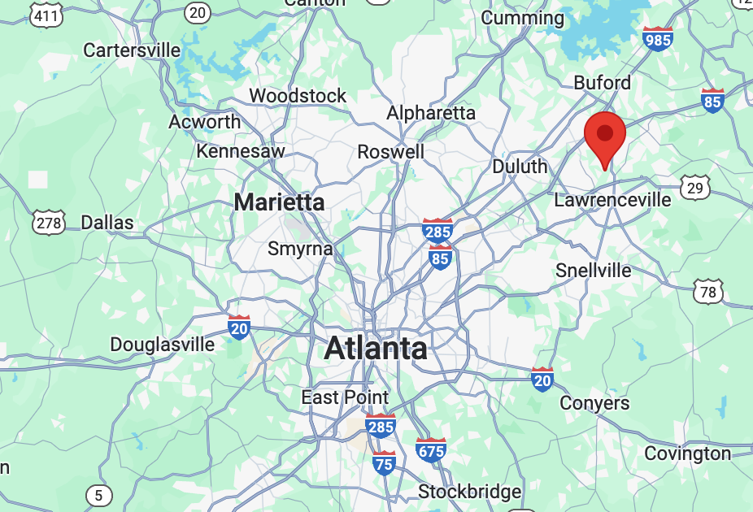
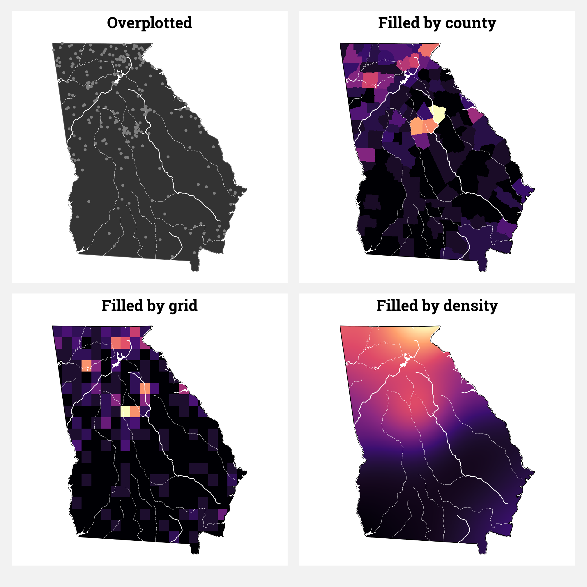
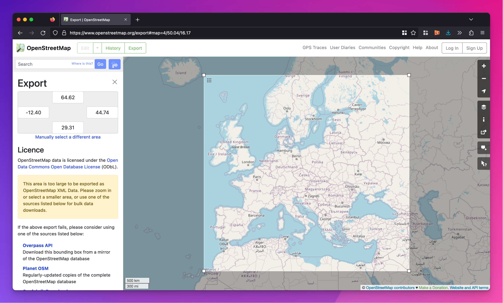

```{r setup, include=FALSE}
knitr::opts_chunk$set(
  fig.width = 6, 
  fig.height = 6 * 0.618, 
  fig.align = "center", 
  out.width = "80%",
  collapse = TRUE
)
```


### Can we make interactive maps with R?

Absolutely! `ggplotly()` works with `geom_sf()`. Here's a regular static map:

```{r}
#| warning: false
#| message: false
#| fig-width: 7
#| fig-height: 3
#| out-width: "100%"

library(tidyverse)
library(sf)
library(rnaturalearth)
library(plotly)

world_map <- ne_countries(scale = 110) |>
  filter(admin != "Antarctica") # Bye penguins

world_map_with_nice_label <- world_map |>
  mutate(
    nice_label = glue::glue(
      "{name}<br>Population: {scales::label_comma()(pop_est)}"
    )
  )

world_population_map <- ggplot() +
  geom_sf(
    data = world_map_with_nice_label,
    aes(fill = pop_est, text = nice_label),
    linewidth = 0.1
  ) +
  scale_fill_viridis_c(
    trans = scales::log_trans(base = 10),
    label = scales::label_comma(),
    name = "Population"
  ) +
  coord_sf(crs = st_crs("+proj=robin")) +
  theme_void()
world_population_map
```

And here's an interactive version with `plotly::ggplotly()`:

```{r}
ggplotly(world_population_map, tooltip = "text")
```

You can also make interactive maps with Observable Plot—[see this for more examples](https://www.andrewheiss.com/blog/2025/02/10/usaid-ojs-maps/)


### Why do we use an empty `ggplot()` call for these functions?

In all the examples, you saw stuff like this:

```{.r}
ggplot() +
  geom_sf(data = only_georgia) +
  geom_sf(data = ga_rivers) +
  geom_sf(data = ga_lakes)
```

This feels different from other ggplot plots where you define the `data` in `ggplot()`, like this:

```{.r}
ggplot(data = mpg, mapping = aes(x = displ, y = hwy, color = drv)) +
  geom_point()
```

[Recall from this FAQ post](/news/2026-02-03_faqs_week-03.qmd#why-does-aes-sometimes-appear-in-ggplot-and-sometimes-in-geom_whatever) that anything you set in `ggplot()`, both `data` and `aes()`, applies to all the other geom layers that come afer. If you're plotting one layer of geographic data, this will totally work, since the `only_georgia` dataset here will apply to all the other geom layers (and here, there's only one of those):

```{.r}
ggplot(data = only_georgia) +
  geom_sf()
```

That ↑ works great and is fine and normal.

If you want a second map layer, you have to specify it as the `data` argument in `geom_sf()`, like this:

```{.r}
ggplot(data = only_georgia) +
  geom_sf() +
  geom_sf(data = ga_rivers)
```

But now things are looking a little weird. Because `data = only_georgia` is set in `ggplot()`, it applies to all the `geom_*()` layers, including the empty one that comes right after. The second `geom_sf()` layer sets its own dataset with `data = ga_rivers`:

```{.r}
ggplot(data = only_georgia) +
  geom_sf() +  # This will show only_georgia
  geom_sf(data = ga_rivers)  # This will show ga_rivers
```

That ↑ will work fine, but it's a lot harder to read because of the empty `geom_sf()`. In general with maps, since you're typically combining lots of different `geom_sf()` layers, it can be easier to specify the data in each individually. Hence this pattern: 

```{.r}
ggplot() +
  geom_sf(data = only_georgia) +
  geom_sf(data = ga_rivers) +
  geom_sf(data = ga_lakes)
```

### What's the difference between a tibble and a tribble?

Throughout the class, you've been working with tibbles, which are really just data frames (or like Excel spreadsheets).

In session 12, you were introduced to the `tribble()` function. This lets you create data frames in a row-wise way (hence the "r" in t**r**ibble).

Here's the difference between the two. You can make your own little dataset with `tibble()` like this:

```{r}
example_data <- tibble(
  state = c("North Carolina", "California", "Texas"),
  abbv = c("NC", "CA", "TX"),
  region = c("South", "West", "South"),
  division = c("South Atlantic", "Pacific", "West South Central")
)
example_data
```

That works fine. You have to feed each column name a vector of values, like `abbv = c("NC", "CA", "TX")`.

You can make the same little dataset with `tribble()` like this:

```{r}
example_data <- tribble(
  ~state,           ~abbv, ~region, ~division,
  "North Carolina", "NC",  "South", "South Atlantic",
  "California",     "CA",  "West",  "Pacific",
  "Texas",          "TX",  "South", "West South Central"
)
example_data
```

It makes exactly the same dataset as before, but it feels more like a spreadsheet. All the cells for each row are included on a single row. If you wanted to comment out California, you can add a `#` to just that line:

```{r}
example_data <- tribble(
  ~state,           ~abbv, ~region, ~division,
  "North Carolina", "NC",  "South", "South Atlantic",
  # "California",     "CA",  "West",  "Pacific",
  "Texas",          "TX",  "South", "West South Central"
)
example_data
```

There's no easy way to do that with the `tibble()` version! You'd need to manually go and remove each California-related thing and hope that things still line up:

```{r}
example_data <- tibble(
  state = c("North Carolina", "Texas"),
  abbv = c("NC", "TX"),
  region = c("South", "South"),
  division = c("South Atlantic", "West South Central")
)
example_data
```

### How many decimal points should I use when I'm working with latitude and longitude?

When you copy/paste geographic coordinates from Google Maps, you'll get numbers that have a ton of decimal points, even though the website doesn't show that many. For instance, here's 55 Park Place (my office building on campus):

{width="80%" fig-align="center"}

When you copy those coordinates, though, you get these values, which have a lot more decimal points:

```default
33.755935998360144, -84.38748192406294
```

Which one is right? 33.75594 or 33.755935998360144?

As you add more decimal points to geographic data, you get more and more precise.

::: {.panel-tabset}

### 34, -84

[34, -84](https://www.google.com/maps/place/34%C2%B000'00.0%22N+84%C2%B000'00.0%22W/@33.8456451,-84.7668176,9.15z/data=!4m4!3m3!8m2!3d34!4d-84?entry=ttu) gets you a little north of Lawrenceville.

{width="80%" fig-align="center"}

### 33.8, -84.4

[33.8, -84.4](https://www.google.com/maps/place/33%C2%B048'00.0%22N+84%C2%B024'00.0%22W/@33.7861216,-84.4904202,12.02z/data=!4m4!3m3!8m2!3d33.8!4d-84.4?entry=ttu) gets you a little north of Midtown.

{width="80%" fig-align="center"}

### 33.76, -84.39

[33.76, -84.39](https://www.google.com/maps/place/33%C2%B045'36.0%22N+84%C2%B023'24.0%22W/@33.7603317,-84.3932691,17.35z/data=!4m4!3m3!8m2!3d33.76!4d-84.39?entry=ttu) gets you just outside of Centennial Olympic Park.

{width="80%" fig-align="center"}

### 33.756, -84.387

With only three decimal points, [33.756, -84.387](https://www.google.com/maps/place/33%C2%B045'21.6%22N+84%C2%B023'13.2%22W/@33.7559478,-84.3892662,18.03z/data=!4m4!3m3!8m2!3d33.756!4d-84.387?entry=ttu) gets you in 55 Park Place

{width="80%" fig-align="center"}

:::

Adding more decimal points will get even more precise like down to the exact inch on the earth. That's excessive.

](img/coordinate_precision_2x.png){width="80%" fig-align="center"}


### Can I use `geom_label_repel()` with maps?

You learned about the {ggrepel} package in [session 9](/example/09-example.qmd), with its `geom_text_repel()` and `geom_label_repel()` functions that make sure none of your labels overlap:

```{r libraries-data, warning=FALSE, message=FALSE}
library(tidyverse)
library(sf)
library(ggrepel)

small_mpg <- mpg |> 
  # Only use the first 10 rows
  slice(1:10) |> 
  # Make a label column
  mutate(fancy_label = glue::glue("{manufacturer} {model} ({year})"))

ggplot(small_mpg, aes(x = displ, y = hwy, color = drv)) +
  geom_point() +
  geom_label_repel(aes(label = fancy_label), seed = 1234)
```

In [session 12](/example/12-example.qmd), you learned about `geom_sf_text()` and `geom_sf_label()` for adding text and labels to maps. But what if your map labels overlap, like this?

```{r counties-fake, eval=FALSE}
# Download cb_2022_us_county_5m.zip under "County" from
# https://www.census.gov/geographies/mapping-files/time-series/geo/cartographic-boundary.html
ga_counties <- read_sf("data/cb_2022_us_county_5m/cb_2022_us_county_5m.shp") |> 
  filter(STATEFP == 13)
```

```{r counties-real, include=FALSE}
ga_counties <- read_sf(here::here("files", "data", "external_data", "maps",
                                  "cb_2022_us_county_5m",
                                  "cb_2022_us_county_5m.shp")) |> 
  filter(STATEFP == 13)
```

```{r ga-places-label-overlap, warning=FALSE}
ga_places <- tribble(
  ~city, ~lat, ~long,
  "Atlanta", 33.748955, -84.388099,
  "Alpharetta", 34.075318, -84.294105,
  "Duluth", 34.002262, -84.143614
) |> 
  st_as_sf(coords = c("long", "lat"), crs = st_crs("EPSG:4326"))

ggplot() +
  geom_sf(data = ga_counties, linewidth = 0.1) +
  geom_sf(data = ga_places) +
  geom_sf_label(data = ga_places, aes(label = city)) +
  theme_void()
```

Unfortunately there's no such thing as `geom_sf_label_repel()`. BUT there's still a way to use `geom_label_repel()` and `geom_text_repel()` with maps, with a couple little tweaks:

1. You have to map the `geometry` column in the data to the `geometry` aesthetic in `geom_text/label_repel()`
2. You have to tell `geom_text/label_repel()` to use the "sf_coordinates" stat so that it uses the latitude and longitude coordinates for x/y

```{r ga-places-label-fixed, warning=FALSE}
ggplot() +
  geom_sf(data = ga_counties, linewidth = 0.1) +
  geom_sf(data = ga_places) +
  geom_label_repel(
    data = ga_places,
    aes(label = city, geometry = geometry),
    stat = "sf_coordinates", seed = 1234
  ) +
  theme_void()
```

### I tried using `nudge_x` to move a label on the map and it didn't move—why?

It likely did, but barely!

The `nudge_x` and `nudge_y` parameters use whatever scale you're using in the x- and y-axes. For instance, here's that `small_mpg` dataset from above. `nudge_y` uses highway MPG units, so nudging things upward by 0.5 means that a car with 28 MPG will have its label appear at 28.5 MPG. If I used 0.5 for `nudge_x`, that would be too much nudging—the x-axis uses displacement units (whatever those are), so a car with 2.8 displacement would have a label at 3.3.

```{r}
small_mpg <- mpg |> 
  # Only use the first 10 rows
  slice(1:10) |> 
  # Make a label column
  mutate(fancy_label = glue::glue("{manufacturer} ({year})"))

ggplot(small_mpg, aes(x = displ, y = hwy, color = drv)) +
  geom_point() +
  geom_label(aes(label = fancy_label), nudge_y = 0.5)
```

The same principle works with maps: the nudge value uses the units in the x- and y-axes.

This gets tricky with maps!

Here's a little illustration with Italy:

```{r}
#| warning: false
#| message: false

library(tidyverse)
library(sf)
library(rnaturalearth)

italy_map <- ne_countries(scale = 50) |>
  filter(admin == "Italy")

italy_cities <- tribble(
  ~city, ~lat, ~long,
  "Rome", 41.899616, 12.501807,
  "Florence", 43.78116, 11.24532,
  "Palermo", 38.114561, 13.357998
) |> 
  st_as_sf(coords = c("long", "lat"), crs = st_crs("EPSG:4326"))
```

Here's a map with three cities on it:

```{r}
#| fig-width: 4
#| fig-height: 4

ggplot() + 
  geom_sf(data = italy_map) + 
  geom_sf(data = italy_cities) +
  geom_sf_text(data = italy_cities, aes(label = city)) 
```

Those city names are right on top of the points, so let's nudge them up a bit. I'll arbitrarily use 5:

```{r}
#| fig-width: 4
#| fig-height: 4
#| warning: false

ggplot() + 
  geom_sf(data = italy_map) + 
  geom_sf(data = italy_cities) +
  geom_sf_text(data = italy_cities, aes(label = city), nudge_y = 5) 
```

oops, too much nudging. Remember that it uses the units in the y-axis. By nudging by 5, we moved Rome's label from 42°N to 47°N—the 5 here means 5°.

Through experimenting, 0.5 seems reasonable:

```{r}
#| fig-width: 4
#| fig-height: 4
#| warning: false

ggplot() + 
  geom_sf(data = italy_map) + 
  geom_sf(data = italy_cities) +
  geom_sf_text(data = italy_cities, aes(label = city), nudge_y = 0.5) 
```

BUT here's the super tricky part. Different projections use different units. Let's look at `italy_cities` to see how the geographic points are measured:

```{r}
italy_cities
```

Rome is at 12.5, 41.9 in *decimal degree* units. That's all fine and good.

But what if we switch to a different projection, like Robinson?

```{r}
#| fig-width: 4
#| fig-height: 4

ggplot() + 
  geom_sf(data = italy_map) + 
  geom_sf(data = italy_cities) +
  geom_sf_text(data = italy_cities, aes(label = city), nudge_y = 0.5) +
  coord_sf(crs = st_crs("+proj=robin"))
```

Nudging by 0.5 doesn't do anything anymore. Let's make it a bigger nudge, like 100:

```{r}
#| fig-width: 4
#| fig-height: 4

ggplot() + 
  geom_sf(data = italy_map) + 
  geom_sf(data = italy_cities) +
  geom_sf_text(data = italy_cities, aes(label = city), nudge_y = 100) +
  coord_sf(crs = st_crs("+proj=robin"))
```

Nothing changes!

What about something huge like 5000?

```{r}
#| fig-width: 4
#| fig-height: 4

ggplot() + 
  geom_sf(data = italy_map) + 
  geom_sf(data = italy_cities) +
  geom_sf_text(data = italy_cities, aes(label = city), nudge_y = 5000) +
  coord_sf(crs = st_crs("+proj=robin"))
```

The labels moved up a tiny bit, but just barely. What's going on?!

The issue is that the Robinson projection (and lots of others, like the US-specific Albers projection) uses *meters* instead of *decimal degrees*. We can convert the city coordinates to Robinson to check:

```{r}
italy_cities |> 
  st_transform(crs = st_crs("+proj=robin"))
```

Rome is now at 1077629, 4477866. Those are *meters* north from the equator and *meters* west of the meridian line at Greenwich.

Remember that nudging uses the values in the axis. If you use `nudge_y = 0.5`, you are indeed nudging. You're moving the city labels up by half a meter. That's why you don't see any changes!

We tried `nudge_y = 100` earlier. That moved all the labels up by 100 meters—completely imperceptible in the map. We got a *little* bit of movement when we nudged by 5000, because that's 5 kilometers, which is a little more visible on the map, but just barely.

What if we shift the labels up by 50 kilometers (≈31 miles)?

```{r}
#| fig-width: 4
#| fig-height: 4

ggplot() + 
  geom_sf(data = italy_map) + 
  geom_sf(data = italy_cities) +
  geom_sf_text(data = italy_cities, aes(label = city), nudge_y = 50000) +
  coord_sf(crs = st_crs("+proj=robin"))
```

That works!

**Always remember to nudge using the values in the axis!**

### Can I use a heatmap on a map?

Choropleths are helpful for filling regions of a map (like countries, states, counties, etc.) by a specific value, but you can also fill an entire map area with a gradient too! This is a good approach for dealing with overplotting. [See this post to learn how to do it](https://www.andrewheiss.com/blog/2023/07/28/gradient-map-fills-r-sf/):




### I tried to make a map and countries are missing—why?

Some of you were brave and made a map of refugee counts for mini project 2. That's fantastic!

If you did, you likely ran into an issue with plotting the countries and getting an incomplete map. Here's an example with our beloved gapminder data.

```{r}
#| label: load-gapminder-map-data
#| warning: false
#| message: false

library(countrycode)    # For dealing with country names, abbreviations, and codes
library(gapminder)      # Global health and wealth
library(rnaturalearth)  # For global shapefiles

# Add an ISO country code column to gapminder for joining
gapminder_clean <- gapminder |> 
  mutate(ISO3 = countrycode(country, "country.name", "iso3c"))

world_map <- ne_countries(scale = 110) |>
  filter(admin != "Antarctica") |> # Bye penguins
  mutate(ISO3 = adm0_a3)  # Use adm0_a3 as the main country code column
```

Let's take just 2007 from gapminder and map life expectancy. To do this we'll need to combine or join the two datasets. One logical way to do this would be to take gapminder, join the world map data to it, and then plot it:

```{r gapminder-2007-error, error=TRUE}
gapminder_with_map <- gapminder_clean |> 
  filter(year == 2007) |> 
  left_join(world_map, by = join_by(ISO3))

ggplot() +
  geom_sf(data = gapminder_with_map, aes(fill = lifeExp))
```

oh no there's an error! When we joined the map data, the special attributes of the `geometry` column in `world_map` got lost. The column is still there, but it won't automatically plot with `geom_sf()`. We can fix that by specifying that the column named "geometry" does indeed contain all the geographic data with `st_set_geometry()`:

```{r gapminder-2007-missing}
gapminder_with_map <- gapminder_clean |> 
  filter(year == 2007) |> 
  left_join(world_map, by = join_by(ISO3)) |> 
  # Fix the geometry column
  st_set_geometry("geometry")

ggplot() +
  geom_sf(data = gapminder_with_map, aes(fill = lifeExp)) +
  theme_void()
```

We have a… map? It's missing a bunch of countries (Russia is the most glaringly obvious hole!). That's because those countries aren't in gapminder, so their corresponding maps didn't come over when using `left_join()`. We can confirm by counting rows. The original map data has maps for 176 countries. Gapminder has 142 countries in 2007. The combined `gapminder_with_map` dataset only has 142 rows—we're not plotting 34 countries, since they're not in gapminder.

```{r count-rows}
nrow(world_map)
nrow(gapminder_clean |> filter(year == 2007))
nrow(gapminder_with_map)
```

One quick and easy way to fix this is to use two `geom_sf()` layers: one with the whole world and one with the partial gapminder-only map:

```{r two-geom-sf-layers}
ggplot() +
  geom_sf(data = world_map) +
  geom_sf(data = gapminder_with_map, aes(fill = lifeExp)) +
  theme_void()
```

The *better* way to fix this is to join the two datasets in a different order—start with the full map data and then add gapminder to it. This maintains the specialness of the geometry column and keeps all the original rows in `world_map`. For countries that are in the map data but not in gapminder, they'll still be in the final `map_with_gapminder` data, but they'll have NA for life expectancy:

```{r gapminder-2007-good}
map_with_gapminder <- world_map |> 
  left_join(filter(gapminder_clean, year == 2007), by = join_by(ISO3))

ggplot() +
  geom_sf(data = map_with_gapminder, aes(fill = lifeExp)) +
  theme_void() +
  # Make the countries with missing data a different color
  scale_fill_gradient(na.value = "grey90")
```

What if we want to facet though? This is just one year—what if we want to show panels for multiple years? This gets a little tricky. The gapminder data has rows for different country/year combinations (Afghanistan 1952, Afghanistan 1957, Albania 1952, etc.), but the world map data only has rows for countries. If we join the gapminder data to the world map data and gapminder has multiple rows for years, there's no clear place for the gapminder rows to connect with the world map rows. R will try to make it work and repeat world_map rows for each of the repeated years, but it can be unpredictable.

The best approach I've found for doing this is to create what I call a "skeleton" data frame that has all the possible combinations of (1) unique countries in the map data and (2) unique years in gapminder (or the refugee data if you're using that). The `expand_grid()` function does this automatically. Like, look what happens if we tell it to make rows for every combination of A, B, C and 1, 2, 3—we get A1, A2, A3, B1, B2, and so on:

```{r expand-grid-example}
expand_grid(
  column_1 = c("A", "B", "C"),
  column_2 = c(1, 2, 3)
)
```

We'll make a similar skeleton with all the countries in the map and all the years we care about in gapminder. We'll just show two panels—1952 and 2007—so we'll make a little filtered dataset first. Then we'll use `expand_grid()` to make a dataset with all those combinations: Afghanistan 1952, Afghanistan 2007, Albania 1952, Albania 2007, and so on:

```{r create-initial-skeleton}
gapminder_smaller <- gapminder_clean |>
  filter(year %in% c(1952, 2007))

skeleton <- expand_grid(
  ISO3 = unique(world_map$ISO3),
  year = unique(gapminder_smaller$year)
)
skeleton
```

Neat, that works. There's Fiji in 1952 and 2007, Tanzania in 1952 and 2007, and so on. Those are all the possible countries in `world_map` with all the possible years in `gapminder_smaller`.

Next we can join in the gapminder data for each country and year, and join in the map data for each country. Notice how it has the same number of rows as `skeleton` (352). If a country doesn't have gapminder data (like Fiji here), it gets an NA for `lifeExp` and `pop` and `gdpPercap`. But it still has map data for both 1952 and 2007, so it'll show up in a plot.

```{r make-full-gapminder-data}
full_gapminder_map <- skeleton |> 
  left_join(gapminder_smaller, by = join_by(ISO3, year)) |>
  left_join(world_map, by = join_by(ISO3)) |> 
  # The geometry column lost its magic powers after joining, so add it back
  st_set_geometry("geometry")
full_gapminder_map
```

Now we can plot it and we'll have consistent countries in each panel:

```{r gapminder-map-fixed}
ggplot() +
  geom_sf(data = full_gapminder_map, aes(fill = lifeExp)) +
  facet_wrap(vars(year), ncol = 1) +
  scale_fill_gradient(na.value = "grey90") +
  theme_void()
```

Perfect!

### I tried to make a map of just Europe and it includes more than just Europe?

Yes, welcome to the world of geopolitics :)

Countries often have smaller country-like subunits:

- The United States has the 48 contiguous states + Hawai'i and Alaska + Puerto Rico, the US Virgin Islands, and a bunch of other territories
- The United Kingdom is technically Great Britain (England, Wales, Scotland, and Northern Ireland) + [a bunch of other islands and territories](https://en.wikipedia.org/wiki/List_of_islands_of_the_United_Kingdom)
- France controls French Guiana and French Polynesia (which vote in French elections! they're like Hawai'i and Alaska!)
- Denmark controls Greenland
- The Netherlands controls Aruba
- Spain controls the Canary Islands
- India controls the [Nicobar Islands](https://en.wikipedia.org/wiki/Nicobar_Islands)
- …and so on!

The Natural Earth Project uses a hierarchy of country units: **Sovereign State > Country > Map unit > Map sub-unit**. [They have a whole table in the documentation](https://www.naturalearthdata.com/downloads/10m-cultural-vectors/10m-admin-0-details/#ne_table) showing where different country-like units appear in this hierarchy

Some countries are easy to work with and have the same value for each of the levels of the hierarchy. Others are way more complex. Here are some from the Natural Earth documentation:

| Sovereignty | Country | Map unit | Map sub-unit |
|:-----------------|:-----------------|:-----------------|:-----------------|
| Algeria | Algeria | Algeria | Algeria |
| Denmark | Greenland | Greenland | Greenland |
| United States of America | United States of America | United States of America | Hawaii |
| United States of America | American Samoa | American Samoa | American Samoa |
| United States of America | US Minor Outlying Islands | Baker Island | Baker Island |
| France | French Southern and Antarctic Lands | French Southern and Antarctic Lands | Bassas da India |
| France | France | French Guiana | French Guiana |
| Spain | Spain | Spain | Canary Islands |

When you download the [default data from Natural Earth](https://www.naturalearthdata.com/downloads/110m-cultural-vectors/) ("Admin 0 - Countries" > "Download countries"), each row is a *country*. You can also download map unit data ("Admin 0 - Details" > "Download map units") where each row is a *map unit*.

```{r}
#| warning: false
#| message: false

library(rnaturalearth)
library(rnaturalearthdata)

# This is the same as ne_110m_admin_0_countries ("Admin 0 - Countries" > "Download countries") 
# at https://www.naturalearthdata.com/downloads/110m-cultural-vectors/
world_shapes_countries <- ne_countries(scale = 110) |>
  filter(iso_a3 != "ATA")

# This is the same as ne_110m_admin_0_map_units ("Admin 0 - Details" > "Download map units") 
# at https://www.naturalearthdata.com/downloads/110m-cultural-vectors/
world_shapes_map_units <- ne_countries(scale = 110, type = "map_units") |>
  filter(iso_a3 != "ATA")
```

The country-level data includes shapes for the *whole* country, so France includes French Guiana and French Polynesia and part of Antarctica

```{r}
world_shapes_countries |> 
  filter(sovereignt == "France") |> 
  ggplot() + 
  geom_sf() +
  labs(title = "All of France") +
  theme_void() +
  theme(plot.title = element_text(face = "bold", hjust = 0.5))
```

The map-unit-level data includes separate shapes for each logical unit, so mainland France is different from French Guiana

::: {.panel-tabset}
### Mainland France alone

```{r}
world_shapes_map_units |> 
  filter(geounit == "France") |> 
  ggplot() + 
  geom_sf() +
  labs(title = "Mainland France") +
  theme_void() +
  theme(plot.title = element_text(face = "bold", hjust = 0.5))
```

### French Guiana alone

```{r}
world_shapes_map_units |> 
  filter(geounit == "French Guiana") |> 
  ggplot() + 
  geom_sf() +
  labs(title = "French Guiana") +
  theme_void() +
  theme(plot.title = element_text(face = "bold", hjust = 0.5))
```

:::

If you want to filter the map data to only include Europe, you can (there's a convenient column named `continent`), but it can lead to unexpected output! If you use the country-level data, French Guiana will show up in Europe (since it's part of France):

```{r}
world_shapes_countries |> 
  filter(continent == "Europe", sovereignt != "Russia") |> 
  ggplot() + 
  geom_sf() +
  labs(title = "Continental Europe avec French Guiana") +
  coord_sf(crs = st_crs("EPSG:3035")) +
  theme_void() +
  theme(plot.title = element_text(face = "bold", hjust = 0.5))
```

If you use the map-unit-level data, though, French Guiana has its own row and counts as South America instead of Europe, so the filtered data only shows continental Europe:

```{r}
world_shapes_map_units |> 
  filter(continent == "Europe", sovereignt != "Russia") |> 
  ggplot() + 
  geom_sf() +
  labs(title = "Continental Europe sans French Guiana") +
  coord_sf(crs = st_crs("EPSG:3035")) +
  theme_void() +
  theme(plot.title = element_text(face = "bold", hjust = 0.5))
```

Alternatively, if you don't want to filter countries out, you can crop the plotting window to zoom in on specific parts of the map. For example, in that Europe map ↑ we removed Russia because it's so wide, but that leaves a weird border on the eastern edge of the map. We're also missing Turkey and North Africa. It might be better to include all those countries and zoom in on continental Europe instead. This also makes it so you don't have to worry about countries and map units.

We can [use a helpful tool from OpenStreetMap](https://www.openstreetmap.org/export#map=4/54.47/12.79) to draw a bounding box on a world map to get coordinates to work with.



We can then create a [little matrix of coordinates](https://felixanalytix.medium.com/how-to-map-any-region-of-the-world-using-r-programming-bb3c4146f97f). We're ultimately going to use the [ETRS89-extended / LAEA Europe projection](https://epsg.io/3035), which is a good Europe-centric projection, so we'll convert the list of coordinates to that projection.

```{r}
europe_window <- st_sfc(
  st_point(c(-12.4, 29.31)),  # left (west), bottom (south)
  st_point(c(44.74, 64.62)),  # right (east), top (north)
  crs = st_crs("EPSG:4326")   # WGS 84
) %>% 
  st_transform(crs = st_crs("EPSG:3035")) %>%  # ETRS89-extended / LAEA Europe
  st_coordinates()
europe_window
```

Now we can plot the full world map data and use `coord_sf()` to limit it to just this window, which gives us a lot more context, like parts of North Africa and Russia and Turkey:

```{r}
ggplot() + 
  geom_sf(data = world_shapes_countries) +
  coord_sf(
    crs = st_crs("EPSG:3035"),
    xlim = europe_window[, "X"],
    ylim = europe_window[, "Y"],
    expand = FALSE
  ) +
  theme_void()
```


### Can we do geographic calculations with {sf}? Like, can we replace ArcGIS with R and {sf}?

Yep and yep! You can do all sorts of neat statistics and data transformations with {sf}. For instance, [see this project I'm working on](https://stats.andrewheiss.com/tight-tortoise/notebook/analysis.html) where we (1) count the number of foreign aid projects within a 50 kilometer buffer zone around every country in the world and (2) measure the distance between foreign aid projects in a country and the country's capital and (3) measure the dispersion of foreign aid projects within countries over time. You can do all of that with super expensive ArcGIS, but you can also do it for free with R


### Saving data that takes a long time to make

In these later sessions, I've had you do things with data from different places on the internet. Some of you used [`osrmRoute()`](https://www.andrewheiss.com/blog/2023/06/01/geocoding-routing-openstreetmap-r/#routing) in exercise 12 to create a mapped route between cities. Some of you used [{tidygeocoder}](/example/12-example.qmd#automatic-geocoding-by-address) to geocode addresses in exercise 12. In past sessions you've used `WDI()` to download data from the World Bank.

When you render a document, R starts with a brand new empty session without any packages or data loaded, and then it runs all your chunks to load packages, load data, and run all your other code. If you have code that grabs data from the internet, **it will run every time you render your document**. [Remember my suggestion to render often](/news/2026-01-26_cleaner-nicer-qmd-output.qmd#render-often)? You'll re-download the data, re-create routes, re-geocode addresses, and so on every time you keep re-rendering. This is excessive, slow, and—most especially—bad R etiquette. You don't want to keep accessing those servers and recalculate things and redownload things you don't need to update. 

BUT at the same time, you should care about reproducibility. You want others—and future you—to be able to run your code and create the same plots and tables and get the same data. But you don't want to do all that excessively and impolitely.

The solution is to be a little tricky with your R Markdown file. If you have code that needs to grab something from the internet, put it in a chunk that doesn't run—use `eval: FALSE` in its chunk options. Then, in an invisible chunk (with `include: FALSE`) load the pre-downloaded data manually. I showed this in [example 8](/example/08-example.qmd#load-and-clean-data) (with {WDI}) and [example 13](/example/13-example.qmd#get-data) (with {tidyquant}) and [example 14](/example/14-example.qmd#get-data) (with {gutenberger})

Here's a quick basic example with Project Gutenberg book data. There are two chunks: `get-book-fake` and `load-book-real`: 

````markdown
```{{r}}
#| label: get-book-fake
#| eval: false

little_women_raw <- gutenberg_download(514, meta_fields = "title")
```

```{{r}}
#| label: load-book-data-real
#| include: false

little_women_file <- "data/little_women_raw.csv"

if (file.exists(little_women_file)) {
  little_women_raw <- read_csv(little_women_file)
} else {
  little_women_raw <- gutenberg_download(514, meta_fields = "title")
  
  write_csv(little_women_raw, little_women_file)
}
```
````

1. The first chunk (`get-book-fake`) contains the code for downloading data with `gutenberg_download()`. It will appear in the document, but **it will not run** since it has `eval` set to false. It will not try to grab anything from the internet. If someone were to follow along with the code in your document, they could run that code and get the book (good!), and it won't run repeatedly on your end (also good!).
2. The second chunk (`load-book-data-real`) does a neat little trick. It first checks to see if a CSV file named `data/little_women_raw.csv` exists. If it does, it'll just load it with `read_csv()`. If it doesn't, it'll grab data from the internet with `gutenberg_download()` and then it will save that as `data/little_women_raw.csv`. This is really neat stuff. If you're rendering your document for the first time, you won't have the Little Women data yet, so the code will connect to Project Gutenberg and get it. The code will then save that data to your computer as a CSV file. The next time you render, R won't need to connect to the internet again—it'll load the CSV file instead of grabbing it from Project Gutenberg. You can render as many times as you want—you won't need to reconnect to any remote servers again.

Again, the general pattern for this is to create two chunks: (1) a fake one that people will see in the document but won't run, and (2) a real one that will run and load data locally if it exists, but that people won't see. 

::: {.callout-note}
#### How should you save your intermediate data?

In the example above, I saved the Little Women data from Project Gutenberg as a CSV file. This is fine—a CSV file is plain text, so it can store any kind of text-based data like numbers and text without any problems.

But sometimes you'll work with slightly more complex types of data. For instance, with geographic data, the magical `geometry` column contains a whole host of extra metadata, like projection details and multiple points (if it's something like country boundaries). If you save a data frame with a `geometry` column as a CSV file you'll lose all that data—CSVs can't store that extra nested metadata. 

Similarly, if you have a factor or categorical variable (i.e. something like "Strongly disagree", "Disagree", "Agree", "Strongly agree"), behind the scenes R stores those as numbers (i.e. 1, 2, 3, 4) with labels attached to the numbers (1 = "Strongly disagree", 2 = "Disagree", etc.). If you save a data frame with a categorical column like that as a CSV, by default R will only store the numbers and you'll lose the labels. You *could* convert the categorical column to text before saving as CSV and then the text labels would get stored, but if the variable is ordered (i.e. "Strongly disagree" is lower than "disagree", etc.), you'll lose that ordering when saving as CSV.

The safest way to save intermediate files like this is to actually not use CSV, but instead use a special kind of file called .rds, which lets you take an entire object from your Environment panel and save it as a file. The .rds file will keep all the extra metadata and attributes (i.e. the projection details and nested points inside a `geometry` column; factor labels and ordering for categorical variables, and so on).

So instead of saving that Little Women book as a CSV file, the better approach is to use `saveRDS()` and `readRDS()` to store it and load it as an .rds file, like this:

````markdown
```{{r}}
#| label: get-book-fake
#| eval: false

little_women_raw <- gutenberg_download(514, meta_fields = "title")
```

```{{r}}
#| label: load-book-data-real
#| include: false

little_women_file <- "data/little_women_raw.rds"

if (file.exists(little_women_file)) {
  little_women_raw <- readRDS(little_women_file)
} else {
  little_women_raw <- gutenberg_download(514, meta_fields = "title")
  
  saveRDS(little_women_raw, little_women_file)
}
```
````
:::

::: {.callout-tip}
#### The fancy pro version of all this

If you want to be super cool, check out [the {targets} package](https://books.ropensci.org/targets/), which is like the professional version of this approach to caching data. {targets} lets you keep track of all your different objects and it will only re-run stuff if absolutely necessary. 

For instance, imagine that in a document you load data, clean it, and plot it. Standard stuff. There's a linear relationship between all this—the raw data leads to the clean data, which leads to a plot. If you change code in your plot, the data cleaning and loading code didn't change, so there's no real reason to need to re-run it. If you change your data cleaning code, your downstream plot will be affected and its code would need to be re-run.

{targets} keeps track of all these dependencies and re-runs code only when there are upstream changes. It's great for plots and models that take a long time to run, or for grabbing data from the internet.

The best way to learn {targets} is to play with [their short little walkthrough tutorial here](https://books.ropensci.org/targets/walkthrough.html), which has you make a simple document that loads data, builds a regression model, and makes a plot.

I use {targets} for all my projects ([including this course website!](https://github.com/andrewheiss/datavizf24.classes.andrewheiss.com#targets-pipeline)) and it makes life a ton easier for any kind of project that involves more than one .qmd file or R script ([see this for an example](https://stats.andrewheiss.com/mountainous-mackerel/analysis/targets.html)). I *highly* recommend checking it out.
:::
