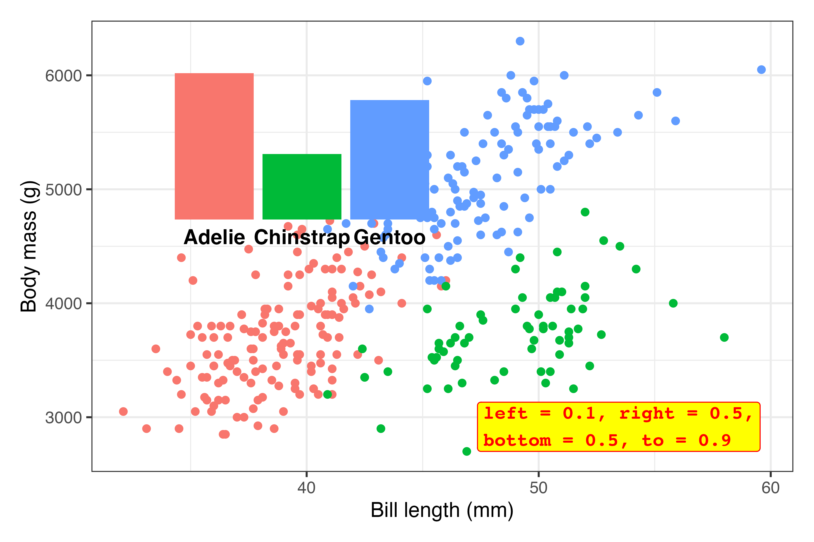

```{r setup, include=FALSE}
knitr::opts_chunk$set(
  fig.width = 6, 
  fig.height = 6 * 0.618, 
  fig.align = "center", 
  out.width = "80%",
  collapse = TRUE
)
```

### Which plot is the best for visualizing time?

So many of you asked some variation of this! You learned about visualizing time with column charts, with heatmaps, with stripes, with lines, and so on. Many of you are wondered "But which one is the best? Which should I always use?"

As with everything in this class, there's no right answer!

There are lots of different ways to show time and there's no specific "time only" kind of plot. Check the [list of visualization flowchart guides here](/resource/visualization.qmd#how-to-select-the-appropriate-chart-type)—there's one there [specifically for time](https://flowingdata.com/2010/01/07/11-ways-to-visualize-changes-over-time-a-guide).

All that matters is that the visualization helps you tell a story in a truthful, understandable way.

For example, here's [the HadCRUT5 temperature data](/assignment/13-exercise.qmd) that lots of you used in your extension:

```{r}
#| eval: false
library(tidyverse)

hadcrut <- read_csv("data/hadcrut.csv")
```

```{r}
#| include: false
#| warning: false
#| message: false

library(tidyverse)

hadcrut <- read_csv(here::here("projects/13-exercise/data/hadcrut.csv"))
owid <- read_csv(here::here("projects/13-exercise/data/emissions_per_capita.csv"))
```

You can visualize that with bars:

```{r}
#| fig-width: 8
#| fig-height: 3

hadcrut |>
  ggplot(aes(x = year, y = anomaly, fill = anomaly)) +
  geom_col(linewidth = 0, color = NA) +
  scale_fill_gradientn(
    colors = rev(RColorBrewer::brewer.pal(11, "RdBu")),
    guide = "none"
  ) +
  theme_minimal()
```

Or as [the famous stripes](https://showyourstripes.info/):

```{r}
#| fig-width: 8
#| fig-height: 2

hadcrut |>
  ggplot(aes(x = year, y = 1, fill = anomaly)) +
  geom_tile() +
  scale_fill_gradientn(
    colors = rev(RColorBrewer::brewer.pal(11, "RdBu")),
    guide = "none"
  ) +
  theme_void()
```

Or as a line:

```{r}
#| fig-width: 5
#| fig-height: 3

hadcrut |> 
  ggplot(aes(x = year, y = anomaly)) +
  geom_line() +
  theme_minimal()
```

Those all work and they all show the same data, but they're useful in different circumstances. If you want the exact temperature differences, the line or bar chart would work great; if you want to see the general trend without numbers, the stripes work great.


### Can I visualize time with a map?

Yep! A few of you tried this with your second mini projects! One way is to use facets for each time period you're interested in—though most of the time this isn't the best way because it's hard to visually compare filled areas like this.

Here's an example with good ol' gapminder. We'll show how life expectancy changed between 1952 and 2007 ([using the skeleton technique I showed in the FAQs for week 12](/news/2026-04-13_faqs_week-12.qmd#i-tried-to-make-a-map-and-countries-are-missingwhy)) (code hidden because it's long—click on the "▶︎ Code" button to see it):

```{r}
#| warning: false
#| message: false
#| fig.width: 7
#| fig.height: 6
#| code-fold: true

library(countrycode) # For dealing with country names, abbreviations, and codes
library(gapminder) # Global health and wealth
library(rnaturalearth) # For global shapefiles
library(sf) # For plotting maps

# Add an ISO country code column to gapminder for joining
gapminder_clean <- gapminder |>
  mutate(ISO3 = countrycode(country, "country.name", "iso3c"))

world_map <- ne_countries(scale = 110) |>
  filter(admin != "Antarctica") |> # Bye penguins
  mutate(ISO3 = adm0_a3) # Use adm0_a3 as the main country code column

gapminder_smaller <- gapminder_clean |>
  filter(year %in% c(1952, 2007))

skeleton <- expand_grid(
  ISO3 = unique(world_map$ISO3),
  year = unique(gapminder_smaller$year)
)

full_gapminder_map <- skeleton |>
  left_join(gapminder_smaller, by = join_by(ISO3, year)) |>
  left_join(world_map, by = join_by(ISO3)) |>
  # The geometry column lost its magic powers after joining, so add it back
  st_set_geometry("geometry")

ggplot() +
  geom_sf(data = full_gapminder_map, aes(fill = lifeExp)) +
  facet_wrap(vars(year), ncol = 1) +
  scale_fill_viridis_c(
    option = "inferno",
    na.value = "grey90",
    guide = guide_colorbar(
      barwidth = 15,
      barheight = 0.75,
      theme = theme(
        legend.title = element_text(hjust = 0.5),
        legend.title.position = "top"
      )
    )
  ) +
  labs(
    title = "Change in life expectancy between 1952 and 2007",
    fill = "Life expectancy (years)"
  ) +
  coord_sf(crs = st_crs("+proj=robin")) +
  theme_void() +
  theme(
    legend.position = "top",
    strip.text = element_text(face = "bold"),
    plot.title = element_text(
      face = "bold",
      hjust = 0.5,
      margin = margin(t = 5, b = 5)
    )
  )
```

↑ That works and you can tell that the world got a lot yellower between 1952 and 2007—especially the Global South. But it's hard to see any exact details, or even things like which countries saw the biggest changes in life expectancy.

We can show changes over time with a single map instead of two maps by using a different variable as the fill aesthetic. Instead of filling by life expectancy, we can calculate the change in life expectancy between 1952 and 2007 and fill by that. This will show us which countries saw the biggest improvements (code hidden because it's long—click on the "▶︎ Code" button to see it):

```{r}
#| fig.width: 7
#| fig.height: 4
#| code-fold: true

gapminder_diffs <- gapminder_clean |>
  select(ISO3, year, lifeExp) |> 
  filter(year %in% c(1952, 2007)) |> 
  pivot_wider(names_from = "year", values_from = "lifeExp") |> 
  mutate(change_in_lifeexp = `2007` - `1952`)

map_with_gapminder <- world_map |> 
  left_join(gapminder_diffs, by = join_by(ISO3))

ggplot() +
  geom_sf(data = map_with_gapminder, aes(fill = change_in_lifeexp)) +
  scale_fill_viridis_c(
    option = "viridis",
    na.value = "grey90",
    guide = guide_colorbar(
      barwidth = 15,
      barheight = 0.75,
      theme = theme(
        legend.title = element_text(hjust = 0.5),
        legend.title.position = "top"
      )
    )
  ) +
  labs(
    title = "Change in life expectancy between 1952 and 2007",
    fill = "Additional years of life expectancy"
  ) +
  coord_sf(crs = st_crs("+proj=robin")) +
  theme_void() +
  theme(
    legend.position = "top",
    strip.text = element_text(face = "bold"),
    plot.title = element_text(
      face = "bold",
      hjust = 0.5,
      margin = margin(t = 5, b = 5)
    )
  )
```

All the lighter, yellower countries here saw improvements of 25+ years in life expectancy, while places like Zimbabwe and Eswatini actually saw declines in life expectancy (due to HIV/AIDS). You can't really see those trends when looking at two separate maps.

### Can we show changes in time with animation?

Yes! This is an excellent use for [{gganimate}](https://gganimate.com/index.html) since you can essentially use time as the animation aesthetic. This is what Hans Rosling did with [his original famous gapminder visualization](https://www.youtube.com/watch?v=jbkSRLYSojo) (code hidden because it's long—click on the "▶︎ Code" button to see it):

```{r}
#| eval: false
#| code-fold: true

library(gganimate)

gapminder_animated <- ggplot(
  gapminder,
  aes(x = gdpPercap, y = lifeExp, size = pop, fill = continent)
) +
  geom_point(pch = 21, color = "white", alpha = 0.7) +
  scale_fill_viridis_d(option = "plasma") +
  scale_size(range = c(2, 12)) +
  scale_x_log10(labels = scales::label_dollar()) +
  guides(fill = "none", size = "none") +
  theme_minimal() +
  # Stuff specific to {gganimate}
  labs(
    title = 'Year: {frame_time}',
    x = "GDP per capita",
    y = "Life expectancy"
  ) +
  transition_time(year) +
  ease_aes("linear")

gapminder_animated_thing <- animate(
  gapminder_animated,
  nframes = max(gapminder$year) - min(gapminder$year),
  width = 1600 * 1.5,
  height = 900 * 1.5,
  res = 300,
  renderer = av_renderer("gapminder.mp4")
)
```

```{r}
#| include: false
#| eval: false

library(gganimate)

gapminder_animated <- ggplot(
  gapminder,
  aes(x = gdpPercap, y = lifeExp, size = pop, fill = continent)
) +
  geom_point(pch = 21, color = "white", alpha = 0.7) +
  scale_fill_viridis_d(option = "plasma") +
  scale_size(range = c(2, 12)) +
  scale_x_log10(labels = scales::label_dollar()) +
  guides(fill = "none", size = "none") +
  theme_minimal() +
  # Here comes the gganimate specific bits
  labs(
    title = 'Year: {frame_time}',
    x = "GDP per capita",
    y = "Life expectancy"
  ) +
  transition_time(year) +
  ease_aes("linear")

gapminder_animated_thing <- animate(
  gapminder_animated,
  nframes = max(gapminder$year) - min(gapminder$year),
  width = 1600 * 1.5,
  height = 900 * 1.5,
  res = 300,
  renderer = av_renderer(here::here("news/video/gapminder.mp4"))
)
```

```{=html}
<div class="ratio ratio-16x9 mb-4 border">
<video controls width="100%">
  <source src="video/gapminder.mp4" type="video/mp4">
</video>
</div>
```

Or you can use a map—like here's life expectancy over time in Africa (code hidden because it's long—click on the "▶︎ Code" button to see it):

```{r}
#| eval: false
#| code-fold: true

super_skeleton <- expand_grid(
  ISO3 = unique(world_map$ISO3),
  year = unique(gapminder_clean$year)
)

super_full_gapminder_map <- super_skeleton |>
  left_join(
    rename(gapminder_clean, continent_gapminder = continent),
    by = join_by(ISO3, year)
  ) |>
  left_join(world_map, by = join_by(ISO3)) |>
  filter(continent_gapminder == "Africa") |> 
  # The geometry column lost its magic powers after joining, so add it back
  st_set_geometry("geometry")

gapminder_map_animated <- ggplot() +
  geom_sf(data = super_full_gapminder_map, aes(fill = lifeExp)) +
  scale_fill_viridis_c(
    option = "inferno",
    na.value = "grey90",
    guide = guide_colorbar(
      barwidth = 15,
      barheight = 0.75,
      theme = theme(
        legend.title = element_text(hjust = 0.5),
        legend.title.position = "top"
      )
    )
  ) +
  labs(
    title = "Change in life expectancy between 1952 and 2007",
    fill = "Life expectancy (years)"
  ) +
  coord_sf(crs = st_crs("+proj=robin")) +
  theme_void() +
  theme(
    legend.position = "top",
    strip.text = element_text(face = "bold"),
    plot.subtitle = element_text(hjust = 0.5, margin = margin(t = 5, b = 5)),
    plot.title = element_text(
      face = "bold",
      hjust = 0.5,
      margin = margin(t = 0, b = 5)
    )
  ) +
  # Here comes the gganimate specific bits
  labs(subtitle = 'Year: {frame_time}') +
  transition_time(year) +
  ease_aes("linear")

gapminder_map_animated_thing <- animate(
  gapminder_map_animated,
  nframes = max(gapminder$year) - min(gapminder$year),
  width = 1600,
  height = 2000,
  res = 300,
  renderer = av_renderer("gapminder-africa.mp4")
)
```

```{r}
#| include: false
#| eval: false

super_skeleton <- expand_grid(
  ISO3 = unique(world_map$ISO3),
  year = unique(gapminder_clean$year)
)

super_full_gapminder_map <- super_skeleton |>
  left_join(
    rename(gapminder_clean, continent_gapminder = continent),
    by = join_by(ISO3, year)
  ) |>
  left_join(world_map, by = join_by(ISO3)) |>
  filter(continent_gapminder == "Africa") |> 
  # The geometry column lost its magic powers after joining, so add it back
  st_set_geometry("geometry")

gapminder_map_animated <- ggplot() +
  geom_sf(data = super_full_gapminder_map, aes(fill = lifeExp)) +
  scale_fill_viridis_c(
    option = "inferno",
    na.value = "grey90",
    guide = guide_colorbar(
      barwidth = 15,
      barheight = 0.75,
      theme = theme(
        legend.title = element_text(hjust = 0.5),
        legend.title.position = "top"
      )
    )
  ) +
  labs(
    title = "Change in life expectancy between 1952 and 2007",
    fill = "Life expectancy (years)"
  ) +
  coord_sf(crs = st_crs("+proj=robin")) +
  theme_void() +
  theme(
    legend.position = "top",
    strip.text = element_text(face = "bold"),
    plot.subtitle = element_text(hjust = 0.5, margin = margin(t = 5, b = 5)),
    plot.title = element_text(
      face = "bold",
      hjust = 0.5,
      margin = margin(t = 0, b = 5)
    )
  ) +
  # Here comes the gganimate specific bits
  labs(subtitle = 'Year: {frame_time}') +
  transition_time(year) +
  ease_aes("linear")

gapminder_map_animated_thing <- animate(
  gapminder_map_animated,
  nframes = max(gapminder$year) - min(gapminder$year),
  width = 1600,
  height = 2000,
  res = 300,
  renderer = av_renderer(here::here("news/video/gapminder-africa.mp4"))
)
```

```{=html}
<div class="ratio mb-4 border" style="--bs-aspect-ratio: 125%;">
<video controls width="100%">
  <source src="video/gapminder-africa.mp4" type="video/mp4">
</video>
</div>
```

Or you can slowly reveal trends in your data, like with the HadCRUT5 temperature data (code hidden because it's long—click on the "▶︎ Code" button to see it):

```{r}
#| eval: false
#| code-fold: true
#| warning: false

hadcrut_animated <- hadcrut |> 
  ggplot(aes(x = year, y = anomaly, group = 1)) +
  geom_line(aes(color = anomaly), linewidth = 1) +
  geom_point(size = 3) +
  scale_color_gradientn(
    colors = rev(RColorBrewer::brewer.pal(11, "RdBu")),
    guide = "none"
  ) +
  labs(x = NULL, y = "Anomaly (°C)", title = "Difference from 1961–1990 average") +
  theme_minimal() +
  transition_reveal(year)

hadcrut_animated_thing <- animate(
  hadcrut_animated,
  nframes = nrow(hadcrut),
  width = 1600 * 1.5,
  height = 900 * 1.5,
  res = 300,
  renderer = av_renderer("hadcrut.mp4")
)
```

```{r}
#| include: false
#| eval: false
#| warning: false

hadcrut_animated <- hadcrut |> 
  ggplot(aes(x = year, y = anomaly, group = 1)) +
  geom_line(aes(color = anomaly), linewidth = 1) +
  geom_point(size = 3) +
  scale_color_gradientn(
    colors = rev(RColorBrewer::brewer.pal(11, "RdBu")),
    guide = "none"
  ) +
  labs(x = NULL, y = "Anomaly (°C)", title = "Difference from 1961–1990 average") +
  theme_minimal() +
  transition_reveal(year)

hadcrut_animated_thing <- animate(
  hadcrut_animated,
  nframes = nrow(hadcrut),
  width = 1600 * 1.5,
  height = 900 * 1.5,
  res = 300,
  renderer = av_renderer(here::here("news/video/hadcrut.mp4"))
)
```

```{=html}
<div class="ratio ratio-16x9 mb-4 border">
<video controls width="100%">
  <source src="video/hadcrut.mp4" type="video/mp4">
</video>
</div>
```

Or with bars (code hidden because it's long—click on the "▶︎ Code" button to see it):

```{r}
#| eval: false
#| code-fold: true

hadcrut_bars_animated <- hadcrut |>
  ggplot(aes(x = year, y = anomaly, fill = anomaly)) +
  geom_col(linewidth = 0, color = NA) +
  scale_fill_gradientn(
    colors = rev(RColorBrewer::brewer.pal(11, "RdBu")),
    guide = "none"
  ) +
  labs(x = NULL, y = "Anomaly (°C)", title = "Difference from 1961–1990 average") +
  theme_minimal() +
  transition_states(year) +
  enter_fade() +
  shadow_mark()

hadcrut_bars_animated_thing <- animate(
  hadcrut_bars_animated,
  nframes = nrow(hadcrut),
  width = 1600 * 1.5,
  height = 900 * 1.5,
  res = 300,
  renderer = av_renderer("hadcrut-bars.mp4")
)
```

```{r}
#| include: false
#| eval: false

hadcrut_bars_animated <- hadcrut |>
  ggplot(aes(x = year, y = anomaly, fill = anomaly)) +
  geom_col(linewidth = 0, color = NA) +
  scale_fill_gradientn(
    colors = rev(RColorBrewer::brewer.pal(11, "RdBu")),
    guide = "none"
  ) +
  labs(x = NULL, y = "Anomaly (°C)", title = "Difference from 1961–1990 average") +
  theme_minimal() +
  transition_states(year) +
  enter_fade() +
  shadow_mark()

hadcrut_bars_animated_thing <- animate(
  hadcrut_bars_animated,
  nframes = nrow(hadcrut),
  width = 1600 * 1.5,
  height = 900 * 1.5,
  res = 300,
  renderer = av_renderer(here::here("news/video/hadcrut-bars.mp4"))
)
```

```{=html}
<div class="ratio ratio-16x9 mb-4 border">
<video controls width="100%">
  <source src="video/hadcrut-bars.mp4" type="video/mp4">
</video>
</div>
```

### Getting the inset plot positioned correctly was tricky—what's the best way to do that?

Yeah, this is tricky and there's no way to get it right the first time—don't even try!

Here's my general process for getting extra details aligned correctly (this applies to annotations, extra text, inset plots, and anything else, really):

First, to illustrate, here are two plots—a bar chart that we'll [use as a legend](https://www.andrewheiss.com/blog/2025/02/19/ggplot-histogram-legend/), and a scatterplot that we'll put that bar chart inside.

::: {.panel-tabset}
### Main plot

```{r}
plot_main <- penguins |> 
  drop_na(sex) |> 
  ggplot(aes(x = bill_len, y = body_mass, color = species)) +
  geom_point() +
  guides(color = "none") +
  labs(x = "Bill length (mm)", y = "Body mass (g)") +
  theme_bw()
plot_main
```

### Bar chart to go inside

```{r}
plot_bars <- penguins |> 
  count(species) |> 
  ggplot(aes(x = species, y = n, fill = species)) + 
  geom_col() +
  guides(fill = "none") +
  labs(x = NULL, y = NULL) +
  theme_void() +
  theme(axis.text.x = element_text(face = "bold"))
plot_bars
```

:::


1. **Figure out the dimensions for the overall plot.** R plots always fit the dimensions of the given plot area. In a Quarto document, the default will be 7″ × 7″, but you'll generally want to use something else. 

   The position of extra labels or inset plots will shift around depending on how much space is available in the main plot, so before you start tinkering with precise values for the location of your extra details, **make sure you start with the size you want first**.

   Like, we want to put that bar chart in the upper left corner of the scatterplot here. Look how much the available space changes depending on the dimensions of the plot:

   ::: {.panel-tabset}

   ### 6″ × 4″

   ```{r}
   #| echo: fenced
   #| fig-width: 6
   #| fig-height: 4

   plot_main
   ```

   ### 6″ × 2″

   ```{r}
   #| echo: fenced
   #| fig-width: 6
   #| fig-height: 2

   plot_main
   ```

   ### 6″ × 8″

   ```{r}
   #| echo: fenced
   #| fig-width: 6
   #| fig-height: 8

   plot_main
   ```

   ### 5″ × 3″

   ```{r}
   #| echo: fenced
   #| fig-width: 5
   #| fig-height: 3

   plot_main
   ```

   :::

   We'll go with 6″ × 4″ just because.

2. **Stick the extra element on the plot *somewhere***. You're going to tinker with the exact values a bunch later, so first, just put the inset plot (or annotation if you're using `annotate()`) on the plot somewhere to make sure it's working and to see if you need to make any adjustments first.

   `inset_element()` uses percentages to place things. Here, this means that the left side of the inset plot will be at 10% of the x-axis, the right side will be at 50% of the x-axis, the top will be at 90% of the y-axis, and the bottom will be at 50% of the y-axis:

   ```{r}
   #| fig-width: 6
   #| fig-height: 4

   library(patchwork)

   plot_main + 
     inset_element(
       plot_bars, 
       left = 0.1, right = 0.5, 
       bottom = 0.5, top = 0.9
     )
   ```

   Those are all arbitrary values! I just chose them to get that plot in the general top left area!

   The font size for those labels might be a little too big, so we'll probably need to adjust that later, but this is good enough for now.

3. **Tinker!** Now that the inset plot is there, we can play with the numbers until it appears where we want. In all the answer keys and example posts, you only ever see the final positioning, but that's always the result of lots of fiddling.

   Here I ended up with 

   ```r
   inset_element(
     plot_bars, 
     left = 0.02, right = 0.35, 
     bottom = 0.65, top = 0.97
   )
   ```

   …but only after a bunch of changes. This is what the process looked like (I made this animation with the [neat {camcorder} package](https://thebioengineer.github.io/camcorder/)):^[[See the code here](https://github.com/andrewheiss/datavizf25.classes.andrewheiss.com/blob/main/files/inset-recording.R) if you're curious.]

   

   ```{r}
   #| fig-width: 6
   #| fig-height: 4
   
   plot_main + 
     inset_element(
       plot_bars, 
       left = 0.02, right = 0.35, 
       bottom = 0.65, top = 0.97
     )
   ```

4. **Make any other final adjustments and tinker more as needed.** This is so close! The last little issue is that the font size for the species names is a little too big. We need to adjust that in `plot_bars` (either back up where we made `plot_bars` in the first place, or on the fly here). In the process of shrinking the text, I also figured that I could widen the inset a little to give the labels some more space, so now it uses `right = 0.4`:

   ```{r}
   #| fig-width: 6
   #| fig-height: 4

   plot_main + 
     inset_element(
       plot_bars + 
         theme(axis.text.x = element_text(face = "bold", size = 9)), 
       left = 0.02, right = 0.4, 
       bottom = 0.65, top = 0.97
     )
   ```

   All done!

### My subscripted 2 wasn't appearing in my plot. Can I fix that?

Lots of you—mostly Windows users—ran into issues when using "CO~2~" in your plot title. It ended up looking like "CO▯" instead.

This is because the `₂` character I provided in the instruction text is a Unicode 2, and Windows often struggles with Unicode text.

The subscripted 2 appeared throughout your document because I typed it like `CO~2~`. That `~blah~` syntax is [special Markdown syntax for making things subscripted](https://quarto.org/docs/authoring/markdown-basics.html#text-formatting), like This~this~. That `~blah~` syntax doesn't use any special Unicode characters—instead it uses the actual text you typed and styles it as subscript (like in HTML, `CO~2~` turns into `CO<sub>2</sub>`).

ggplot (and R in general) doesn't let you use fancy formatting in plot text, so the `₂` is a cheating way to get subscripts in the plot. But it only works if (1) your R session is set to use Unicode, and (2) the font you're using has the `₂` character in it.

But there are more official ways around this so you don't have to cheat! And you've (kind of) already seen them in [the annotations session](/content/09-content.qmd). You can use [{ggtext}](https://wilkelab.org/ggtext/) and `element_markdown()` to format plot text using HTML. This uses the actual text instead of Unicode replacements, so it works with any arbitrary text too:

```{r}
#| fig-width: 6
#| fig-height: 1.5
library(ggtext)

ggplot() +
  labs(
    title = "CO~2~ emissions",
    subtitle = "More<sub>subscripted text</sub> and ^superscripted^ text and **bold text** and <span style='color: red'>*red italic*</span> text"
  ) +
  theme(
    plot.title = element_markdown(face = "bold"),
    plot.subtitle = element_markdown()
  )
```

This can be helpful when you have more mathy things too:

```{r}
#| fig-width: 6
#| fig-height: 1.5
ggplot() +
  labs(title = "y = β~0~ + β~1~ x~1~") +
  theme(plot.title = element_markdown(face = "bold"))
```

But that's a little deceptive, because there I'm cheating again by using the Unicode β character, which will only appear if the font supports it.

A better way to use math is to use the neat [{latex2exp} package](https://www.stefanom.io/latex2exp/), which lets you [write LaTeX math](/resource/markdown.qmd#math) like $y = \beta_0 + \beta_1 x_1$:

```{r}
#| fig-width: 6
#| fig-height: 1.5

library(latex2exp)

ggplot() +
  labs(
    title = TeX(r"($y = \beta_0 + \beta_1 x_1$)"),
    subtitle = TeX(r"(This works for text too, like ${CO}_2$)")
  )
```

### What's the difference between using `by = "thing"` and `join_by("thing")` with the different join functions?

This is a great question! Here's some imaginary data (from [Lesson 12](/lesson/12-lesson.qmd)) to help illustrate.


```{r}
#| warning: false
#| message: false

library(tidyverse)

national_data <- tribble(
  ~state, ~year, ~unemployment, ~inflation, ~population,
  "GA",   2018,  5,             2,          100,
  "GA",   2019,  5.3,           1.8,        200,
  "GA",   2020,  5.2,           2.5,        300,
  "NC",   2018,  6.1,           1.8,        350,
  "NC",   2019,  5.9,           1.6,        375,
  "NC",   2020,  5.3,           1.8,        400,
  "CO",   2018,  4.7,           2.7,        200,
  "CO",   2019,  4.4,           2.6,        300,
  "CO",   2020,  5.1,           2.5,        400
)

state_regions <- tribble(
  ~region, ~state,
  "Northeast", c("CT", "ME", "MA", "NH", "RI", "VT", "NJ", "NY", "PA"),
  "Midwest", c("IL", "IN", "MI", "OH", "WI", "IA", "KS", "MN", "MO", "NE", "ND", "SD"),
  "South", c("DE", "FL", "GA", "MD", "NC", "SC", "VA", "DC", "WV", "AL", "KY", "MS", "TN", "AR", "LA", "OK", "TX"),
  "West", c("AZ", "CO", "ID", "MT", "NV", "NM", "UT", "WY", "AK", "CA", "HI", "OR", "WA")
) |> unnest(state) |> 
  arrange(state)
```

Here we have `national_data` with a bunch of made-up state-level variables and `state_regions` with columns showing which states are in which regions:

```{r}
national_data

state_regions
```

The two datasets have a shared column: `state`. We can use that column to merge the region data into the national data with `left_join`, and we can do it in a few different ways.

First, I like to use `left_join()` **without** specifying which columns are shared, just to make sure that R can figure it out (and to check for multiple shared columns), like this:

```{r}
national_data |> 
  left_join(state_regions)
```

That merged fine, and R provided a helpful message saying that it joined by `state`. That `by = join_by(state)` message is actually working R code too and it's the official recommended way to specify joins. Once I know things are working, I'll actually copy/paste that message and put it in `left_join()`, like this:

```{r}
national_data |> 
  left_join(state_regions, by = join_by(state))
```

Often you'll see this syntax instead of `join_by()`:

```{r}
national_data |> 
  left_join(state_regions, by = "state")
```

↑ That works and is completely valid and fine—it's just the older way of specifying shared columns. `join_by()` was introduced in {dplyr} version 1.1.0 in January 2023 ([see this for complete details](https://tidyverse.org/blog/2023/01/dplyr-1-1-0-joins/)) and it's the better, more powerful, and more flexible way to specify shared columns.

`join_by()` is especially nice when you're working with shared columns with different names. Let's rename the state column in `state_regions` to something else:

```{r}
state_regions <- state_regions |> 
  rename(ST = state)
state_regions
```

If we try to join now, we'll get an error because R doesn't know that `state` and `ST` are shared:

```{r}
#| error: true
national_data |> 
  left_join(state_regions)
```

The old style way of specifying which things are shared was to use a named character vector, like this:

```{r}
national_data |> 
  left_join(state_regions, by = c("state" = "ST"))
```

↑ That works fine. It's saying that `state` in the first dataset (`national_data`) is the same as `ST` in the second dataset (`state_regions`). 

But that `c("blah" = "blah")` syntax is clunky. The process of specifying shared columns feels like a filtering approach, and when you use `filter()`, you use `==` to say that you want two things equal to each other (like `filter(state == "GA")`). But here, you have to use a single `=`.

`join_by()` fixes this by using this syntax:

```{r}
national_data |> 
  left_join(state_regions, by = join_by(state == ST))
```

You use two equals signs `==`, and you don't need to put column names in quotes, which makes it all feel more like the rest of the tidyverse and matches what you do with `mutate()`, `group_by()`, `summarize()`, `filter()`, `arrange()`, and friends.

You can also specify multiple shared columns, like if you're joining country-year data like gapminder to other country-year data. And not all the columns need to have the `==`. Like, if you had two datasets with country-year data and they both had a `year` column and the first had a country name column named `country` and the second had one called `country_name`, you could do this:

```{r}
# Old way:
c("country" = "country_name", "year")

# New way:
join_by(country == country_name, year)
```

One really neat thing about `join_by()` is that you can do way more complex joins like rolling joins and inequality joins ([see this post for more examples](https://tidyverse.org/blog/2023/01/dplyr-1-1-0-joins/)). That's because `join_by()` works like `filter()`, so you can do stuff like `join_by(unemployment >= 5)` to merge based on *ranges* of values.

Here's a quick example with letter grades. Imagine a dataset with points like this:

```{r}
scores <- tibble(
  student = c("Alice", "Bob", "Charlie", "Dana", "Evan"),
  points = c(85, 82.9, 91, 99, 76)
)
scores
```

I want to assign letter grades to each of these students based on this grade scale:

```{r}
grade_scale <- tibble(
  grade = c("A+", "A", "A-", "B+", "B", "B-", "C+", "C", "C-", "D", "F"),
  min_points = c(99, 93, 90, 87, 83, 80, 77, 73, 70, 60, 0),
  max_points = c(100, 99, 93, 90, 87, 83, 80, 77, 73, 70, 60)
)
grade_scale
```

I *could* do this with a super gross `ifelse()` or `case_when()`, like this:

```{.r}
scores |> 
  mutate(grade = case_when(
    points <= 100 & points >= 99 ~ "A+",
    points < 99 & points >= 93 ~ "A",
    points < 93 & points >= 90 ~ "A-",
    # AND SO ON
  ))
```

But that's gross and involves *so much typing*.

Instead, we can actually use `left_join()` to merge the `grade_scale` dataset into the `scores` dataset. With `join_by()`, we can specify a range of values to join by, like this:

```{r}
scores |>
  left_join(grade_scale, join_by(between(points, min_points, max_points)))
```

That's so cool (and impossible to do with the old-style `by = c("...")` syntax).
