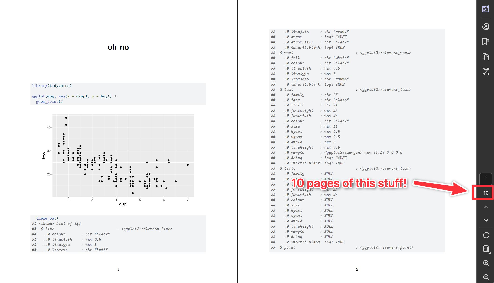
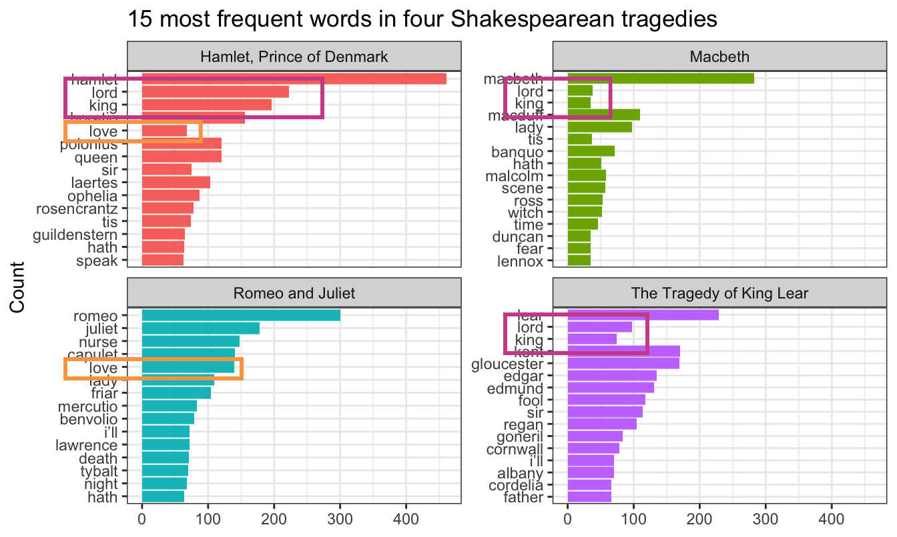

```{r setup, include=FALSE}
knitr::opts_chunk$set(
  fig.width = 6,
  fig.height = 6 * 0.618,
  fig.align = "center",
  out.width = "80%",
  collapse = TRUE
)

# Custom knitr hook for truncation: 
# https://bookdown.org/yihui/rmarkdown-cookbook/hook-truncate.html

# Save the default output hook
default_output_hook <- knitr::knit_hooks$get("output")

truncate_output <- function(x, max_head = 10, max_tail = 5) {
  lines <- strsplit(x, "\n")[[1]]

  if (length(lines) <= (max_head + max_tail)) {
    return(x)
  }

  head_lines <- lines[1:max_head]
  tail_lines <- lines[(length(lines) - max_tail + 1):length(lines)]

  paste(c(head_lines, "....", tail_lines), collapse = "\n")
}

knitr::knit_hooks$set(output = function(x, options) {
  if (!is.null(options$truncate)) {
    if (is.logical(options$truncate) && options$truncate) {
      x <- truncate_output(x)
    } else if (is.numeric(options$truncate) && length(options$truncate) == 2) {
      x <- truncate_output(x, options$truncate[1], options$truncate[2])
    }
  }
  default_output_hook(x, options)
})
```

### Why didn't the number of words in my `all_words` dataset match what you had in the instructions?

Oh man, I have no idea. This was bedeviling, and I think I discovered a bug.

In the exercise instructions, I said that you should have had a dataset with 572,169 rows after using `unnest_tokens()`. None of you could get that number. Instead, you were getting 571,989 rows. That's a 280-row difference!

**Turns out that you should have gotten 571,989 rows.**

Long story short. I use [Positron](https://positron.posit.co/) (the future successor to RStudio) for [all my R work](https://www.andrewheiss.com/blog/2024/07/08/fun-with-positron/) nowadays (but still teach RStudio). There's some sort of bug in the macOS version of Positron that slightly changes a language setting that controls how periods are dealt with when using `unnest_tokens()`. Normally, `unnest_tokens()` is smart enough to recognize that things like `example.com` or `T.M.I.` are whole words and it keeps them together. 

Because of this really bizarre Positron bug ([which I just reported!](https://github.com/posit-dev/positron/issues/11012)), `unnest_tokens()` uses a slightly different (and less smart) English language definition that *doesn't* recognize that `example.com` is one word and instead splits it into "example" and "com".

This is why the instructions were higher by 280 words! 

For instance, in Season 2, Episode 1, there was this sentence: 

> Gyaaah. T.M.I. T.M.I my friends.

R running in RStudio split that sentence into 5 words:

1. `gyaaah`
2. `t.m.i.`
3. `t.m.i.`
4. `my`
5. `friends`

R running in Positron split it into 9 words:

1. `gyaaah`
2. `t`
3. `m`
4. `i`
5. `t`
6. `m`
7. `i`
8. `my`
9. `friends`

It split `T.M.I.` into three separate words. It ended up doing stuff like that 280 times. Since I wrote the instructions in a Quarto file in Positron, I was looking at the inflated word count, resulting in the mismatch in the number of rows.


### Why did you have us use a TV script? How is this relevant to anything we might ever do? Do people use this kind of text analysis and visualization in real life?

The *The Office* dataset for Exercise 14 was unexpectedly polarizing! Some of you loved it—others absolutely hated it and thought it was a waste of time because they'd never use TV scripts in their own work in the future.

And yes, you'll likely never work with actual TV scripts in your own work. Similarly, unless you're doing digital humanities stuff, you'll never work with public domain books like in the example. 

This has been the case for *all* the datasets you've used throughout the semester—some of you will never work with data about cars or penguins or climate change or voting restrictions or WNBA statistics or state-level economic data like the Urban Institute stuff. The reason I gave you these datasets during the course is that there's no way to know or anticipate what you'll be doing with your own data or careers in the future, so I chose data that looked fun and interesting.

That's a totally normal approach when learning anything related to data analysis—you always work with example data unrelated to your specific interest. That's the point of #TidyTuesday too, which is really just a bunch of random neat datasets to play with.

**Your job is always to adapt what you learn from these different examples and exercises to your own data.**

It might seem like you'll never work with huge collections of text data, but you actually will often have text! If you've ever ran a survey on Google Forms or Qualtrics or Surveymonkey or some other survey platform, you've probably included free response questions. That's text! You can use these visualization techniques on those responses!

The same general principles apply. You can visualize word frequencies. You can figure out general topics with topic modeling. You can get a rough sense of respondent sentiment.

You can even use those difficult-to-interpret tf-idf values to find unique words! Recently, a couple friends of mine worked on a research project where they wanted to see if people in the general public feel differently about organizations in different sectors—like, what do people think about for-profit businesses vs. government and public sector organizations vs. nonprofits and charities. To do this, they asked several hundred survey respondents to write a couple sentences explaining what they think organizations in those different sectors do in general. They then analyzed the results by tokenizing the text into individual words and bigrams and then finding the tf-idf for the words in each sector. This then let them see which kinds of words and phrases are the most unique for each sector (e.g. government had words like "duty", "service", and "sacrifice" while private corporations had words like "profit", "efficiency", and "money"). And now they're working on looking at specific parts of speech, like the most unique nouns and verbs for the sectors, [like this other example here](https://andrewheiss.quarto.pub/tf-idf-and-parts-of-speech/).

That's so cool! 

It has nothing to do with *The Office* or books from Project Gutenberg, but the same principles work across types of text data.

So when you have a dataset that is unrelated to anything you normally do, *embrace it* and play with it and look for connections to your own work.

### What's the difference between `geom_pointrange()` and `geom_segment() + geom_point()`?

You've seen plots with points and lines around them in two different plot types this semester: (1) lollipop charts and (2) coefficient plots. 

In the examples, I've shown you how to make these with `geom_pointrange()`, but some online resources/tutorials (and ChatGPT) make them with two separate geom layers: with `geom_segment() + geom_point()`. While that works, it's a little extra work, can be confusing (you have to use two different `x` aesthetics!), and can be inconvenient if you're mapping aesthetics like color, since you have to do it to both layers.

Here's a little illustration of how the two approaches work. With `geom_pointrange()`, you need to specify three aesthetics: 

1. `x` (or `y` if you're going vertically): The placement of the point
2. `xmin` (or `ymin` if you're going vertically): The left (or bottom) end of the line
2. `xmax` (or `ymax` if you're going vertically): The right (or top) end of the line

```{r}
#| warning: false
#| message: false
#| echo: false
#| fig-width: 4.25
#| fig-height: 1.5

library(tidyverse)

ggplot(data = tibble(x = 1, y = "A"), aes(x = x, y = y)) +
  geom_pointrange(aes(xmin = 0.5, xmax = 1.5), color = "#1D6996") +
  annotate(
    geom = "text",
    label = "geom_pointrange()",
    x = 1,
    y = 1.5,
    hjust = 0.5,
    family = "mono",
    fontface = "bold",
    color = "#1D6996",
    size = 5
  ) +
  annotate(
    geom = "text",
    label = "x",
    x = 1,
    y = 1.25,
    hjust = 0.5,
    family = "mono",
    color = "#1D6996"
  ) +
  annotate(
    geom = "text",
    label = "xmin",
    x = 0.5,
    y = 1.25,
    hjust = 0.5,
    family = "mono",
    color = "#1D6996"
  ) +
  annotate(
    geom = "text",
    label = "xmax",
    x = 1.5,
    y = 1.25,
    family = "mono",
    color = "#1D6996"
  ) +
  annotate(
    geom = "segment",
    x = 1,
    xend = 1,
    y = 1.175,
    yend = 1.075,
    arrow = arrow(angle = 30, length = unit(0.25, "lines")),
    color = "grey50",
    linewidth = 0.4
  ) +
  annotate(
    geom = "segment",
    x = 0.5,
    xend = 0.5,
    y = 1.175,
    yend = 1.075,
    arrow = arrow(angle = 30, length = unit(0.25, "lines")),
    color = "grey50",
    linewidth = 0.4
  ) +
  annotate(
    geom = "segment",
    x = 1.5,
    xend = 1.5,
    y = 1.175,
    yend = 1.075,
    arrow = arrow(angle = 30, length = unit(0.25, "lines")),
    color = "grey50",
    linewidth = 0.4
  ) +
  theme_void()
```

With `geom_point() + geom_segment()`, you need to specify three aesthetics *across two different geoms*:

1. **For the point**: This stuff applies to `geom_point()`:

   1. `x` (or `y` if you're going vertically): The placement of the point.

2. **For the line**: This stuff applies to `geom_segment()`:

   1. `x` (or `x` if you're going vertically): The left (or bottom) end of the line.
   2. `xend` (or `yend` if you're going vertically): The right (or top) end of the line.

```{r}
#| warning: false
#| message: false
#| echo: false
#| fig-width: 4.25
#| fig-height: 1.5

ggplot(data = tibble(x = 1, y = "A"), aes(x = x, y = y)) +
  geom_segment(aes(x = 0.5, xend = 1.5), color = "#0F8554") +
  geom_point(size = 2.6, color = "#E17C05") +
  annotate(
    geom = "text",
    label = "geom_point()",
    x = 1,
    y = 1.5,
    hjust = 0.5,
    family = "mono",
    fontface = "bold",
    color = "#E17C05",
    size = 5
  ) +
  annotate(
    geom = "text",
    label = "x",
    x = 1,
    y = 1.25,
    hjust = 0.5,
    family = "mono",
    color = "#E17C05"
  ) +
  annotate(
    geom = "text",
    label = "geom_segment()",
    x = 1,
    y = 0.6,
    hjust = 0.5,
    family = "mono",
    fontface = "bold",
    color = "#0F8554",
    size = 5
  ) +
  annotate(
    geom = "text",
    label = "x",
    x = 0.5,
    y = 0.75,
    hjust = 0.5,
    family = "mono",
    color = "#0F8554"
  ) +
  annotate(
    geom = "text",
    label = "xend",
    x = 1.5,
    y = 0.75,
    family = "mono",
    color = "#0F8554"
  ) +
  annotate(
    geom = "segment",
    x = 1,
    xend = 1,
    y = 1.175,
    yend = 1.075,
    arrow = arrow(angle = 30, length = unit(0.25, "lines")),
    color = "grey50",
    linewidth = 0.4
  ) +
  annotate(
    geom = "segment",
    x = 0.5,
    xend = 0.5,
    y = 0.825,
    yend = 0.925,
    arrow = arrow(angle = 30, length = unit(0.25, "lines")),
    color = "grey50",
    linewidth = 0.4
  ) +
  annotate(
    geom = "segment",
    x = 1.5,
    xend = 1.5,
    y = 0.825,
    yend = 0.925,
    arrow = arrow(angle = 30, length = unit(0.25, "lines")),
    color = "grey50",
    linewidth = 0.4
  ) +
  theme_void()
```

   Notice how the `x` aesthetic gets used twice **in different ways** in the two geoms. **That's weird and confusing.** `x` is used for the placement of the point *and* for the beginning of the segment, and those are different values! Ew.

Both approaches work! But I prefer `geom_pointrange()` for these kinds of plots because I don't have to double up what the `x` aesthetic is doing—I find that it's a lot more straightforward to specify an `x`, `xmin`, and `xmax` instead of two different `x`s and an `xend`.

Here's an example with some penguins data for a lollipop chart and a mean and confidence interval. (I calculated the confidence interval here using a *t*-test. I don't actually care about testing any hypotheses or anything—I do this because `t.test()` happens to return a confidence interval as a side effect of doing the statistical test, so it's a quick and convenient way to calculate a confidence interval.)

```{r}
library(tidyverse)

penguin_details <- penguins |> 
  group_by(species) |> 
  summarize(
    total = n(),
    avg_weight = mean(body_mass, na.rm = TRUE),
    lower = t.test(body_mass)$conf.int[1],
    upper = t.test(body_mass)$conf.int[2]
  )
penguin_details
```

Here's a lollipop chart with both approaches.

The pointrange version of the lollipop chart works by setting `xmin` to 0 and `xmax` to the value of `x`. There is some doubling up of values (i.e. `x = total, xmax = total`), but no doubling up of aesthetics like in the point+segment version (i.e. `x = total, x = 0`)

They create the same plot, but again, I like the pointrange version because it feels weird to use different `x` values in the point+segment version:

::: {.panel-tabset}

#### `geom_pointrange()`

```{r}
#| fig-width: 6
#| fig-height: 3

ggplot(
  penguin_details,
  aes(x = total, y = fct_reorder(species, total), color = species)
) +
  geom_pointrange(aes(xmin = 0, xmax = total)) +
  guides(color = "none")
```

#### `geom_segment() + geom_point()`

```{r}
#| fig-width: 6
#| fig-height: 3

ggplot(
  penguin_details,
  aes(x = total, y = fct_reorder(species, total), color = species)
) +
  geom_point(size = 2.6) +
  geom_segment(aes(x = 0, xend = total)) +
  guides(color = "none")
```

:::

And here's an average and a confidence interval. Here there's no need to set `xmin` to 0 or anything—we can use actual lower and upper values from the confidence interval for `xmin` and `xmax`:

::: {.panel-tabset}

#### `geom_pointrange()`

```{r}
#| fig-width: 6
#| fig-height: 3

ggplot(
  penguin_details,
  aes(x = avg_weight, y = fct_reorder(species, avg_weight), color = species)
) +
  geom_pointrange(aes(xmin = lower, xmax = upper)) +
  guides(color = "none")
```

#### `geom_segment() + geom_point()`

```{r}
#| fig-width: 6
#| fig-height: 3

ggplot(
  penguin_details,
  aes(x = avg_weight, y = fct_reorder(species, avg_weight), color = species)
) +
  geom_segment(aes(x = lower, xend = upper)) +
  geom_point(size = 2.6) +
  guides(color = "none")
```

:::

Again, they're the same, but it's weird to have `x = avg_weight` *and* `x = lower`.

::: {.callout-tip}
#### Filled points

There is one use case for using two separate geoms though! If you want a filled point with a different border (i.e. shape = 21-25), you can't use `geom_pointrange()` because the `color` aesthetic controls both the point and the line. 

But you can use `geom_linerange() + geom_point()`. `geom_linerange()` is nicer than `geom_segment()` because it uses `xmin` and `xmax` instead of the doubled-up `x` and `xend`:

```{r}
#| fig-width: 6
#| fig-height: 3

ggplot(
  penguin_details,
  aes(x = avg_weight, y = fct_reorder(species, avg_weight), color = species)
) +
  geom_linerange(aes(xmin = lower, xmax = upper)) +
  geom_point(aes(fill = species), size = 2.6, shape = 21, color = "white") +
  guides(color = "none", fill = "none")
```

You can also use `geom_pointinterval()` from {ggdist} to control the point and line independently and do it with one geom, like this:

```{r}
#| warning: false
#| message: false
#| fig-width: 6
#| fig-height: 3

library(ggdist)

ggplot(
  penguin_details,
  aes(x = avg_weight, y = fct_reorder(species, avg_weight))
) +
  geom_pointinterval(
    aes(
      xmin = lower,
      xmax = upper,
      interval_color = species,
      point_fill = species
    ),
    shape = 21,
    point_color = "white",
    point_size = 2.6
  ) +
  guides(interval_color = "none", point_fill = "none")
```

:::


### Sometimes when I render my document I get pages of code in addition to the output—why, and how do I stop it?

Many of you have run into this over the course of the semester! You'll render your document and end up with several pages of stuff like this:

{fig-align="center" .border .border-1 .shadow-sm}

That's a common accidental problem and an easy fix—90% of the time, you just need to add a `+`.

There are two general reasons this could be happening. 

1. **You might be accidentally showing the source code of a function.** In R, if you run the name of a function by itself without the parentheses, it'll show you its source code:

   ```{r}
   geom_point
   ```

   That's helpful if you're developing R packages or want to look at the guts of a function, but in practice you rarely want to do that. And you definitely never want to do that in a nice rendered document.

   To fix it, either get rid of the bare function name or add parentheses to it.

2. **You might be running a ggplot function that's not conencted to the rest of the plot.** This is the most common reason I see for this problem. If you run a ggplot function by iteself, like this:

   ```{r}
   geom_point()
   ```

   …it'll show output that needs to be added to the `ggplot()` function to work. An orphaned `geom_point()` like that (1) won't plot anything, and (2) will show a bunch of text in the console.

   The worst offender for this is adding theme layers, since you typically add those to the end of the plot. If you run something like `theme_bw()` by itself, you get hundreds of lines like this:

   ```{r}
   #| truncate: [5, 6]
   theme_bw()
   ```

   So if you have a plot like this:

   ```{.r}
   ggplot(...) + 
     geom_point() +
     scale_x_continuous() + 
     labs(...)  # ← No + here!
     theme_bw()
   ```

   …you'll end up with a plot, but (1) it won't use `theme_bw()`, and (2) you'll see hundreds of lines of output. That's because `theme_bw()` is all by itself here—it's not connected to the previous ggplot layers because there's no `+` at the end of `labs()`. To fix it, add a `+`:

   ```{.r}
   ggplot(...) + 
     geom_point() +
     scale_x_continuous() + 
     labs(...) +  # ← Added a + here
     theme_bw()
   ```

### What's the best way to add words like "Season" to the facet titles?

There are a couple ways to control the facet titles. 

First, the easy way that I like to use: make a new column with something like `paste0()` or `glue::glue()` and facet by *that*. Here's an example with cars data:

```{r}
mpg_to_plot <- mpg |> 
  filter(cyl != 5) |> 
  mutate(cyl_nice = str_glue("{cyl} cylinders"))

ggplot(mpg_to_plot, aes(x = displ, y = hwy)) + 
  geom_point() + 
  facet_wrap(vars(cyl_nice))
```

Second, the trickier (but more official?) way is to use the `labeller` argument in `facet_wrap()`, which converts the facet titles using a function:

```{r}
mpg |> 
  filter(cyl != 5) |> 
  ggplot(aes(x = displ, y = hwy)) + 
  geom_point() + 
  facet_wrap(vars(cyl), labeller = as_labeller(\(x) str_glue("{x} cylinders")))
```

That works, but it's kinda gross and convoluted.

That `labeller` argument *is* helpful if you're faceting by multiple things and want to control how those labels appear. Like, if you do this, you get two layers of facet labels, but no easy way of knowing what those values mean.

```{r}
mpg |> 
  filter(cyl != 5) |> 
  ggplot(aes(x = displ, y = hwy)) + 
  geom_point() +
  facet_wrap(vars(cyl, year))
```

You can use the `label_both()` function to include the variable names as prefixes:

```{r}
mpg |> 
  filter(cyl != 5) |> 
  ggplot(aes(x = displ, y = hwy)) + 
  geom_point() +
  facet_wrap(vars(cyl, year), labeller = label_both)
```

Or you can skip the `labeller` approach and make your own labels with `mutate()`:

```{r}
mpg |>
  filter(cyl != 5) |>
  mutate(
    cyl_nice = str_glue("{cyl} cylinders"),
    year_nice = str_glue("({year})")
  ) |>
  ggplot(aes(x = displ, y = hwy)) +
  geom_point() +
  facet_wrap(vars(cyl_nice, year_nice))
```

### Some of the words in my word frequency/tf-idf plot were out of order—how can I fix that?

In the [example for session 14](/example/14-example.qmd#tokens-and-word-counts), I showed the 15 most frequent words in Hamlet, Macbeth, Romeo and Juliet, and King Lear, faceted by play. Only Romeo and Juliet, though, has the words in the correct order. The other plays have strange ordering. Note how "lord" and "king" are weirdly misplaced in Macbeth and Hamlet and how "love" is weirdly misplaced in Hamlet:



The word "lord" is the second most common word in Hamlet, so R thinks it is the second most common word across all the plays. It doesn't know that there's a difference between "lord" in Hamlet and "lord" in Macbeth. As a result, any common words that are shared across the plays will appear out of order.

This is fixable though! [See this blog post by Julia Silge](https://juliasilge.com/blog/reorder-within/), one of the authors of {tidytext}. Basically, you need to use `reorder_within()` to sort the words correctly inside each play, then add `scale_y_reordered()` to make them display correctly.

Here's what that looks like with the Shakespeare words.

```{r libraries-data-reordering, warning=FALSE, message=FALSE}
library(tidyverse)
library(gutenbergr)  # For getting books from Project Gutenberg
library(tidytext)    # For working with text
```

```{r get-text-fake, eval=FALSE}
tragedies_raw <- gutenberg_download(
  c(
    1524,  # Hamlet
    1532,  # King Lear
    1533,  # Macbeth
    1513   # Romeo and Juliet
  ),
  meta_fields = "title"
)
```

```{r load-saved-text, include=FALSE}
withr::with_dir(here::here(), {
  invisible(list2env(targets::tar_read(gutenberg_books), .GlobalEnv))
})
```

```{r clean-tragedies, message=FALSE}
# Clean up the tragedies text
top_words_tragedies <- tragedies_raw |> 
  drop_na(text) |> 
  unnest_tokens(word, text) |> 
  # Remove stop words
  anti_join(stop_words) |> 
  # Get rid of old timey words and stage directions
  filter(!(word %in% c("thou", "thy", "haue", "thee", 
                      "thine", "enter", "exeunt", "exit"))) |> 
  # Count all the words in each play
  count(title, word, sort = TRUE) |> 
  # Keep top 15 in each play
  group_by(title) |> 
  top_n(15) |> 
  ungroup()
top_words_tragedies
```

Because we used `top_n()`, these words are already sorted in order of frequency (with "hamlet" appearing the most at 461 times). In example 14, we locked in that order by making the `word` column an ordered factor, like this:

```{r plot-top-words-tragedies-wrong}
top_words_tragedies_order_wrong <- top_words_tragedies |>
  # Make the words an ordered factor so they plot in order
  mutate(word = fct_inorder(word)) 

ggplot(top_words_tragedies_order_wrong, aes(y = fct_rev(word), x = n, fill = title)) + 
  geom_col() + 
  guides(fill = "none") +
  labs(y = "Count", x = NULL, 
       title = "15 most frequent words in four Shakespearean tragedies") +
  facet_wrap(vars(title), scales = "free_y") +
  theme_bw()
```

But that's wrong!

Instead of using `fct_inorder()`, we need to use `reorder_within()` and tell it to sort the words by count within each play:

```{r tragedies-reorder-within}
top_words_tragedies_order_right <- top_words_tragedies |>
  # Make the words an ordered factor so they plot in order
  mutate(word = reorder_within(word, n, title)) 

top_words_tragedies_order_right
```

Notice how the `word` column looks a little weird now. It added the play name to the end of each word, like `macbeth___Macbeth`. That's actually a creative hack for fixing the ordering. Remember that the main reason the ordering is messed up across facets is because R doesn't know that the word "love" in Hamlet is different from the word "love" in Romeo and Juliet. By changing the words to `love___Romeo and Juliet` and `love___Hamlet`, R can now recognize the different versions of "love" and sort them correctly. Let's plot this version:

```{r plot-top-words-tragedies-right-but-wrong}
ggplot(top_words_tragedies_order_right, aes(y = word, x = n, fill = title)) + 
  geom_col() + 
  guides(fill = "none") +
  labs(y = "Count", x = NULL, 
       title = "15 most frequent words in four Shakespearean tragedies") +
  facet_wrap(vars(title), scales = "free_y") +
  theme_bw()
```

oh no.

The order is right (yay!) but the y-axis is horrible since it's including the hacky `___play name` at the end of each of the words. 

To fix that, we can use `scale_y_reordered()`, which cleans up those word labels by removing the three underscores and any text that follows them:

```{r plot-top-words-tragedies-right}
ggplot(top_words_tragedies_order_right, aes(y = word, x = n, fill = title)) + 
  geom_col() + 
  scale_y_reordered() +
  guides(fill = "none") +
  labs(y = "Count", x = NULL, 
       title = "15 most frequent words in four Shakespearean tragedies") +
  facet_wrap(vars(title), scales = "free_y") +
  theme_bw()
```

Perfect!


### Cleaning up text is *always* specific and specialized

In the Shakespeare example, we removed common stop words like "the" and "a" with `anti_join()` and then manually removed some other more specific words like "thou" and "thee" and "exit":

```{r old-timey-words, eval=FALSE}
# Clean up the tragedies text
top_words_tragedies <- tragedies_raw |> 
  drop_na(text) |> 
  unnest_tokens(word, text) |> 
  # Remove stop words
  anti_join(stop_words) |> 
  # Get rid of old timey words and stage directions
  filter(!(word %in% c("thou", "thy", "haue", "thee", 
                       "thine", "enter", "exeunt", "exit")))
```

That's because in these specific plays, those are common words that we want to ignore—they're basically our own custom stop words. We should also probably get rid of words like "act" and "scene" too, but we didn't here.

Many of you kept that exact code in exercise 14, removing "thou", "thy", "exeunt", and those other words from *The Office*. **But that's not necessary or helpful.** Those words aren't really in there. In the Shakespeare example, we removed "enter" and "exit" because those are stage directions, but in *The Office* (and other texts), those are regular actual words and probably shouldn't be removed.

There's no one universal set of stop words that you can use—every text is unique and has its own quirks that you need to take care of. 

For example, in the past, I had students analyze their own books from Project Gutenberg, and one student looked at four books by W. E. B. Du Bois and did this to clean up the stop words:

```{r dubois-words, eval=FALSE}
dubois_clean |>
  anti_join(stop_words) |> 
  filter(!(word %in% c("1", "2", "cong", "sess", "act", "pp", "_ibid",
                       "_house", "3", "doc")))
```

That's awesome. Those are all words that are specific to those four books and that were likely appearing in the frequency plot. One (or more) of the books probably mentioned lots of congressional activity, like congressional sessions, acts of congress, stuff happening in the House of Representatives, and so on. There were probably also a lot of citations, with things like "pp." (the abbreviation for "pages", like "pp. 125-127") and "ibid" (the abbreviation for "see the previous citation"). That list of words is specific to those four books and *should not* be applied to other books—like, there's no reason to remove those words from the Shakespeare tragedies or from *The Office* or whatever because none of those mention congressional sessions or use "ibid".

Data cleaning is *always* context specific.

### I tried filtering out words like `i'm` and they didn't filter—why not?

Some of you ran into an issue where you had words like this

```{r}
some_book_words <- tibble(text = "I’m a student in the class") |> 
  unnest_tokens(word, text)
some_book_words
```

You want to get rid of the common words like "a" and "the", so you filter them out as stop words:

```{r}
some_book_words |> 
  anti_join(stop_words)
```

"I'm" is still in there, so you filter it out manually:

```{r}
some_book_words |> 
  anti_join(stop_words) |> 
  filter(!(word %in% c("i'm")))
```

But it's still there! It didn't filter! Why not?!

That's because you're searching for `i'm`, but in the column, it uses a [typographically correct](https://typographyforlawyers.com/straight-and-curly-quotes.html) curly single quote, or `i’m`.

There's a subtle visual difference between straight quotes like `'` and `"` and opening and closing curly quotes like `‘` and `’` and `“` and `”`, and they count as separate characters. So in this case, instead of filtering to remove `i'm`, you'd need to filter to remove `i’m`:

```{r}
some_book_words |> 
  anti_join(stop_words) |> 
  filter(!(word %in% c("i’m")))
```

### I tried filtering out blank words with `drop_na()` and it didn't work—why not?

Some of you ran into a different filtering issue where your data looked like this:

```{r}
other_book_words <- tibble(word = c("student", "", "class"))
other_book_words
```

That second word there isn't a word—it's blank, so you want to get rid of it. You use `drop_na()` like in the example…

```{r}
other_book_words |> 
  drop_na(word)
```

…and it's still there. Why?!

That's because that value isn't actually missing, or `NA`. Missing values mean there's nothing in the cell, and it'll appear as `NA`, like this:

```{r}
tibble(word = c("student", NA, "class"))
```

In this case, though, the second non-word here is an empty character string, or `""`. It's not missing—it's still text—so `drop_na()` won't work. You can filter it instead:

```{r}
other_book_words |> 
  filter(word != "")
```

Sometimes you might also have empty values that contain spaces, like `" "`. These are also hard to see:

```{r}
tibble(word = c("student", " ", "class"))
```

If you try filtering to remove `""`, it won't work:

```{r}
# Nothing will get rid of this thing!
tibble(word = c("student", " ", "class")) |> 
  drop_na(word) |> 
  filter(word != "")
```

Instead you need to filter to remove `" "`:

```{r}
tibble(word = c("student", " ", "class")) |> 
  filter(word != " ")
```

How do you know what to use to filter correctly? Trial and error! It all depends on the data you have.

### Is there any way to interpet tf-idf values beyond just comparing their rankings?

Nope, not really. The actualy tf-idf values don't really have any sort of inherent interpretation.

The values that you get depend on a lot of different moving parts (document length, collection size, term frequency), so the numbers depend entirely on the corpus of text and the words that are in it. A tf-idf value of 0.01 in one corpus of text means something completely different from a value of 0.01 in a different corpus.

All you can do is compare relative rankings within or across documents (like the top N most unique words by character or season or whatever).
