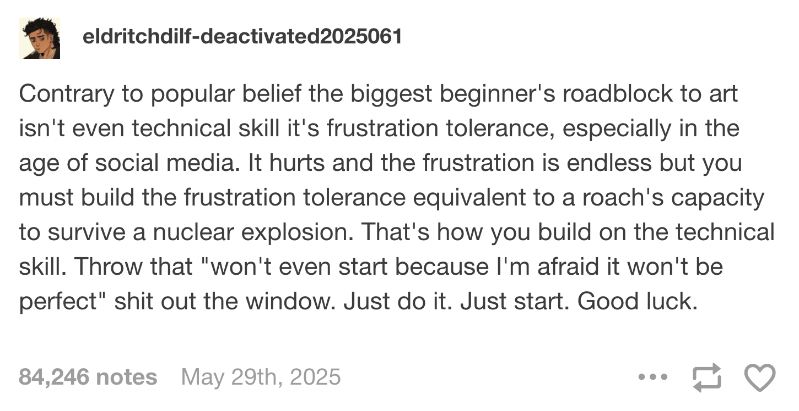

```{r setup, include=FALSE}
knitr::opts_chunk$set(
  fig.width = 6, 
  fig.height = 6 * 0.618, 
  fig.align = "center", 
  out.width = "80%",
  collapse = TRUE
)
```

You made it! Congratulations!

Here are the final few FAQs from the final exercise.

### What kind of communities can I follow online to keep up with this R stuff?

So many!

- One really neat group is the [Data Science Learning Community](https://dslc.io/), or DSLC. These are the same people that organize and run #TidyTuesday. They have a free a Slack workspace that you can join to talk with other people doing and learning R and Python, and they have regular book clubs and group projects and all sorts of other neat activities. Check them out at <https://dslc.io/>.

- Every Thursday, [Posit hosts a Data Science Hangout zoom call](https://pos.it/dsh) with different people from the data community. These are great—you should join in!

- In general, you should also follow the #rstats, #dataviz, and #TidyTuesday hashtags at Bluesky and LinkedIn to see public discussions about all the stuff you've learned. Bluesky (and Twitter before then) in particular is a fantastic place to meet people—check out the #databs (**data** **b**lue**s**ky) hashtag there too, and [this starter pack of dataviz people and organizations](https://bsky.app/starter-pack/chezvoila.com/3l347rina522u).

- There are also annual hashtag challenges like the #30DayMapChallenge in November and the #30DayChartChallenge in April.

- The Data Visualization Society ([web](https://www.datavisualizationsociety.org/); [Bluesky](https://bsky.app/profile/datavizsociety.bsky.social)) is a central community for general purpose (i.e. not R-specific) data visualization people, and they have a [regular publication called *Nightingale*](https://nightingaledvs.com/) (named after Florence Nightingale, who, as you learned way back in week 1, helped invent data visualization).

- There's a weekly newsletter called [R Weekly](https://rweekly.org/) with lists of the latest tutorials, package updates, and more from the broader R world.


### Who in the R and dataviz world should I be following?

Oh man, so many people, and the list constantly evolves and there's no way I can give any sort of comprehensive list.

Here are some off the top of my head. **This is not complete at all!** Follow other people! I'd recommend looking at who these people follow on Bluesky and LinkedIn and following them as well.

- **Libby Heeren** ([Bluesky](https://bsky.app/profile/libbyheeren.bsky.social); [LinkedIn](https://www.linkedin.com/in/libbyheeren)) is Posit's official online community builder and she does an amazing job boosting resources and tools and encouraging people to learn these tools. She also runs Posit's weekly [Data Science Hangout](https://pos.it/dsh) and other neat events.
- **Nicola Rennie** ([Bluesky](https://bsky.app/profile/nrennie.bsky.social); [LinkedIn](https://www.linkedin.com/in/nicola-rennie/); [web](https://nrennie.rbind.io/)) is a professional data visualization expert. She's famous for doing something almost every week for Tidy Tuesday (hundreds of plots! [check them out here!](https://nrennie.rbind.io/viz-gallery/)), and she has [a free online book](https://nrennie.rbind.io/art-of-viz/) that shows her step-by-step process for building incredible charts with R and ggplot. Check out the book and follow her!
- **Cédric Scherer** ([Bluesky](https://bsky.app/profile/cedricscherer.com); [LinkedIn](https://www.linkedin.com/in/cedscherer); [web](https://www.cedricscherer.com/)) is a professional data visualization expert who posts all sorts of fantastic blog posts and tutorials (you've seen some of his stuff as readings in past weeks).
- **Kieran Healy** ([Bluesky](https://bsky.app/profile/kjhealy.co)) and **Claus Wilke** ([Bluesky](https://bsky.app/profile/clauswilke.com))—the authors of the two textbooks you used this semester—are also active on Bluesky.


### Will R ever be fully replaced by AI?

Probably not.

Some software like Excel [is actually trying to do this](https://www.geekwire.com/2025/excel-formula-meets-ai-prompt-microsoft-brings-new-copilot-function-to-spreadsheet-cells/), and (to me) it is totally bonkers. LLMs make up numbers! If you ask it to calculate the average of some numbers, an LLM won't actually do the math—it'll give a number that looks plausible. Excel's `COPILOT` function even includes a huge disclaimer warning people that the results could be wrong.

However, I don't think that AI will have *no* place in data analytics. Where I think LLMs will be helpful (and *are* helpful already) is in generating the code to use R (or Python or Julia or Stata or whatever). Instead of asking "What's the average of this column" and getting some made up number, you can ask "How can I calculate the average of this column" and get code like `mean(dataset$column)`, which you can then inspect yourself and make sure it makes sense and is the right thing to use.

This is actually what the Posit company (the developers of RStudio and the tidyverse) are betting on. If you have time, [check out this video](https://www.youtube.com/watch?v=tSFHQWGyRzo) from the 2025 posit::conf (held here in Atlanta!), where Hadley Wickham (creator of ggplot and dplyr and a billion other things, and chief data scientist at Posit) and Joe Cheng (the chief technology officer at Posit) talk about this.

```{=html}
<div class="ratio ratio-16x9 mb-4">
<iframe src="https://www.youtube.com/embed/tSFHQWGyRzo" frameborder="0" allow="accelerometer; autoplay; encrypted-media; gyroscope; picture-in-picture" allowfullscreen></iframe>
</div>
```

[Positron](https://positron.posit.co/), the successor to RStudio, has two built-in AI chat interfaces:

- [Positron Assistant](https://positron.posit.co/assistant.html): this gives advice about code
- [Databot](https://positron.posit.co/databot.html): this can see your data and (try to) generate and run R code that can analyze it

Neither of these tools analyze the data for you—Posit doesn't want to just make up numbers. Instead, they help you create the code necessary for analyzing data.

*This*, I think, is the future of LLMs/AI in data analysis. It still has to be human driven, with humans making decisions and humans looking at the code and humans understanding the code and humans running the code and humans writing about the output.


### Will you incorporate LLMs and AI prompting into the course in the future?

No.


### Why won't you incorporate LLMs and AI prompting into the course?

::: {.callout-note title="AI for Me, Not (Yet) For Thee?"}
[See this for a more complete explanation of why](https://stats.andrewheiss.com/pinky-lychee/).
:::

These tools *are* useful for coding ([see this for my personal take on this](https://www.andrewheiss.com/ai/#code)).

However, they're only useful if you know what you're doing first. If you skip the learning-the-process-of-writing-code step and just copy/paste output from ChatGPT, you will not learn. You cannot learn. You cannot improve. You will not understand the code.

Up above I mentioned that Positron has an LLM chatbot interface called [Databot](https://positron.posit.co/databot.html) that can look at your data and help you analyze it.

[They have a huge long disclaimer about it though](https://posit.co/blog/databot-is-not-a-flotation-device/)—[**it is dangerous**](https://posit.co/blog/databot-is-not-a-flotation-device/). Joe Cheng says this about it:

> In my 30-year career writing software professionally, Databot is both the most exciting software I’ve worked on, and also the most dangerous.
>
> –Joe Cheng, Posit CTO

In that post, it warns that **you cannot use it** as a beginner:

> …to use Databot effectively and safely, you still need the skills of a data scientist: background and domain knowledge, data analysis expertise, and coding ability.

There is no LLM-based shortcut to those skills. **You cannot LLM your way into domain knowledge, data analysis expertise, or coding ability.**

The only way to gain domain knowledge, data analysis expertise, and coding ability is to struggle. To get errors. To google those errors. To look over the documentation. To copy/paste your own code and adapt it for different purposes. To explore messy datasets. To struggle to clean those datasets. To spend an hour looking for a missing comma.

This isn't a form of programming hazing, like "I had to walk to school uphill both ways in the snow and now you must too." It's the actual process of learning and growing and developing and improving. You've gotta struggle.

This Tumblr post puts it well (it's about art specifically, but it applies to coding and data analysis too):

> Contrary to popular belief the biggest beginner's roadblock to art isn't even technical skill it's **frustration tolerance**, especially in the age of social media. **It hurts and the frustration is endless but you must build the frustration tolerance equivalent to a roach's capacity to survive a nuclear explosion**. That's how you build on the technical skill. Throw that "won't even start because I'm afraid it won't be perfect" shit out the window. Just do it. Just start. Good luck.
>
> (*The original post has disappeared, but [here's a reblog](https://sinisterlaugher.tumblr.com/post/784894680255152128).*)

{fig-align="center" .border .border-1 .shadow-sm}

It's hard, but struggling is the only way to learn anything.

Once you've gotten these skills, you have enough knowledge and expertise to use LLMs and fight and argue with them and speed things up. But before that point, you're in danger-land.

AND EVEN THEN-even if you have that knowledge and expertise—there's a good case to be made to avoid using them. I personally enjoy the process of making things. [As I say here](https://www.andrewheiss.com/ai/):

> I enjoy creating things. I like being the human behind all this stuff.

[This post by a colleague of mine](https://mileswilliams.substack.com/p/why-i-rarely-use-ai) puts it similarly:

> Much of the work I do is a combination of teaching, research, and writing. I enjoy doing all three; not just the things I produce, but the process itself.

That applies to code too! [Williams continues](https://mileswilliams.substack.com/p/why-i-rarely-use-ai):

> If writing is thinking, so too is writing code. I’m fluent in English, and I’m fluent in the R programming language. Both are a means to thinking. If I offload coding or my prose to AI, and by extension, my own thoughts, where’s the joy in that? I don’t use AI much at all to write code simply because I enjoy writing code, the same way a novelist likes writing novels or a philosopher likes crafting a well-argued essay. I derive meaning from the process; not just the final product.

You might not enjoy code as much as Williams does (or I do), but there's still value in maintaining coding skills as you improve and learn more. You don't want your skills to atrophy.

[As I discuss here](https://www.andrewheiss.com/ai/#code), when I do use LLMs for coding-related tasks, I purposely throw as much friction into the process as possible:

> To avoid falling into over-reliance on LLM-assisted code help, I add as much friction into my workflow as possible. I only use GitHub Copilot and Claude in the browser, not through the chat sidebar in Positron or Visual Studio Code. I treat the code it generates like random answers from StackOverflow or blog posts and generally rewrite it completely. I disable the inline LLM-based auto complete in text editors. For routine tasks like generating {roxygen2} documentation scaffolding for functions, I use [the {chores} package](https://posit.co/blog/introducing-chores/), which requires a bunch of pointing and clicking to use.

Even though I use Positron, I purposely do not use either [Positron Assistant](https://positron.posit.co/assistant.html) or [Databot](https://positron.posit.co/databot.html). I have them disabled.

---

So in the end, for pedagogical reasons, I don't foresee me incorporating LLMs into this class. I'm pedagogically opposed to it. I'm facing all sorts of external pressure to do it, but I'm resisting.

You've got to learn first.

In this class, I don't actually care that much what your final outputs are. I want you to make fascinating mini projects and a final project you can show off to the world. I want you to do neat extensions in your exercises. But I don't care so much about you getting the exact right answer. That's the whole point of the ✓ grading system.

The point of all the exercises this semester has been to get you to struggle and learn. The main output for this class isn't the stuff you make—**it's the stuff you learn**.
